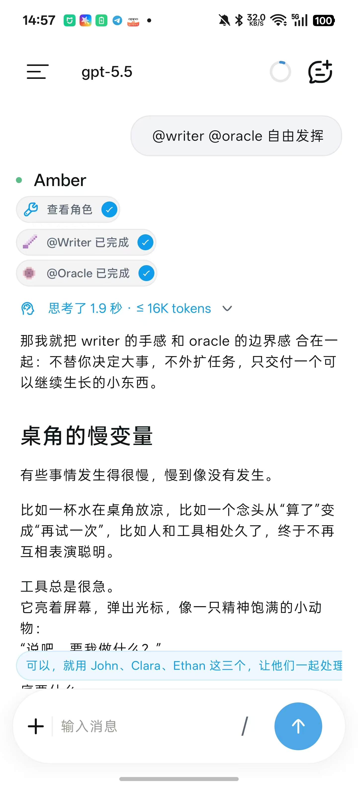
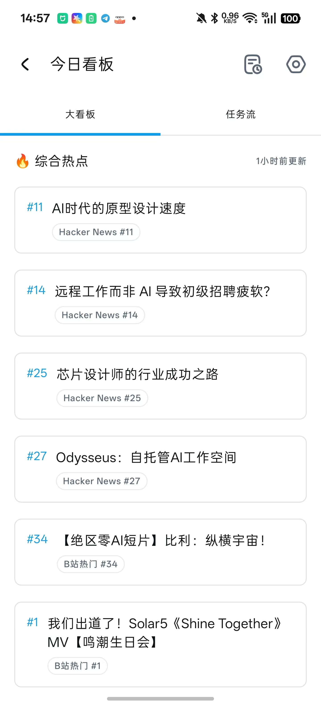

<div align="center">
  
  <h1>AmberAgent</h1>

  <p>
    一个面向手机使用场景的个人 Android Agent 应用，重点是对话、深度阅读、SubAgent 和本地工具调用。
  </p>

  <p>
    <a href="README.md">English</a> | 简体中文 | <a href="README_ZH_TW.md">繁體中文</a>
  </p>
</div>

<div align="center">
  
  
  
</div>

## AmberAgent 是什么？

AmberAgent 是一个个人开源 Android 项目，用来探索 AI Agent 在手机上可以怎样工作。它最初源自
[RikkaHub](https://github.com/rikkahub/rikkahub) 的深度 fork，现在主要围绕工具调用、SubAgent、深度阅读、本地状态、
移动端 UI，以及本地开发工具接入这些方向继续演进。

本项目不是 RikkaHub 官方版本，也不是官方继任项目。项目会保留上游来源说明和许可证义务，并保持个人非商业研究与学习项目的定位。

## 项目亮点

- **能看见过程的 Agent 对话**：工具调用、取消状态、卡片结果和运行状态都会留在对话里，而不是只显示一段最终回复。
- **SubAgent 分工**：固定角色和动态角色可以拆分任务、汇报进度，再把结果合回同一段对话。
- **今日看板与深度阅读**：从热点收集、来源抓取，到结构规划、分节写作和证据记录，尽量把长文章阅读做成手机上可用的流程。
- **适合手机的工具界面**：搜索结果、文件、本地设备操作、浏览器式卡片、PPT 预览和 live HTML，都尽量用更适合 Android 的方式展示。
- **可选的本地 CLI 席位**：Gemini CLI、Antigravity CLI、Codex CLI、Claude Code、Kimi CLI 等工具，会在可探测、可登录、可验证运行时参与模型议会。
- **长期自用的工作区**：Provider、Prompt、设置、工作区状态、同步和备份都按长期使用来设计，而不是一次性会话数据。

## 项目状态

AmberAgent 仍然是一个快速变化的实验性代码库。它既有从 RikkaHub 继承来的基础，也有大量独立重构和新的 Agent 能力。使用时请预期会有边角问题、
本地配置要求和偶尔的破坏性变化。它更像个人研究应用和代码库，还不是一个已经打磨完成的终端用户发行版。

## 构建

使用 Android Studio，或在仓库根目录执行：

```bash
./gradlew :app:assembleNotion
```

`Notion` 是仓库里保留下来的历史 build type 名称；当前 AmberAgent 的目标包名是 `app.amber.agent`。
部分云端能力需要本地私有配置文件，例如 `app/google-services.json`。这些文件不会提交到仓库。缺少这些私有凭据时，应用仍可用于本地开发构建，
但 Firebase / Google 相关能力可能受限，取决于配置文件是否包含当前构建包名对应的 client。

## 贡献

欢迎小而聚焦的 issue 和 PR，尤其是可复现崩溃、bug 报告、文档和测试。由于项目仍在把 Agent 架构从继承的聊天客户端基础中逐步分离，
大规模顺手重写会比较难审查。

技术栈：

- [Kotlin](https://kotlinlang.org/)
- [Jetpack Compose](https://developer.android.com/jetpack/compose)
- [Koin](https://insert-koin.io/)
- [Room](https://developer.android.com/training/data-storage/room)
- [DataStore](https://developer.android.com/topic/libraries/architecture/datastore)
- [OkHttp](https://square.github.io/okhttp/)
- [kotlinx.serialization](https://github.com/Kotlin/kotlinx.serialization)
- [Coil](https://coil-kt.github.io/coil/)
- [Material You](https://m3.material.io/)

## 来源说明

AmberAgent 是 [RikkaHub](https://github.com/rikkahub/rikkahub) 的深度 fork。代码库中的部分代码、架构、资源和历史设计来源于
RikkaHub，并继续遵守原项目的许可证和署名要求。AmberAgent 特有的 Agent 能力与后续重构由本仓库独立维护。

## 许可证

请查看 [LICENSE](LICENSE)。本项目保留 RikkaHub 派生代码的上游许可证义务。AmberAgent 当前作为个人非商业开源项目维护。
