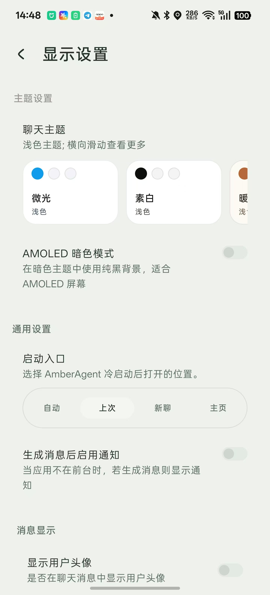

<div align="center">
  
  <h1>AmberAgent</h1>

  <p>
    一個個人非商業 Android Agent Runtime，用來探索行動端優先的 AI 工作流。
  </p>

  <p>
    <a href="README.md">English</a> | <a href="README_ZH_CN.md">简体中文</a> | 繁體中文
  </p>
</div>

<div align="center">
  
  
  
</div>

## AmberAgent 是什麼？

AmberAgent 是一個個人開源 Android 專案，目標是探索手機上的 AI Agent Runtime 應該是什麼樣子。它最初源自
[RikkaHub](https://github.com/rikkahub/rikkahub) 的深度 fork，目前圍繞 Agent 工作流獨立維護和演進，包括工具呼叫、
SubAgent、深度閱讀、本地優先狀態、行動端 UI，以及外部執行時實驗。

本專案不是 RikkaHub 官方版本，也不是官方繼任專案。專案會保留上游來源說明和授權義務，並保持個人非商業研究與學習專案的定位。

## 目前重點

- 行動端優先的聊天與 Agent 執行體驗。
- SubAgent 與固定/動態角色協作工作流。
- 深度閱讀、來源收集、分節寫作和報告式輸出。
- 搜尋、檔案、瀏覽器式卡片、本地應用能力等工具執行介面。
- 豐富生成物預覽，包括 live HTML / PPT 風格內容。
- 可驗證執行的外部 CLI 席位實驗。
- 用於保存個人配置和工作區狀態的同步與備份流程。

## 專案狀態

AmberAgent 仍然是一個快速演進的實驗性程式碼庫。它既包含從 RikkaHub 繼承而來的基礎能力，也包含大量獨立重構和新的 Agent
Runtime 工作。使用時請預期會有邊角問題、本地配置要求和較快迭代。

## 構建

使用 Android Studio，或在倉庫根目錄執行：

```bash
./gradlew :app:assembleNotion
```

部分雲端能力需要本地私有配置檔案，例如 `app/google-services.json`。這些檔案不會提交到倉庫。缺少這些私有憑據時，應用仍可用於本地開發構建，
但 Firebase / Google 相關能力可能受限，取決於配置檔案是否包含目前構建包名對應的 client。

## 貢獻

歡迎小而聚焦的 issue 和 PR，尤其是可復現崩潰、bug 報告、文件和測試。由於專案仍在把 Agent 架構從繼承的聊天客戶端基礎中逐步分離，
大規模順手重寫會比較難審查。

技術棧：

- [Kotlin](https://kotlinlang.org/)
- [Jetpack Compose](https://developer.android.com/jetpack/compose)
- [Koin](https://insert-koin.io/)
- [Room](https://developer.android.com/training/data-storage/room)
- [DataStore](https://developer.android.com/topic/libraries/architecture/datastore)
- [OkHttp](https://square.github.io/okhttp/)
- [kotlinx.serialization](https://github.com/Kotlin/kotlinx.serialization)
- [Coil](https://coil-kt.github.io/coil/)
- [Material You](https://m3.material.io/)

## 來源說明

AmberAgent 是 [RikkaHub](https://github.com/rikkahub/rikkahub) 的深度 fork。程式碼庫中的部分程式碼、架構、資源和歷史設計來源於
RikkaHub，並繼續遵守原專案的授權和署名要求。AmberAgent 特有的 Agent 能力與後續重構由本倉庫獨立維護。

## 授權

請查看 [LICENSE](LICENSE)。本專案保留 RikkaHub 派生程式碼的上游授權義務。AmberAgent 目前作為個人非商業開源專案維護。
