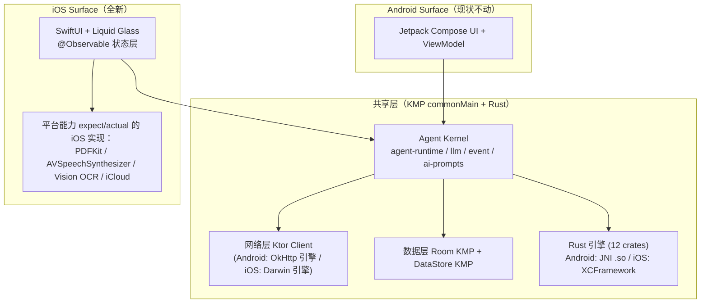
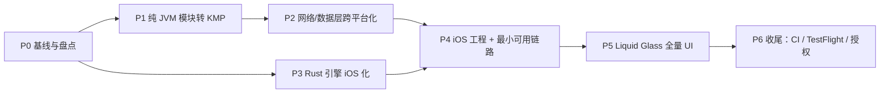

# AmberAgent iOS 移植计划书

> 日期：2026-06-12
> 状态：待执行
> 读者：执行移植任务的 AI Agent（本文档自包含，不依赖任何对话上下文）

---

## 0. 执行者必读（先读完这一节再动手）

### 0.1 仓库须知 — 禁区

仓库根目录下存在**多份完整的项目副本目录**，它们是历史快照/实验工作区，**任何任务都不得读取、修改、统计或 grep 进入这些目录**：

```
main/  legacy/  jank-opt/  ui-graphite/  arch/  OpenOmniBot/
```

真正的主工程是仓库根目录的模块树（`app/`、`core/`、`feature/`、`ai/`、`native/` 等，以根目录 `settings.gradle.kts` 中 `include(...)` 的模块为准）。所有搜索请限定在主工程目录内。

### 0.2 协作规范

1. **一个任务卡 = 一个独立分支 + 独立提交**。分支命名 `ios-port/<任务ID>`，如 `ios-port/p1-t2`。提交信息前缀 `ios-port(P1-T2): ...`。
2. **只改任务卡范围内的代码**。发现范围外的问题，记录在任务报告里，不要顺手修。
3. **每个任务卡的"验收标准"全部通过才算完成**，验证命令必须实际运行并在报告中贴出结果。
4. 任务完成后，在本文档对应任务卡的 `状态:` 行更新为 `✅ 完成 (日期, 分支名)`，并附一行备注。
5. 遇到本文档与代码现实不符的地方（依赖变了、文件移动了），**以代码为准**，在报告中指出文档偏差，不要硬套文档。
6. Android 端是受保护的存量业务：**任何阶段都不允许改变 Android 端的运行行为**。每个动到共享代码的任务都必须用 `./gradlew :app:assembleDebug` + 相关模块单测验证 Android 不回归。

### 0.3 已核实的工程事实（2026-06-12 快照）

| 事实 | 数据 |
|---|---|
| Kotlin | 2.3.21 |
| Ktor | 3.4.3（client + server 均已在 `gradle/libs.versions.toml`，client 目前仅 OkHttp 引擎） |
| OkHttp | 5.3.2（`:ai` 模块以 `api(...)` 暴露 okhttp / okhttp-sse / okhttp-logging，类型泄漏到下游） |
| Room | 2.8.4（≥2.7，原生支持 KMP） |
| Koin | BOM 4.2.1（koin-core 支持 KMP；当前用了 koin-android / koin-androidx-workmanager） |
| DataStore | 1.2.1（支持 KMP） |
| kotlinx.serialization | 1.11.0；coroutines 1.10.2 |
| Rust | `native/` 是 Cargo workspace，12 个 crate（见 P3），当前经 JNI + cargo-ndk 出 `.so` 给 Android |
| app 模块规模 | 约 16 万行 Kotlin（Compose UI + ViewModel 为主） |
| 授权 | LLM/markdown/highlight 渲染基础设施 fork 自 rikkahub（AGPL v3 / 商业双授权），iOS 移植版仍是衍生作品 |

---

## 1. 目标与边界

### 1.1 目标

把 AmberAgent 移植到 iOS：**业务内核跨平台共享，UI 用 SwiftUI 按 Liquid Glass 设计语言全新重做**。最终交付一个可上 TestFlight 的 iOS App，与 Android 版共享同一套 Agent Kernel、数据层和 Rust 引擎。

### 1.2 总体决策（已定，执行者不要重新论证）

| 决策点 | 结论 | 理由 |
|---|---|---|
| 跨端方案 | **Kotlin Multiplatform（KMP）共享逻辑** | 项目本就在向 "Agent Kernel + Surfaces" 演进，iOS 是新增的 Surface；大量纯 Kotlin 模块近零成本转换 |
| iOS UI | **SwiftUI 原生，全面采用 Liquid Glass**，不用 Compose Multiplatform | CMP 是自绘渲染，拿不到系统玻璃材质与原生手感 |
| iOS 最低版本 | **iOS 26** | Liquid Glass API（`glassEffect()`、`GlassEffectContainer`）是 iOS 26 能力，单一设计轨道，不做降级分支 |
| 网络 | 共享层 OkHttp → **Ktor Client**（Android 引擎仍用 OkHttp，iOS 用 Darwin） | 行为对 Android 透明，iOS 获得原生 NSURLSession |
| 数据库 | Room 2.8.4 **KMP 模式**（BundledSQLiteDriver） | 已在用的版本即支持，迁移成本最小 |
| DI | 共享模块用 **koin-core（KMP）**；平台模块保留各自平台 Koin | 最小改动 |
| Rust 引擎 | **复用全部 crate**，新增 C-ABI（cbindgen）导出层，打包 XCFramework | Rust 交叉编译 iOS 是成熟路径，解析逻辑零重写 |
| Kotlin↔Swift 桥 | **SKIE**（Flow → AsyncSequence，suspend → async） | Swift 侧体验决定 iOS 代码质量 |
| ViewModel | **不共享**。iOS 用 Swift `@Observable` 状态层，直接消费内核事件流 | UI 是重新设计的，强行共享 presenter 只会两头别扭 |

### 1.3 非目标（本计划不做）

- 不做 Android UI 改动，不做 M3 页面到 iOS 的逐页翻译。
- 不做 Compose Multiplatform 评估。
- 不在本计划内处理 App Store 上架审核材料（只到 TestFlight）。

### 1.4 目标架构



---

## 2. 阶段总览与依赖关系



P1/P2 与 P3 可以由不同执行者**并行**推进；P4 之后建议单执行者主导 iOS 工程，UI 页面任务（P5）可再次并行分发。

---

## 3. 任务卡

### Phase 0 — 基线与盘点（半天级，必须最先做）

#### P0-T1 建立可重复的 Android 基线
状态: ✅ 完成 (2026-06-12, main) — assembleDebug + test 全绿，报告 docs/ios-port/P0_BASELINE.md
- **做什么**：在干净检出上运行并记录：`./gradlew :app:assembleDebug` 和 `./gradlew test`（或仓库现有的等价测试任务）。把通过/失败清单写入 `docs/ios-port/P0_BASELINE.md`（新建 `docs/ios-port/` 目录存放本计划的所有产出报告）。
- **为什么**：后续每个任务都拿这个基线对照，区分"我改坏的"和"本来就坏的"。
- **验收**：基线报告存在，包含命令输出摘要、失败项清单（如有）、Gradle/JDK 版本。

#### P0-T2 共享候选模块的 Android 依赖泄漏盘点
状态: ✅ 完成 (2026-06-12, main) — 21/24 可直接转 KMP，3 个少量泄漏（各 1 行 import），报告 docs/ios-port/P0_LEAK_AUDIT.md
- **做什么**：对下列"纯 JVM"模块逐一扫描源码中的 `import android.`、`import androidx.`（DataStore/Room 除外，它们走 P2）以及对 Android-only 库的依赖，输出报告 `docs/ios-port/P0_LEAK_AUDIT.md`：
  `core/agent-runtime`、`core/agent-utils`、`core/ai-prompts`、`core/event`、`core/llm`、`core/sync/api`、`feature/history`、`feature/webview`、`feature/board/api`、`feature/chat/api`、`feature/deepread/api`、`feature/live/api`、`feature/office/api`、`feature/terminal/api`
- **同时盘点**：以下 `android.library` 接口模块是否只是"惯性挂了 Android 插件"而实际无 Android 依赖（若是，列入 P1 转换名单）：
  `core/ai/api`、`core/ai/generation/api`、`core/ai/transformers/api`、`core/automation/api`、`core/context/api`、`core/memory/api`、`feature/modelcouncil/api`、`feature/runtime/api`、`feature/subagent/api`、`feature/tools/api`
- **验收**：报告给出每个模块的结论三选一：`可直接转 KMP` / `少量泄漏需先剥离（列出文件:行）` / `深度绑定 Android（说明原因）`。

---

### Phase 1 — 纯 JVM 模块转 KMP（机械性高、可并行分发）

#### P1-T1 制定 KMP 模块转换模板
状态: ✅ 完成 (2026-06-12, main) — core/agent-utils 样板转完，模板 docs/ios-port/P1_CONVERSION_TEMPLATE.md
- **做什么**：选 `core/agent-utils`（最小、仅依赖 kotlinx-serialization）做样板：
  1. `kotlin("jvm")` → `kotlin("multiplatform")`，目标：`jvm()`、`iosArm64()`、`iosSimulatorArm64()`。
  2. 源码 `src/main/java|kotlin` → `src/commonMain/kotlin`，测试 → `src/commonTest/kotlin`（JVM-only 测试如 JUnit5/kotest-runner 留在 `src/jvmTest`）。
  3. 确认下游 Android 模块对它的 `project(...)` 依赖无需任何改动（KMP 的 jvm artifact 对 JVM 消费者透明）。
  4. 把转换步骤、踩坑、Gradle 配置片段写成 `docs/ios-port/P1_CONVERSION_TEMPLATE.md`，供后续任务复制。
- **验收**：`./gradlew :core:agent-utils:compileKotlinIosSimulatorArm64` 通过；`./gradlew :app:assembleDebug` 通过；模板文档存在。

#### P1-T2 批量转换其余纯 JVM 模块
状态: ✅ 完成 (2026-06-12, main) — 15 个纯 JVM 模块 + core/automation/api 泄漏剥离，全部 iOS 编译通过 + Android 不回归
- **前置**：P0-T2、P1-T1。
- **做什么**：按模板转换 P0-T2 报告中标为 `可直接转 KMP` 的全部模块。建议顺序（依赖自底向上）：`core/event` → `core/agent-runtime` → `core/llm` → `core/ai-prompts` → `core/sync/api` → `feature/*/api` 各模块 → `feature/history` → `feature/webview`。每个模块一个提交。
- **注意**：kotest-runner-junit5 不支持 Kotlin/Native，common 测试迁到 kotlin-test + kotest-assertions（assertions 支持 KMP）；属性测试如难迁移则留在 jvmTest，报告中注明覆盖差异。
- **验收**：每个模块 `compileKotlinIosSimulatorArm64` 通过；`./gradlew :app:assembleDebug` 与基线一致；全部已转模块 `./gradlew <module>:jvmTest` 通过。

#### P1-T3 处理"少量泄漏"模块
状态: ✅ 完成 (2026-06-12, main) — 全部 3 个泄漏模块已剥离并转 KMP：core/automation/api (Rect), feature/runtime/api (Log+currentTimeMillis), core/ai/transformers/api (Context→Any?)
- **前置**：P0-T2。
- **做什么**：对报告标为 `少量泄漏需先剥离` 的模块，把 Android 依赖点抽成 `expect/actual` 或下推到调用方，然后按模板转换。**每处剥离须在提交信息中说明原依赖是什么、如何替代**。
- **验收**：同 P1-T2。

---

### Phase 2 — 网络与数据层跨平台化（核心难点，建议单执行者串行）

#### P2-T1 拆分 `:ai` 模块：逻辑与 UI 分离
状态: ✅ 完成 (2026-06-12, main) — 19 个纯文件移入 ai-core KMP 模块，:ai 保留 provider 实现和 OkHttp 依赖，api(project(":ai-core"))
- **背景**：`:ai` 目前是 android.library，混有 Compose/material3 依赖（`ai/build.gradle.kts` 里 `androidx.compose.bom`、`material3`），同时以 `api(...)` 泄漏 OkHttp 类型。
- **做什么**：
  1. 盘点 `:ai` 内引用 Compose / android.* 的文件，把它们移到 `:app`（或新建 `:ai-android-ui`，二选一以改动量小者为准）。
  2. 剩余纯逻辑（Provider 抽象、UIMessage、流式合并等）保持在 `:ai`，为 P2-T2 做准备。
- **红线**：不改任何业务逻辑，只做文件搬迁和依赖整理。
- **验收**：`:ai` 的 build.gradle.kts 中不再有 compose 相关依赖；`./gradlew :app:assembleDebug` 通过；app 运行行为不变（抽查一次对话流式输出）。

#### P2-T2 共享层网络栈 OkHttp → Ktor Client
状态: ✅ 完成 (2026-06-13, codex/ios-port-wip) — 全量迁移：4 AI provider SSE、18 搜索服务、7 TTS、非流式 HTTP、OAuth；:ai 零 import okhttp3.*；okhttp-sse 从 :ai 和 :common 移除
- **前置**：P2-T1。
- **做什么**：
  1. 把 `:ai` 中直接使用 OkHttp/okhttp-sse 的代码改为 Ktor Client 3.4.3（catalog 已有 `ktor-client-core`、`ktor-client-okhttp`、`ktor-client-content-negotiation`；SSE 用 Ktor client 的 SSE 插件，需在 catalog 补 `ktor-client-sse` 相关 artifact 及 `ktor-client-darwin`、`ktor-client-logging`）。
  2. Android 侧引擎用 `OkHttp`（保留现有拦截器/自定义 header 行为），引擎配置放 androidMain。
  3. `:ai` 转为 KMP 模块（jvm/android + ios 目标）。
  4. OkHttp 类型从公共 API 面退场：下游模块若直接 import okhttp3.*，逐处替换或经接口隔离。
- **关键回归点**：SSE 流式响应（含取消）、自定义 headers、超时与重试、代理设置（如有）。
- **验收**：`:ai` 的 `compileKotlinIosSimulatorArm64` 通过；Android 端实测一次完整流式对话 + 中途取消；`./gradlew :app:assembleDebug` 通过；`grep -r "import okhttp3" --include="*.kt"` 在共享模块中为零。

#### P2-T3 Room → Room KMP
状态: ✅ 完成 (2026-06-12, main) — core/agent-store-room 转 KMP，BundledSQLiteDriver + @ConstructedBy expect/actual 模式，三端编译通过
- **做什么**：把 `core/agent-store-room`（AgentRuntimeDatabase：agent_run / agent_event / trace_span 三张表）迁到 Room KMP 模式：模块转 KMP，`androidx.room` Gradle 插件 + `BundledSQLiteDriver`，DAO/Entity 移入 commonMain。**`:app` 的主数据库 AppDatabase 不在本任务范围**（它绑定大量 app 内类型，留在 Android 侧，未来按需再议）。
- **注意**：保留 `room.schemaLocation` 与现有 schema 历史，迁移不得引发 Android 端数据库版本变更。
- **验收**：`compileKotlinIosSimulatorArm64` 通过；Android 单测/instrumented 测试（如有）通过；`:app:assembleDebug` 通过。

#### P2-T4 DataStore 与 Koin 的共享化
状态: ✅ 完成 (2026-06-12, main) — datastore-preferences → datastore-preferences-core (core:app-infra + core:settings)；koin-core catalog 就绪
- **做什么**：共享模块中用到 preferences 的部分切到 `androidx.datastore:datastore-preferences-core`（KMP artifact）；共享模块的 DI 声明改用 `koin-core`，平台注入（Context、WorkManager 等）留在 androidMain/app。
- **验收**：同上三连：iOS 目标编译通过、Android 构建通过、行为不变。

---

### Phase 3 — Rust 引擎 iOS 化（与 P1/P2 并行）

`native/` Cargo workspace 现有 crate：`markdown-parser`、`markdown-preprocess`、`highlight-parser`、`html-diff-normalizer`、`reader-extractor`、`office-parsers`、`regex-transformer`、`sync-crypto`、`json-expr`、`tokenizer`、`jni-common`（JNI 胶水，iOS 不用）。
现有 Kotlin JNI 桥（Android 侧持续使用，不动）：`app/src/.../SyncCryptoNative.kt`、`MarkdownParserNative.kt`、`RegexTransformerNative.kt`、`MarkdownPreprocessNative.kt`、`HtmlDiffNormalizerNative.kt`、`ReaderExtractorNative.kt`、`highlight/src/.../HighlighterNative.kt`、`document/src/.../OfficeParserNative.kt`、`common/src/.../JsonExprNative.kt`。

#### P3-T1 iOS 交叉编译打通
状态: ✅ 完成 (2026-06-12, main) — 全部 10 crate 成功编译 aarch64-apple-ios + aarch64-apple-ios-sim
- **做什么**：为 workspace 添加 `aarch64-apple-ios` 与 `aarch64-apple-ios-sim` target 构建（`rustup target add` + 必要的条件编译：JNI 相关代码用 `#[cfg(target_os = "android")]` 隔离）。产出脚本 `native/build-ios.sh`。
- **验收**：两个 target `cargo build --release` 全 workspace 通过（jni-common 可排除）。

#### P3-T2 C-ABI 导出层 + XCFramework
状态: ✅ 完成 (2026-06-13, codex/ios-port-wip) — amber-ffi crate: 22个 #[no_mangle] extern "C" FFI 函数; cbindgen 194行头文件; AmberNative.xcframework 手动打包 (32MB/slice)

#### P3-T3 共享 Kotlin 层的 Rust 绑定（cinterop）
状态: ✅ 完成 (2026-06-13, codex/ios-port-wip) — core/native/ KMP cinterop 模块; AmberNativeBridge expect/actual; TokenCounterNative nativeMain 通过 cinterop 调用 Rust
- **前置**：P3-T2，P1-T2。
- **做什么**：内核共享逻辑依赖的 crate（`regex-transformer`、`sync-crypto`、`json-expr`、`tokenizer`）通过 Kotlin/Native cinterop 绑定到 KMP 模块的 iosMain；commonMain 定义 `expect` 接口，androidMain 走现有 JNI，iosMain 走 cinterop。渲染类 crate（markdown/highlight 等）**不走 Kotlin**，留给 Swift 直接调用（P5）。
- **验收**：KMP 模块 iOS 单测中完成一次 regex-transformer 与 json-expr 的真实调用往返。

---

### Phase 4 — iOS 工程与最小可用链路（Vertical Slice）

#### P4-T1 Xcode 工程与 KMP 框架集成
状态: ✅ 完成 (2026-06-13, codex/ios-port-wip) — :shared KMP umbrella; 25个 export() + api() 依赖; Shared.h 15159行, 4900+ Swift 可见类型; SKIE 禁用 (0.9.5 不兼容 Kotlin 2.3.21)

#### P4-T2 最小对话链路
状态: 🟡 进行中 (2026-06-13) — ai-provider-openai KMP 模块 + ChatViewModel 真实调用 generateText() 已通; 待完成: 流式渲染(Flow收集)、取消生成、agent_run 落库验证

#### P4-T3 iOS Markdown 渲染管线
状态: ⬜ 未开始
- **前置**：P4-T2、P3-T2。
- **做什么**：Swift 调用 `markdown-parser`（Rust AST）→ 渲染器输出 `AttributedString`/TextKit 2。首版范围：段落、标题、粗斜体、列表、引用、行内代码、围栏代码块（代码高亮接 `highlight-parser`）。表格/数学公式/mermaid 列为后续任务，不做。
- **注意**：流式增量渲染策略对照 Android 端现有的 streaming reveal 实现（参考 `HANDOFF_STREAMING_RENDERING.md`），但允许 iOS 用更简单的整段重排首发。
- **验收**：聊天页能正确渲染含上述元素的流式回复，无明显闪烁；代码块有语法高亮。

---

### Phase 5 — Liquid Glass 全量 UI（页面级任务可并行分发）

**统一设计原则（所有 P5 任务必须遵守）**：
- 按 Apple HIG 与 Liquid Glass 规范**重新设计**，禁止逐控件翻译 Android M3 页面。
- 导航骨架：`TabView` + `NavigationStack`（系统自动应用玻璃形态）；自定义浮层/工具条用 `glassEffect()` 与 `GlassEffectContainer`；图标一律 SF Symbols（Android 端的 Lucide 不带过来）；设置用 `Form`，列表用 `List`，搜索用 `searchable`。
- 文案与本地化：首版仅中英双语，沿用 Android 端字符串语义，key 重新组织为 String Catalog。
- 每个页面任务交付：SwiftUI 实现 + 与共享层的接线 + 一段录屏/截图。

#### P5-T1 信息架构与导航骨架
状态: ✅ 完成 (2026-06-13, codex/ios-port-wip) — AppShell + per-tab NavigationStack + enum Route/Sheet；报告 docs/ios-port/P5_IA.md
- 定义 Tab 结构（建议：对话 / 工作区 / 助手 / 设置，最终以实际功能盘点为准）、路由与深链方案，产出 `docs/ios-port/P5_IA.md` 供页面任务引用。

#### P5-T2 会话列表 + 历史
#### P5-T3 聊天页完整版（附件、工具调用展示、reasoning 折叠、消息分支切换）
#### P5-T4 助手管理（Assistant 配置：系统提示词、温度、上下文等）
#### P5-T5 Provider/模型设置
#### P5-T6 平台能力 actual 实现：TTS（AVSpeechSynthesizer + 现有 HTTP provider）、文档（PDFKit；office 走 Rust office-parsers）、OCR（Vision）、文件与 iCloud
状态: ⬜ 未开始（P5-T2 ~ T6 在 P5-T1 完成后并行分发，各自建任务报告）

---

### Phase 6 — 收尾

#### P6-T1 CI：GitHub Actions macOS runner，跑共享层 iOS 测试 + xcodebuild + Rust iOS 构建缓存
#### P6-T2 TestFlight 首个构建（签名、隐私清单 PrivacyInfo.xcprivacy、加密合规声明）
#### P6-T3 授权合规审查：整理 iOS 版对 rikkahub AGPL 衍生代码的使用清单，给出开源义务结论（如计划商用需取得商业授权，此项升级为阻塞项交还人类决策）
状态: ⬜ 未开始

---

## 4. 已知风险与坑（执行前过一遍）

1. **`:ai` 的 OkHttp `api(...)` 泄漏面**：下游可能大量直接 import okhttp3 类型，P2-T2 的真实工作量在调用方而不在 `:ai` 本身。先 grep 全量评估再动手。
2. **iText 是 JVM-only**（`settings.gradle.kts` 含 itextsupport 仓库，document 模块使用）：iOS 的 PDF 能力走 PDFKit（P5-T6），不要尝试移植 iText。
3. **`core/model`、`core/settings` 挂了 Compose 插件**：它们名为 core 实为 UI 污染模块。共享层不得依赖它们；若内核类型被困在里面，需先做类型下沉（参照 P2-T1 的拆分思路，单开任务）。
4. **kotest JUnit5 runner 不支持 Kotlin/Native**：见 P1-T2 注意事项。
5. **WorkManager 后台任务**：iOS 对应 BGTaskScheduler，语义差异大（系统调度不保证执行）。后台同步类功能在 iOS 首版降级为前台执行，单独立项再议。
6. **`web` 模块（Ktor server + 前端静态资源）**：Ktor server 理论上可跑 Kotlin/Native，但 iOS 后台存活策略完全不同。**首版 iOS 不带内嵌 web server**，列为非目标。
7. **AGPL 衍生义务**（见 P6-T3）：商用前必须解决，勿当成普通待办。
8. **副本目录污染搜索结果**：任何 grep/glob 必须排除 0.1 节列出的六个目录，否则会改错文件。

---

## 5. 里程碑验收定义

| 里程碑 | 标志 |
|---|---|
| M1（P0–P1 完成） | ≥14 个模块产出 iOS klib，Android 构建与基线一致 |
| M2（P2 完成） | 共享层无 OkHttp/Android 依赖，`:ai` + agent-store-room 双端编译 |
| M3（P3 完成） | AmberNative.xcframework 产出，Kotlin/Swift 双侧调通 |
| M4（P4 完成） | 真机完成一次流式对话（纯文本+markdown），事件落库 |
| M5（P5 完成） | 全部核心页面 Liquid Glass 实现，双语 |
| M6（P6 完成） | TestFlight 可安装，CI 绿，授权结论明确 |
