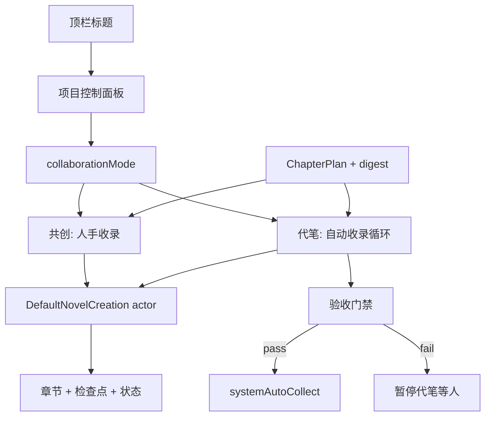

# 小说创作：共创模式 / 代笔模式

> Status: Active
> Date: 2026-08-05
> Phase 0: Completed (2026-08-05) — `needsSync` blocks formal prose across UI/reducer/injection/retry; sync banner copy updated; retry syncs composer mode/granularity.
> Phase 1: Completed (2026-08-05) — ChapterPlan + digest + injection; project `collaborationMode`; title-panel mode switch & readiness; ghostwrite whole-chapter requires confirmed plan; manual collect still.
> Phase 2: Completed (2026-08-06) — Single-chapter ghostwrite loop with structured plan acceptance (stateSync model), digest-bound auto-collect, pause/continue, hard-cut guard while running.
> Phase 4: Completed (2026-08-09) — Bounded multi-chapter ghostwrite (max 10): chapter 1 user-confirmed plan; chapters 2…N auto-propose+confirm; fail-closed pause.
> Phase 5: In progress (2026-08-09) — Self-heal loop (A′+thin C′): no same-draft re-accept; bounded auto-rewrite + failure receipt; polish-first human recovery. Spec: `docs/superpowers/specs/2026-08-09-ghostwrite-self-heal-loop-design.md`.
> Product names: **共创模式** / **代笔模式**
> Depends on: [`NOVEL_CREATION_SPEC.md`](NOVEL_CREATION_SPEC.md)、[`adr/0007-novel-creation-owns-project-state.md`](adr/0007-novel-creation-owns-project-state.md)、[`../CONTEXT.md`](../CONTEXT.md)

## Outcome

同一本小说项目支持两种推进方式，可按当前进度切换：

- **共创模式**：人机商量，草稿须用户收录才进正史（现有主路径，先补逻辑漏洞）。
- **代笔模式**：策划包就绪后，系统按章自动「写 → 验收 → 进正史」；验收不过则停住等人。

两种模式共享项目设定、章节正史、分支状态与检查点；**不共享「谁有权把候选写成正史」的规则**。

## Decisions Locked

| 决策 | 选择 |
| --- | --- |
| 代笔章末入正史 | **自动收录**；仅验收失败 / 同步失败 / 用户暂停时停下 |
| 模式归属 | **项目级**字段；当前活动分支的进度决定能否切换 |
| 切换入口 | 顶栏标题点击 → 现有「写作偏好 / 上下文」面板扩展为**项目控制面板**，内含模式切换 |
| 第一版范围 | 代笔只跑**当前主分支一条线**；不自动 Fork、不自动合并分支 |
| 模型角色 | 创作 / 剧情同步 / **审稿** 三角色；合同验收与连续性审计走审稿模型（缺省跟随全局） |

---

## 1. 两种模式对照

### 1.1 一句话

| | 共创模式 | 代笔模式 |
| --- | --- | --- |
| 用户角色 | 作者兼责编，每步拍板 | 责编：先定规矩，中途抽查 |
| AI 角色 | 助手出草稿 | 代笔按合同写章 |
| 正史门槛 | 用户点「收录正文」 | 系统验收通过后自动收录 |
| 典型节奏 | 讨论 ↔ 写候选 ↔ 收录 ↔ 同步 | 策划冻结 → 循环「下一章」直到暂停/失败/书完 |

### 1.2 共享资产（模式无关）

- 项目设定：世界观、人物档案、总剧情大纲、写作要求、自定义资料
- 分支状态：事件、当前状态摘要、伏笔、进度
- 章节版本、检查点、Fork、导入导出、润色（润色仍不改剧情事实）
- 领域权威仍是小说项目文档；Chat / Memory / Workspace 不覆盖

### 1.3 共创模式（完善后的契约）

**允许**

- 讨论规划（不推进正史）
- 写正文候选（续写 / 整章）
- 用户段落多选收录、收录前编辑
- 整章润色 / 整章重写（门禁与现网一致并加强）
- Fork、撤销最新创作节点、手动编辑后状态同步
- 资料建议确认后写入

**禁止 / 挡住**

- `needsSync` 或存在阻塞性 pending 时：**不得**启动正式正文生成（见 §3 漏洞修复）
- 未收录候选不得进入章节、事件、状态摘要
- 讨论不能直接改分支状态；设定修订须用户确认

**用户可见流程**

```text
讨论 / 写草稿 → 候选气泡 → 收录 → 自动剧情同步 → 可继续写
手动改正文 → 待同步 → 同步完成前不能写正式正文
```

### 1.4 代笔模式（MVP 契约）

**进入代笔前必须满足「策划包就绪」**

最少全部为真：

1. 有可识别的总剧情大纲（或等价 master outline 资料）
2. 至少一名人物档案已确认
3. 写作要求已填写（允许简短）
4. 当前分支 `synchronized`，无阻塞 pending / 未解决润色事务
5. 存在**下一章合同**（见 §2），或系统能为「下一章」生成并请用户确认首份合同

**代笔主循环（单章有界）**

```text
取/确认下一章合同
  → 按合同生成整章候选（创作模型）
  → 验收门禁（见下）
  → 通过：系统自动收录为下一章 + 剧情同步 + 检查点
  → 失败：保留候选与失败原因，暂停代笔，等待用户
  → 用户可：改合同后重试 / 收下并强制同步路径不适用 / 切回共创
```

**验收门禁（自动收录前必须全过）**

1. 候选完整（非整章残稿、非 interrupted 未收口）
2. 与本章合同核对：必发生事件未明显缺失、禁止项未明显出现（结构化检查 + 同步模型裁定）
3. 自动收录事务成功（与现有 `collectCandidate` 同领域路径，新增 `systemAutoCollect` 来源，仍走 reducer / receipt）
4. 收录后剧情同步成功；同步失败则章节可按现有「正文已存、待同步」语义处理，**代笔暂停**，不得继续下一章
5. 可选软信号：连续性审计高严重问题 → 暂停（默认开启「高严重暂停」，用户可在面板关闭）

**代笔运行中限制**

- 锁定：总纲、人物核心档案、写作要求的「静默改写」；要改必须先**暂停代笔**
- 禁止：同分支再开人手写正文 run（讨论可保留为只读建议，或一并禁用——MVP 建议**暂停代笔前禁止写正文**，讨论可开但结果只进建议）
- Fork：须先暂停代笔
- 顶栏显示「代笔中 · 第 N 章」类状态，可点进面板暂停

**代笔不是**

- 一键百万字成书保证
- 多分支同时自动推进
- 无人看管的无限后台（仍受现有 App 级 run / 系统后台边界约束；OpenAI background 路径可优先接入）

### 1.5 模式切换规则

模式存在项目上：`NovelProjectCollaborationMode = cocreation | ghostwrite`（名称可再定，用户文案固定为共创 / 代笔）。

**共创 → 代笔**

须同时：

- 策划包就绪（§1.4）
- 无 active run、无代笔 pipeline run
- 无未处理正文候选（或用户确认丢弃/先处理）
- 当前分支 synchronized

**代笔 → 共创**

须同时：

- 代笔已暂停或处于「等待用户」终态（不得在章中半自动写入时硬切）
- 当前章若已自动收录则保留；未通过验收的候选保留在 Session，改由人手收录/丢弃

**切换 UI**

- 入口：顶栏标题（现 [`NovelProjectWorkspaceView`](../iosApp/iosApp/NovelCreation/NovelProjectWorkspaceView.swift) principal 按钮）
- 面板：扩展现 `.writingContext` 为项目控制面板
  - 当前模式说明（一句人话）
  - 切换开关 / 分段控件
  - 不可切换时展示**具体缺什么**（缺大纲 / 待同步 / 代笔进行中…）
  - 代笔专属：暂停 / 继续、是否「连续性高严重时暂停」、当前章合同摘要
  - 保留原写作偏好与本次注入入口

---

## 2. 本章合同（两模式共用零件）

新增一等工件（分支级、指向「下一章或指定章」）：

- 目标与冲突
- 必发生 / 禁止发生
- 章末钩子
- POV 可见事实（世界真相 vs 角色已知，MVP 可先做「可见要点」列表）
- 与总纲的位置说明（第几章 / 哪个情节点）

| 模式 | 合同用法 |
| --- | --- |
| 共创 | 可选：写整章前可生成/编辑合同；有合同则注入，无合同不挡生成 |
| 代笔 | 必选：无有效合同不得开写；验收对照合同 |

合同确认后冻结 digest；写正文与验收绑定该 digest（防「审的是 A 计划、写的是 B 计划」）。

---

## 3. 共创模式逻辑漏洞（先修，再上代笔）

按严重度。证据来自当前规格与代码对照。

### P0 — 正式写正文未强制 `synchronized`

- **现象**：`canStart(.prose)` 与 `NovelGenerationReducer` 的 `.prose` 分支只挡「阻塞性 pending」，**不要求** `branch.syncStatus == .synchronized`；润色 / 重写则要求已同步。
- **危险**：手动改正文后处于 `needsSync` 时仍可继续生成正式剧情候选，注入侧仅警告，违反规格「正式生成前必须先同步」。
- **位置**：[`NovelSessionViewModel.canStart`](../iosApp/iosApp/NovelCreation/NovelSessionViewModel.swift)、[`NovelGenerationReducer`](../iosApp/iosApp/NovelCreation/NovelGenerationReducer.swift)、[`NovelSessionPresentation.retryBlocker`](../iosApp/iosApp/NovelCreation/NovelSessionPresentation.swift)
- **修复**：prose / prose retry 与 domain start 对齐：`needsSync` → `.branchNeedsSync`；补回归测试。

### P0 — 自动同步失败后的「假进展」

- **现象**：收录后 `scheduleAutomaticStateSync`；失败有横幅，但用户仍可能继续讨论/（修复前）继续写正文。
- **危险**：正史正文与分支状态长期分叉；代笔若复用同一路径会连写多章脏状态。
- **修复**：共创在 `needsSync` 时禁用正式正文；代笔在同步未成功时禁止进入下一章；面板明确「先同步再写」。

### P1 — 无本章合同，长程只靠摘要 + 注入预算

- **现象**：有总纲资料与状态摘要，但无「下一章义务」冻结物。
- **危险**：共创易写飞；代笔无法做自动验收。
- **修复**：引入 §2 合同；共创可选，代笔强制。

### P1 — 连续性审计只诊断、不参与放行 ✅（Phase 3b）

- **现象**：[`NovelContinuityAudit`](../iosApp/iosApp/NovelCreation/NovelContinuityAudit.swift) 明确不写盘、退出即丢；不挡生成。
- **危险**：对共创可接受；对代笔自动收录则不够。
- **修复**：共创保持可选扫描；代笔把「高严重未解决」设为可配置暂停条件（默认开）。

### P1 — 候选身份未绑定计划 digest

- **现象**：有 generation / injection receipt，无「章合同 digest ↔ 正文」硬绑定。
- **危险**：改计划后旧候选仍可收录；代笔自动收录更危险。
- **修复**：候选与自动收录 receipt 携带 `chapterPlanDigest`；digest 不匹配则不可收录/不可自动过。

### P2 — Composer 与真实 run 的 mode/granularity 分叉

- **现象**：代码已注明 `start(_:)` 不回写 composer，重试时 UI 模式可能与真实 run 不一致。
- **危险**：用户以为在「讨论」实际在重试「正文」。
- **修复**：状态条已按真实 run 显示；进一步在重试时同步 composer 或显式标注「重试的是上次正文」。

### P2 — POV / 知识边界未建模

- **现象**：状态里有事件与摘要，无「谁知道什么」。
- **危险**：角色开天眼；代笔放大该问题。
- **修复**：合同与状态摘要增加「可见要点」；注入正式正文时优先可见层（MVP 轻量字段即可）。

### 明确不当漏洞、保持边界

- 未收录候选不进正史（共创正确；代笔用**同一领域收录事务**的系统来源，不绕过）
- 不自动合并分支
- 不把小说写进普通 Chat 存储

---

## 4. 架构落点（实现时）



- UI：[`NovelProjectWorkspaceView`](../iosApp/iosApp/NovelCreation/NovelProjectWorkspaceView.swift) 标题面板；Session 代笔进度条
- 领域：项目字段 + ChapterPlan 记录 + `NovelAction` 扩展（切换模式 / 确认合同 / 暂停继续 / system 收录）
- 生成：代笔 pipeline 为 App 级 owner 的有界循环（类比现有 batch polish，但每步过门禁）
- 不改普通 Chat 存储；不引入向量库作为 MVP 依赖

---

## 5. 分期

### Phase 0 — 共创补洞（可先于代笔上线） — Completed

1. [x] `needsSync` 禁止正式 prose（UI `canStart` + reducer + injection planner + retry 投影 + 测试）
2. [x] 同步失败 / 待同步横幅改为「可继续讨论；写正文前请先重试同步」；写正文占位提示同步
3. [x] 重试时把 composer 的 mode/granularity 对齐到被重试的 run

### Phase 1 — 本章合同 + 面板模式切换（共创可选） — Completed

1. [x] ChapterPlan 模型、确认、digest、注入（整章 prose）
2. [x] 顶栏面板模式切换 + 策划包就绪缺项说明（切代笔不强制本章合同）
3. [x] 共创可选合同；代笔写整章强制已确认合同；收录仍人手

### Phase 2 — 代笔 MVP — Completed

1. [x] 单章循环：合同 → 写整章 → 门禁 → 自动收录 → 同步
2. [x] 暂停 / 继续 / 失败停住
3. [x] 切回共创规则（代笔进行中硬切）
4. [x] 后台与 `runId` 所有权对齐现有小说生成生命周期（pipeline 挂 SessionViewModel，类比 batch polish）
5. [x] 候选绑定 `chapterPlanDigest`（防改合同后旧稿过关）；结构化合同验收用 stateSync 模型

### Phase 3 — 加强（非 MVP）

#### Phase 3a — 跨章防复读（薄回执）✅

1. [x] 章收录后剧情同步沉淀有界 `recentWrittenHighlights`（事件 summary 合并截断；不改 state-delta JSON 合同）
2. [x] 整章 prose 注入 `RECENT WRITTEN BEATS`（仅 `.proseWholeChapter`）
3. [x] 合同验收 schemaVersion 2：`obviousRepetition` 软门 → 暂停不自动收录（仍用 stateSync 模型）
4. [x] 面板一行薄回执（`ghostwriteProgress.detailMessage`）；完成时提示已记入要点条数
5. [x] **不**新增第三项目模型角色；**不**做完整看板 / 离屏弧推演

#### Phase 3b — 连续性软门 ✅

1. [x] 项目偏好 `pauseGhostwriteOnBlockingContinuity`（默认开；旧文档缺字段 decode 为 true）
2. [x] 合同验收通过且无复读后、自动收录前：`auditContinuityIncludingCandidate`（已有正文 + 候选下一章）
3. [x] 仅 `blocking`（界面「严重」）→ 暂停不收录；继续时代笔重写不复用同稿
4. [x] 项目控制面板 Toggle「连续性高严重时暂停」；代笔进行中禁用切换
5. [x] **不**新增第三模型；复用既有 continuity audit / stateSync 模型

#### Phase 3c — 审稿模型 / 下一弧 / 代笔看板（薄可交付）✅

1. [x] 独立审稿模型角色 `NovelModelRole.review`（项目级 + App 默认；合同验收与连续性审计走该策略；缺省 global）
2. [x] 有界「下一弧」工件 `NovelUpcomingArcRecord`（每分支最多 8 条）；整章 prose 注入 `UPCOMING ARC`；面板可保存/清除（**不**做完整离屏世界模拟）
3. [x] 项目控制面板内只读「代笔看板」：相位、步骤回执、本章合同、本轮收录、审稿模型、下一弧；无 token 收据时不显示假成本（**不**新建独立看板页）

---

## 6. 验收标准

### 共创（含补洞）

- `needsSync` 时无法启动正式正文；同步后可写
- 未收录候选仍不进正史
- 收录 / 同步 / Fork / 润色原契约保持

### 代笔 MVP

- 策划包不齐时无法切入代笔，面板说明缺项
- 一章验收通过后无需点收录即出现于正文页，并有检查点
- 验收失败不进正史，代笔暂停，候选可查原因
- 同步失败不开始下一章
- 代笔中改核心设定须先暂停
- 可按规则切回共创，已入正史章节保留
- 取消、后台、重试不重复自动收录同一合同 digest

### 回归

- 普通 Chat 不受影响
- 现有 NovelSession / Fact / Injection / Polish 门禁套件全绿后再扩代笔测试

---

## 7. 文案口径（产品）

- 共创模式：一起写，你点头才进书。
- 代笔模式：你定大纲和规矩，它按章代写；写坏了会停，不会假装写完。
- 避免：「一键成书」「保证质量」「全自动完美」。

---

## 8. 文档与规格后续

文档同步：

1. [x] [`NOVEL_CREATION_SPEC.md`](NOVEL_CREATION_SPEC.md) 增加协作模式与本章合同；Out Of Scope 标明自动收录属 Phase 2
2. [x] [`CONTEXT.md`](../CONTEXT.md) 词条：共创模式、代笔模式、本章合同
3. [x] [`PROJECT_STATE.md`](PROJECT_STATE.md) 记录 Phase 2/3a/3b 完成与下一刀；不必另建 handoff
