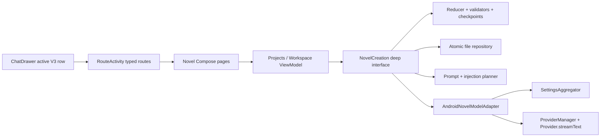

# Amber Android 小说创作复刻实施计划

> Status: Proposed — 勿在 amberagent-ios 仓执行；应在 Android 主仓开工
> Date: 2026-07-12
> Product contract: `docs/NOVEL_CREATION_SPEC.md`
> iOS implementation evidence: `docs/NOVEL_CREATION_IMPLEMENTATION_PLAN.md`
> Approved UX direction: `docs/NOVEL_UX_SIMPLIFICATION_PLAN.md`
> Ownership decision: `docs/adr/0007-novel-creation-owns-project-state.md`

## 目标一句话

在 Amber Android 中实现与 iOS `NovelProjectDocumentV1` 和 `.ambernovel` 项目包双向兼容的一级功能「小说创作」，保留候选收录、分支状态、准确 Fork、整章润色和失败恢复等正确性边界，但从第一版就采用 Fable5 建议的简化体验：用户主要只看到「创作」和「资料」，日常循环是 **生成 -> 收录 -> 继续写**。

完成不以“页面能打开”或“模型能回字”为准。Android 必须同时证明：

- 普通 Chat、Conversation、Memory、Lorebook 和 Workspace 行为不变。
- 未收录候选永远不进入正式正文、事件或当前分支状态。
- 收录要么原子提交正文与状态，要么留下可恢复的 pending，不丢正文。
- Fork、撤销、手动同步、润色和版本恢复都基于不可变检查点。
- cancel、error、route exit、background、retry、重复 terminal 和重启不会重复提交。
- Android 导出的 `.ambernovel` 能被 iOS V1 解码、校验和继续编辑，反向亦然。
- 真机走通真实 provider、中文键盘、长章流式、后台中断和 SAF 导入导出。

## Grok 执行前必须知道的当前事实

### iOS 已完成与未完成不能混写

- iOS 领域 Phase A-F 已完成；架构精简 S1-S3 也已完成。这里的“架构 S1-S3”是死代码、busy owner、重复校验和 request evidence 精简，不是 Fable UX 的 S1-S7。
- 架构精简阶段记录的 29 个 Novel 测试类为 327/327，Stable 与 Experimental arm64 Simulator build 通过。
- Fable UX S1-S7 随后已在当前工作区实现并验证：两 Tab 与五类资料、章节阅读/编辑/润色、三段式 composer、人物档案与当前分支名字匹配经历、建议就地化/跳转、就近撤销和 Fork 后提示均已落地；最新 `PROJECT_STATE` 记录全部 `Novel*Tests` 329 passed，Stable/Experimental Simulator build 成功，Stable 包在 iPhone 17 Pro Simulator 启动并验证入口与首屏。
- `NOVEL_UX_SIMPLIFICATION_PLAN.md` 当前状态为 `Implemented and verified`。Android 可以把最终 iOS 流程作为行为和视觉参考，但仍不得逐文件翻译 SwiftUI，也不得复制 Swift actor、FileDocument 或 iOS 导航结构；领域细节以 V1 contract 为准，Android 复用以本仓库真实 Android 能力为准。
- iOS 的真实 provider 全链路、当前 UX 真机交互和系统 Files picker 仍有外部证据缺口。Android 不能继承这些结论，必须独立验证。

### Android 当前事实

- 当前一级导航使用 `app/src/main/java/app/amber/feature/ui/pages/chat/ChatDrawer.kt` 的 active V3 rows；真实可见项有「新聊天 / 今日看板 / 小应用」，没有 WebMount 行。
- Android 入口应在 active V3 的「小应用」之后新增「小说创作」。不要为了字面复刻 iOS 顺序而凭空增加 WebMount，也不要接到同文件下半部未被调用的旧 drawer helper。
- typed route 与 destination 集中在 `app/src/main/java/app/amber/agent/RouteActivity.kt`。
- 当前真实 build types 是 `debug / graphite / release / baseline`。2026-07-12 已用 Gradle 核实：`:app:assembleGraphite` 存在，旧文档中的 `assembleNotion` 不存在；app 只有 `testDebugUnitTest`，没有 `testGraphiteUnitTest`。
- 开发装机默认使用带 `.graphite` 后缀的 Debug 包，避免覆盖用户日常 `app.amber.agent`；只有用户明确要求时才安装 canonical Graphite 包。

## 权威顺序

出现文档或代码冲突时按以下顺序判断：

1. iOS V1 真实 Codable 结构、validator、reducer 和项目包代码决定线协议与数据正确性。
2. `NOVEL_CREATION_SPEC.md` 与 ADR-0007 决定领域语义；SPEC 中旧三视图的呈现段落已被用户批准的两 Tab UX 取代，不再是 UI 权威。
3. `NOVEL_UX_SIMPLIFICATION_PLAN.md` 决定最终信息架构、默认值和用户文案。
4. 本计划决定 Android 模块、调用链和阶段边界。
5. 当前 SwiftUI 只用于理解已存在行为，不作为 Android UI 模板。

任何低成本可核实的事实必须读真实代码或运行命令；不要根据旧 handoff、记忆、行号或测试数自行补造结论。

## 产品目标形态

```text
Chat Drawer
  -> 小说创作
     -> 项目列表
        -> 项目工作区
           -> 创作
           -> 资料
              -> 正文
              -> 角色
              -> 世界观
              -> 剧情
              -> 更多
```

### 创作

```text
项目名 · 当前分支（点击切换）
[ 讨论 | 续写 | 整章 ]   [⋯]

聊天式创作记录
Agent 一次输出一个完整候选气泡

[输入框........................] [发送/停止]
```

- `讨论` = `discussPlan`，不产生可收录正文，不改变剧情状态。
- `续写` = `writeProse + continuation`。
- `整章` = `writeProse + wholeChapter`，项目默认值和最近选择仍需持久化。
- `⋯` 只放「本次上下文…」和「项目模型…」。上下文高级预算折叠，不在主界面裸露 token。
- 正文输出始终是候选气泡；用户点「收录正文」后才进入正式正文和分支状态。
- 整章候选默认「新开第 N+1 章」；续写默认「并入第 N 章」；当前无章节时统一新开第一章。
- 整章润色入口只在章节阅读页菜单出现。没有正式章节时不显示，不放一个无法解释的灰色魔法棒。

### 资料

- **正文**：书目式章节列表 -> 沉浸阅读；菜单为版本历史、编辑本章、整章润色。
- **角色**：人物档案 + 当前分支经历时间线 + 本角色待确认建议。
- **世界观**：世界观资料及本类待确认建议。
- **剧情**：总纲、当前分支摘要、分支走向和事件时间线。
- **更多**：写作要求、自定义资料、项目模型、润色偏好、分支管理、注入规则预览、项目包/Markdown 导出、项目重命名。导入放在项目列表，因为它可能创建、替换或复制整个项目，不在已打开项目里再放第二个入口。
- 「资料」显示未决建议数量；Quick Start 建议在对应分类就地确认，不自动写入设定。
- 主 UI 不显示 `revision`、`head`、`checkpoint`、`transaction`、`token` 等工程词。
- 禁用动作必须隐藏，或显示用户可理解的原因；不允许只有静默灰态。

### V1 人物经历的明确限制

- V1 不新增 `CharacterExperience` 或角色实体 ID。经历来自当前分支 `stateSnapshot.eventIDs` 指向的事件。
- 匹配只使用人物资料当前标题，对 `event.entityReferences` 做确定性匹配：标准化后完全匹配优先，其次包含匹配，按事件 sequence 降序展示。V1 的通用 tags 没有“人物别名”语义，禁止拿“主角/反派”等标签关联经历；别名要等明确字段或显式用户确认后再设计。
- Quick Start V1 必须恰好保存四条 typed proposal，其中只能有一条 `.character`。iOS validator 会拒绝擅自拆成多条 Quick Start 人物 proposal。
- Android 不做启发式自动拆档。若该 proposal 是多人合并的「主要人物」总览，则将其作为角色总览资料展示，并明确不能可靠形成单人经历页；用户可再建立独立人物档案。不要伪造关联，也不要改 V1 schema。

## 不可违反的边界

- 小说项目是唯一权威来源；不得把小说 Session 存进普通 Conversation、MessageNode、Room conversation 表、Memory、Lorebook 或 Workspace。
- 普通 Chat 的消息分支不是剧情分支。不得用 fake Conversation 套壳小说功能。
- 不修改 `ChatService`、`ChatVM`、`ChatInput`、`ChatMessage`、普通 conversation storage 或 provider 内部实现来换取接线便利。
- 不把 iOS Swift actor、SwiftUI `scenePhase`、`FileDocument`、Xcode target 结构机械翻译到 Android。
- 不新增 Room schema。V1 延续单项目 JSON、previous、derived index 和 recovery sidecar。
- 不引入通用事件溯源框架、embedding、云同步、多人协作、自动分支合并、分支树图或场景级正文管理。
- 不为明确不支持的第二 coordinator、多进程并发写同一项目建立全局 lease registry。
- 不把 provider await 放在文件锁或 Kotlin `Mutex` 内。
- 不把测试 fake、scripted runner 或源码字符串 canary 放进 production source set。
- 不先做完整旧 iOS UI，再做 UX 简化；Android 第一个可见版本就是最终两 Tab。

## 修改边界

允许写入：

- 新模块 `feature/novel/**`。
- `settings.gradle.kts` 与 `app/build.gradle.kts` 的最小模块接线。
- `app/src/main/java/app/amber/feature/ui/pages/novel/**`。
- 新的 `app/src/main/java/app/amber/core/di/NovelModule.kt` 及 Koin 注册点。
- `AmberAgentApp.kt` 中加载 `novelModule` 并显式启动 lifecycle bridge 的最小接线。
- `RouteActivity.kt` 的两个 typed routes 与 destination。
- `ChatDrawer.kt` active V3 rows 中一条入口。
- 小说相关 string resources、SAF launcher 与 MIME。
- 小说定点单测、Compose 测试、instrumentation tests、跨端 fixture 和项目状态文档。
- 平台中立的共享 fixture 目录 `test-fixtures/novel-v1/**`；Android test source set 只引用它，不复制第二份 golden 数据。

默认禁止写入：

- `iosApp/iosApp/NovelCreation/**` production 代码；只允许在跨端 fixture 无法建立时，经过单独确认增加 test-only fixture 生成或解码用例。
- 普通 Chat、Memory、Workspace、Council、provider 和 Markdown renderer 的行为代码。
- 现有 Room schema、conversation storage、vendor/native Markdown。
- 与小说无关的 Android 页面、主题和设置。

## 模块架构

### 一个领域模块，不拆 api/impl 套娃

新增单一 Android library module `:feature:novel`：

```text
feature/novel/
  build.gradle.kts
  src/main/kotlin/app/amber/feature/novel/
    NovelCreation.kt
    model/
    serialization/
    domain/
    persistence/
    runtime/
  src/test/kotlin/app/amber/feature/novel/
test-fixtures/novel-v1/        # iOS/Android 共用且平台中立
```

依赖方向固定为 `:feature:novel -> :ai + :core:settings + :core:types + :core:app-infra + kotlinx-serialization + coroutines`，严禁依赖 `:app`。`ModelSelector`、`MarkdownBlock` 等 app-local Compose 组件只由 app 页面调用。

选择 Android library 而不是本轮迁移到 KMP 的原因：iOS V1 已有稳定 Swift 实现，本轮目标是 Android 交付和项目包互通；同时迁移 iOS 领域到 Kotlin 会把端口变成高风险重写。未来只有在 iOS 真正准备采用 Kotlin 领域实现时，才把已证明纯净的 reducer/codec 下沉 common source set。

模块内部建议按职责组织，但不要把 iOS 48 个文件一一翻译：

- `model`：V1 project/material/branch/session/chapter/checkpoint/event/receipt/pending DTO。
- `serialization`：Swift Codable 兼容 serializer、canonical JSON、SHA-256、package envelope。
- `domain`：纯 reducer、document/transition validator、段落选择、人物事件匹配。
- `persistence`：文件 repository、derived index、previous、recovery/lifecycle sidecar。
- `runtime`：Prompt catalog、注入计划、模型 adapter、generation/fact/manual-sync/polish lifecycle。

### 深模块接口

Android 不复制 iOS V1 把 operation ID、expected revision 和内部事务参数暴露给 UI 的浅接口。对 Compose 和测试只暴露用户意图：

```kotlin
interface NovelCreation {
    suspend fun snapshot(query: NovelQuery): NovelSnapshot
    suspend fun perform(intent: NovelIntent): NovelOutcome
    fun start(request: NovelRunRequest): NovelRun
    fun interrupt(request: NovelInterruptRequest)
}

data class NovelRun(
    val id: NovelRunId,
    val events: Flow<NovelRunEvent>,
)
```

- module 内生成 operation ID、payload hash、expected revision、checkpoint/version IDs。
- `RetryPending`、`RetryTerminal`、`UndoHead` 等都是 `NovelIntent`，不继续扩张公开方法。
- `NovelProjectPersisting` 与 `NovelModelRunning` 是两个真实 seam：分别有 production adapter 与 test adapter。
- reducer、validator、canonicalizer、prompt compiler 和 matcher 保持 module-internal，不为每个类建 interface。
- `start` 同步返回 module 生成的 run ID，再由 coordinator 注入并复用仓库现有 `AppScope` reserve/dispatch；`interrupt` 必须先同步登记 tombstone，再在同一 scope 完成持久化收口。不得另造全局 scope，也不得把这两个任务托管给 Compose 或 `viewModelScope`，否则 route dispose 时调用方 scope 先取消会留下 running marker。
- `events` 是单次 run 的 hot、replayable、只观察流；重复 collect 或配置重连绝不能再次 reserve、重发 provider 请求或重复 terminal。正式状态仍以 repository snapshot 为准。

### 所有权与并发

- Koin 只创建一个 `DefaultNovelCreation` singleton 和一个 repository singleton。
- module 使用一个进程内单写者和 `Mutex` 保护 reserve/finalize；网络调用在锁外执行，返回后重新核对最小 guard。
- run 先 reserve 并落盘，再调用 provider；terminal 用 CAS 从 `running` 进入 `completed | interrupted | failed`，只允许一次。
- interrupt 在首次 suspension 前登记 cancellation tombstone；route/background 先到时，迟到 start 不能落盘为正式 run，也不能发 provider 请求。
- UI 只建 `NovelProjectsViewModel` 和一个 project-scoped `NovelWorkspaceViewModel`。Workspace VM 是项目页唯一 mutable UI operation owner；Session 与资料用纯 projection/helper 拆文件，不再创建第二个会清理 busy 的可变 owner。
- project ID 由 Navigation3 route 作为 Koin constructor parameter 显式传入，再按需镜像进 `SavedStateHandle`；handle 只保存 ID 和轻量导航选择，恢复时从 `NovelCreation` 重新读取权威文档。



## Android 复用矩阵

| 能力 | 直接复用 | 禁止的伪复用 |
|---|---|---|
| Provider | `ProviderManager`、`Provider.streamText`、`TextGenerationParams`、`Settings.getCurrentChatModel/findModelById`、`Model.findProvider` | `ChatService`、普通 Chat generation/store、Council transcript |
| 项目模型 UI | `ModelSelector`，`allowClear/onClear` 表示跟随全局 | 复制 provider/model 列表或只存可能重名的 model ID |
| Markdown | public `MarkdownBlock`；阅读字体可用 `NotoSerifSC` | 复制 Markdown parser，修改 renderer 迁就小说 |
| 外观 | `WorkspaceTopBar`、`WorkspaceIconButton`、`workspaceColors()`、`LocalChatTheme`、Material3 Sheet/Dialog/segmented control | 新设计系统、嵌套卡片、iOS 式玻璃硬搬到 Android |
| 图标 | HugeIcons；实现前用 `find-hugeicons` 查真实名称 | 手画 SVG 或猜不存在的 icon 常量 |
| 文件选择 | `ActivityResultContracts.OpenDocument/CreateDocument` 的现有使用模式 | 存储权限、无界 `readBytes()`、把所有 JSON 都注册给 Amber |
| Chat 视觉 | 复用颜色、排版、Markdown 和 loading/stop 语义 | 复用强耦合 `ChatInput`、`ChatMessage`、MessageNode action footer |
| Council | 借鉴 model selector、segmented、运行中只读和 bottom sheet 组合 | 复用 Council ViewModel、runner、store 或消息类型 |

### Android 模型 adapter

`AndroidNovelModelAdapter` 直接依赖 `ProviderManager` 与 `SettingsAggregator`：

1. 每次 run reserve/dispatch 先读取 `settingsFlow.filterNot { it.init }.first()`，不能消费启动时的 `Settings.dummy()`。项目 policy 为 `global` 时直接使用 `Settings.getCurrentChatModel()`；为 `fixed` 时用 `Settings.findModelById` 解析 model，再同时核对保存的 provider ID 与 `Model.findProvider(settings.providers)`。
2. 使用 provider setting 获取真实 provider implementation。
3. tools 为空，不注入普通 Memory、Skills、MCP、Workspace policy、普通 Assistant prompt 或搜索。
4. system/user prompt 由小说 Prompt catalog 和 injection planner 编译。
5. 流式 delta 经 feature runtime 累积并发布 `NovelRunEvent`；Compose 只渲染当前活动尾气泡。
6. 复用现有 provider 对 reasoning/temperature/custom headers/body 的能力，但禁止调用方覆盖小说保留字段。
7. receipt 保存 effective provider/model、参数、Prompt 版本、注入 revision/hash；不得保存 API key、OAuth token、cookie 或 base URL。

固定模型引用是设备本地配置，不属于可移植凭据。iOS 包导入 Android（或反向）后如果 provider/model ID 无法解析，必须原样保留项目 policy 和历史 receipt，显示“项目模型不可用，请重新选择”，只阻止需要模型的操作；不得按名称猜测映射，也不得阻止阅读、导出或资料编辑。用户显式重选后再以普通项目 mutation 更新 policy。

不要直接把 `ProviderModelCouncilTextRunner` 当小说 runner。它可以作为如何调用 provider 的参考；只有出现第二个真实通用调用方且能机械迁移现有 Council tests 时，才提取无领域含义的 provider text runner。

## V1 存储与跨端兼容

### Android 内部布局

```text
context.filesDir/amberagent/novel-creation/
  index.json
  projects/<project-id>.json
  projects/<project-id>.previous.json
  recovery/<project-id>-<run-id>.json
  lifecycle/<project-id>-<operation-id>.json
```

- 每个项目的 primary JSON 是唯一权威文档，index 只保存可重建摘要。
- 正式写入：validate current -> pure reduce -> full validate -> 同目录 temp -> fsync -> atomic move/install -> 重读校验 -> 发布内存状态。
- primary 损坏时只读加载 validated previous；用户明确恢复前禁止覆盖 previous。
- recovery 约每 2 秒或新增约 8 KiB 覆盖，terminal/background/cancel/error 立即 flush。
- 不支持两个进程或两个 repository 同写一个根目录；不要为此预建锁服务器。

### `.ambernovel` 固定契约

- `format = "amber.novel.project"`
- `envelopeVersion = 1`
- `projectSchemaVersion = 1`
- extension = `.ambernovel`
- MIME = `application/vnd.amberagent.novel+json`
- project 最大 100 MiB；envelope 最大 140 MiB。
- SHA-256 与 byte count 针对 Base64 解码后的 raw project bytes；Base64 必须无换行且解码后重新编码与原字符串完全一致。
- higher schema 在任何 repository 写入前拒绝。
- import running run 归一为 interrupted；replace/keep-both 完整校验，keep-both 重映全部 project ID 引用。
- Markdown 只导出当前 branch head checkpoint，不包含 working/pending 草稿。
- 本机项目存在 active run 或 pending lifecycle mutation 时，`.ambernovel` 与 Markdown 导出均返回 `projectBusy`；不得为导出静默中断生成。

### Swift Codable 兼容不是普通 Kotlin DTO

Phase 0 必须先用双向 golden fixtures 固定以下真实编码：

- typed ID 是 `{"rawValue":"UUID大写"}`，不是裸字符串。
- Swift `Date` 是自 2001-01-01 起的秒数，例如 Unix epoch 0 编为 `-978307200`。
- associated enum 使用 keyed object：
  - `global` -> `{"global":{}}`
  - `fixed(providerID, modelID)` -> `{"fixed":{"modelID":"m","providerID":"p"}}`
  - `custom("Place")` -> `{"custom":{"_0":"Place"}}`
  - cursor、import policy 等 associated enum 同样处理。
- Swift optional nil 默认省略；Kotlin encoder 需明确 `explicitNulls = false`、`encodeDefaults = true`。项目包 decoder 为匹配 `JSONDecoder` 应忽略同 schema 的未知 key，但仍拒绝 malformed JSON、类型错误、非法数值和 higher schema；不要把结构化模型输出的“未知字段严格拒绝”误套到项目包 codec。
- Kotlin sealed class 默认 discriminator 与 Swift 不兼容，必须写 custom serializer。
- package/project 输出需 deterministic；canonical payload hash 使用 module-private 递归 key sort，不依赖 data class 声明顺序。

至少提交三组共享 fixture：

1. 最小空白项目。
2. 两分支、两章节、资料 revisions、events/state/checkpoints、receipts、polish/version 的完整项目。
3. 含 interrupted run、pending collection/manual sync 的项目。

`previous`、recovery sidecar 和 lifecycle journal 不属于 `NovelProjectDocumentV1` 或 `.ambernovel` envelope，另做 Android repository-only crash fixtures，禁止混进共享 codec fixture。再增加一组“缺少 V1 兼容默认字段”的旧包：Android 解码时须与 Swift 一样补 `material.isDeleted=false`、`stateSnapshot.settingProposalIDs=[]`、document 的 `factAttempts/polishTransactions/polishAttempts/polishAssessments=[]`；Android 新输出则必须写出这些非 optional 字段。

双向 gate：

- iOS 生成 raw project 与 envelope -> Android decode/full validate/re-encode。
- Android 生成项目与 envelope -> iOS `NovelProjectPackageCodec.decode` + `NovelDocumentValidator.validate`。
- fixture 覆盖 Date、ID、每个 associated enum、payload SHA、Base64、higher schema 和 malformed input。裸 `UUID`（例如 `factCompatibilityID`）编码为大写字符串，不是 typed-ID 对象；SHA-256 是 64 位小写 hex。

若 iOS fixture harness 或 test target 在 Grok 执行时不可用，不得顺手修改 SwiftUI。应请求主线提供 fixture，或只增加经确认的 test-only codec harness；没有 iOS decoder 反向通过证据时只能报告“Android 内部 codec 通过”，不能声称跨端兼容。

## 关键运行状态机

### 生成

1. 在锁内解析项目/分支、写用户消息、run marker、injection/generation receipt。
2. 在锁外调用 provider，持续更新内存 tail 与 recovery sidecar。
3. terminal 在锁内 CAS：讨论消息、正文候选、润色候选或 interrupted/error draft。
4. 候选生成完成仍不改变章节、events、state snapshot 或 branch head。

### 收录与事实同步

```text
candidate
  -> durable pending collection
  -> strict state-delta model call
  -> one atomic commit:
       candidate + chapter version + events + state snapshot + checkpoint
  OR retryable pending sync
```

- pending 内容不进入正式生成上下文、Markdown、Fork 或正式正文，但进入完整项目包和重启恢复。
- retry 必须复用同一 pending/operation identity，不重复章节或事件。
- 状态模型只能提出共享设定建议，不能自动改项目资料。

### 手动编辑

- 保存 working chapter version 后 branch 进入 `needsSync`。
- 讨论仍可用；正式续写/整章、收录和 working head Fork 被阻止并显示原因。
- sync 从最早受影响正文之前的 checkpoint 重建派生后缀，成功生成 `manualSync` checkpoint。

### Fork、撤销与分支

- Fork 只接受已提交 checkpoint，继承当时 chapters、state、overrides 和准确 Session cursor。
- 源分支不写入；继承候选只读。
- undo 只把当前 head 移到 parent，正文和状态一起回退，不删除历史。
- 唯一分支不可删；主分支删除前先指定新主分支；删除父分支不级联子分支。

### 整章润色

- 绑定 source chapter version，并要求采用时仍为当前版本。
- 固定“不改变剧情”Prompt 高于用户润色偏好。
- drift/timeout/invalid JSON 一律 fail closed。
- 安全采用创建同 fact compatibility lineage 的 chapter version/checkpoint，复用原 state snapshot。
- 漂移候选只能放弃或「保存为剧情改写」并进入 `needsSync`。

### Android lifecycle

- application-owned `NovelLifecycleBridge` 在 Koin 启动后由 `AmberAgentApp` 显式 `get().start()`：冷启动先 reconcile 一次，再观察 `ProcessLifecycleOwner.ON_STOP` 并调用同一个幂等 interrupt intent。不能只注册一个惰性 singleton 后等页面碰巧解析它。
- route exit 由 Navigation3 entry-scoped `NovelWorkspaceViewModel.onCleared()` 调用同一非挂起 interrupt；有 `rememberViewModelStoreNavEntryDecorator` 时配置变化不会销毁该 entry。禁止把普通 Compose `DisposableEffect.onDispose` 当 route exit，重组或条件内容移除不能误杀生成。
- 配置变化只重连 ViewModel，不应被误判为应用真正进入后台。
- 后台契约与 iOS V1 一致：bounded flush 最新 partial、取消底层请求、标记 interrupted；首版不新增 Foreground Service 静默继续付费生成。
- process death 后启动 reconcile 遗留 running marker 与 recovery sidecar，最多恢复一次 interrupted draft。
- ViewModel `onCleared` 不是唯一生命周期保证。

## Phase 0：契约冻结、基线与红测试

### 目标

先证明 Android 知道要复刻什么、哪些字节必须兼容，再写领域实现。

### 工作

- 读取本计划、SPEC、ADR、iOS真实 domain/package/validator 和当前 Android 代码。
- 记录 Android 当前 build tasks、baseline 结果和已有无关红灯；不得使用 `assembleNotion`。
- 建 `:feature:novel` 空模块与最小 test source set。
- 建跨端 fixture 目录与 custom serializer/canonical hash 的红测试。
- 固定 Prompt 版本：
  - `novel.quick-start.v2`
  - `novel.discussion.v1`
  - `novel.prose-continuation.v1`
  - `novel.prose-whole-chapter.v1`
  - `novel.state-delta.v1`
  - `novel.manual-sync.v2`
  - `novel.whole-chapter-polish.v2`
  - `novel.polish-drift.v1`
- 固定注入默认值：16k estimated input tokens、章节尾 6k chars、最近 Session 12 条；不引入 embedding。
- 确认 V1 Quick Start 人物总览限制。当前 Manifest 明确 `allowBackup=false`；本轮保持全应用备份策略和 backup/data-extraction rules 不变，`.ambernovel` SAF 手动导出是唯一承诺的便携备份。系统备份若要开启，必须另立安全与产品决策。

### 验收

- base/zh/zh-TW 的术语表冻结：创作、资料、候选、收录、分支、剧情改写等不混用。
- iOS fixture 的 Date、ID、enum、envelope 红测试能准确暴露 kotlinx 默认编码不兼容。
- `:app:testDebugUnitTest`、`:app:compileDebugKotlin`、`:app:compileGraphiteKotlin` 的基线归因清楚。
- 普通 Chat production 零改动。

### Review gate

两个独立只读 reviewer：一个审 V1 schema/领域边界，一个审 Android 真实复用点与 Gradle/导航事实。P0/P1 finding 未清零前不进 Phase 1。

## Phase 1：V1 模型、Reducer、原子仓库与项目包

### 工作

- 完整实现 `NovelProjectDocumentV1` 所有 record/array，不做“先少几个字段以后补”。
- custom serializer、canonical payload、SHA-256、Base64、package codec。
- 纯 reducer、完整 document validator、transition guard、idempotency ledger。
- project create/list/load/rename/material revision/model policy/proposal resolution。
- primary/previous/index/recovery/lifecycle 文件 repository；temp/failure injection test adapter。
- degraded previous 只读、显式 restore、higher schema fail-before-write。
- import preview、reject/replace/keep-both 与 Markdown head exporter 的领域实现。

### 验收

- create -> mutate -> restart -> snapshot round-trip。
- 同 operation/payload 幂等；同 ID 不同 payload 冲突。
- temp write、install 后重读、index 写失败、primary corruption、previous restore 均不丢唯一好副本。
- 三组跨端 fixture 双向解码和 full validation 通过；否则 Phase 1 不完成。

### Review gate

领域 reviewer 逐条比对 iOS validator 与 package；调用链 reviewer 检查 UI 未来只需通过 `NovelCreation`，没有第二 repository 或旁路写入。

## Phase 2：Prompt、注入、模型运行与 terminal recovery

### 工作

- 版本化 Prompt catalog 与 snapshot tests。
- 确定性 injection planner：固定约束/当前状态/章节尾/最近 Session/常驻/force include/smart；超预算显式失败。
- `AndroidNovelModelAdapter` 接现有 settings/provider，不接普通 Chat runtime。
- Quick Start、讨论、续写、整章 generation reducer。
- request/injection/generation receipts 与 canonical hash。
- `running -> completed | interrupted | failed` CAS、partial sidecar、retry terminal、pre-start tombstone。
- scripted model adapter 只放 test source set。

### 验收

- 讨论不产生 candidate；续写/整章只产生 candidate，manuscript/state/head hash 不变。
- Quick Start completed run 恰好拥有世界观/人物/总纲/写作要求四条 unresolved proposal。
- missing/disabled model、provider error、invalid terminal、cancel、background、迟到 complete 均恰好一次收口。
- 小说请求无 tools/Memory/Skills/MCP/Workspace/普通 Assistant prompt。
- settings 尚为 dummy 时不 dispatch；跨端导入的 fixed model 无法解析时保留 policy 并给出可操作 blocker，绝不按显示名猜测映射。

### Review gate

重点审 provider dispatch、锁外 await、cancel-before-start、terminal CAS、receipt 实际消费和旧结果覆盖风险。

## Phase 3：收录、事实提取、人物经历与手动同步

### 工作

- 稳定 paragraph IDs、默认全选、收录前编辑、章节目标建议纯函数。
- 整章 -> 新章；续写 -> 当前章；无章 -> 第一章。优先从 candidate/source run 粒度回溯，无法回溯才用项目最近粒度。
- 两阶段 pending collection、严格 `NovelStateDeltaV1` decode/validation、一次 final commit。
- 解析 character states、relationships、foreshadowing、state summary、branch outline、setting proposals，并投影进 V1 已有的 events/state snapshot/material proposal 结构；禁止据此给顶层 document 新增持久数组。
- retryable pending 与重启恢复。
- manual edit working version、`needsSync`、分块 rebuild、resume/retry 和 `manualSync` checkpoint。
- `NovelCharacterEventMatcher` 纯函数与角色总览限制。

### 验收

- 第二章整章候选默认新开第二章；续写默认并入第一章。
- fact 提取失败时文本安全留在 pending，但不进入正式正文、注入、Markdown 或 Fork。
- retry/restart 不重复 chapter version、event、snapshot 或 checkpoint。
- `needsSync` 阻正式生成/收录/working Fork，不阻讨论。
- 独立命名人物档案在收录后出现当前分支相关经历；其他分支不串线。

### Review gate

重点审正文与状态原子性、pending 的“既保存又不冒充正式”、manual rebuild 后缀和人物匹配误关联。

## Phase 4：Checkpoint、Fork、Undo、润色与版本

### 工作

- initial/collection/manualSync/polish/restore checkpoints 与不可变 lineage。
- 精确 Session cursor Fork、branch overrides、source/child isolation。
- switch/rename/delete/set-main/head undo、clone/recollect。
- 整章润色 sentinel、drift validator、fact compatibility lineage、safe adopt/restore、剧情改写。
- package import/delete/replace 与 active run/pending mutation 协调。
- package/Markdown export 通过一致性 read reservation 读取；active run 或 pending lifecycle mutation 一律 `projectBusy`，不以导出为由取消生成。

### 验收

- 从 collection、manualSync、polish、restore checkpoint Fork 都继承准确正文、state 和 Session 前缀。
- 源分支 hash 不变，子分支后续独立。
- undo 正文与状态一起回退；旧 checkpoint/version 不被删除。
- 安全润色不改 events/state；漂移、timeout、invalid JSON 不能按润色采用。
- incompatible restore 只能成为 manual rewrite 并同步。

### Review gate

重点审 Session cursor、跨分支共享 immutable record、source version stale、undo/clone 和 import during active run。

## Phase 5：Compose 最终体验，不做过渡 UI

### 工作

- 项目列表：新建、Quick Start、空白、导入、重命名、删除、只读恢复。
- Workspace 只做「创作 / 资料」两 Tab；标题点击切换分支；不建齿轮工具页。
- 创作页：稳定 keyed `LazyColumn`、小说自有 rows、`MarkdownBlock`、三段 composer、overflow、发送/停止、显式回底。
- 候选 action：收录、继续/重试、Fork、采用/放弃润色、保存为剧情改写、head 撤销收录。
- 资料五分类；建议就地确认；Quick Start 建议气泡提供「查看并确认设定建议」并只做 UI 路由到对应资料分类；项目模型两击可达。
- 章节列表与 reader：上一/下一章、版本、编辑、润色。
- 角色页：档案 + 当前分支经历；剧情页：总纲 + state + outline + event timeline。
- disabled blocker 可见；错误与恢复操作使用用户语言。
- 新文案全部走 typed error/code -> app `stringResource` 的现有本地化链路，领域模块不硬编码用户文案。默认英文、简中、繁中完整；其余 locale 沿用 base fallback，不借本功能扩张无关翻译范围。

### 复用纪律

- 直接用 public `ModelSelector` 和 `MarkdownBlock`。
- 新建薄 text-only `NovelComposer`，不要给 `ChatInput` 构造 fake Conversation。
- 新建小说气泡，复用主题/Markdown，不给 `ChatMessage` 构造 fake MessageNode。
- `LazyColumn` 只让 active tail 随 delta 变化；用户查看历史时不强拉到底部。先做局部简单 follow policy，有真实重复后再考虑抽普通 Chat policy。

### 验收

- 新用户只需理解：创作、资料、候选、收录、分支。
- composer 可见控件只有三段、overflow、输入、发送/停止。
- 任意章节两击内进入全文阅读；项目模型两击内可达。
- 不出现旧三 Tab、齿轮、两个上下文入口或魔法棒。
- 不显示裸 `revision/head/checkpoint/token/transaction`。
- Robolectric Compose tests 覆盖模式映射、整章收录默认值、候选 action、Quick Start 建议跳转、disabled 原因、资料分类和模型 clear/fixed。

### Review gate

增加独立 UX reviewer：只评普通娱乐型用户的首次路径、控件密度、命名和渐进披露；不以新增教程卡片解决坏默认值。

## Phase 6：Navigation3、DI、SAF、lifecycle、便携导出与入口

### 工作

- `RouteActivity.Screen` 只新增 `NovelProjects` 与 `NovelWorkspace(projectId: String)` 两个顶层 route；reader/edit/sheets 留 workspace 内。当前自定义 Navigation3 不会自动把 typed key 写进 `SavedStateHandle`，destination 必须用 `parametersOf(route.projectId)` 显式构造 project-scoped VM。
- `NovelModule.kt` 注册 repository、model adapter、coordinator singleton、application-owned `NovelLifecycleBridge` 和 ViewModels；更新 `KoinModulesVerifyTest` 的 `loadedAtStartup` 与 `requiredAliases`，明确验证 bridge 和 `NovelCreation` interface alias，而不是只把 module 放进列表。
- 最后才在 `ChatDrawer` active V3「小应用」后接一级入口，避免暴露半成品。
- SAF：`.ambernovel` 的 `CreateDocument` 使用专用 MIME；`OpenDocument` 接受专用 MIME、`application/json`、`application/octet-stream`，必要时用 `*/*` 兜底，因为不同文件提供者不会稳定保留自定义 MIME。Markdown 使用独立 `text/markdown` launcher。安全边界由 bounded stream、format/schema/SHA/full validator 建立，不依赖 MIME。
- 不申请存储权限；未知长度 URI 也按 max+1 限制读取。
- route/process lifecycle 共用 interrupt；真后台与配置变化区分。
- 保持 `allowBackup=false` 与现有 backup/data-extraction rules 不变，不宣称自动备份。

### 验收

- Navigation back、切项目、切分支、rotation、process recreation 不串状态。
- route exit/background 保存 partial 并 terminal；迟到 callback no-op。
- SAF 导入导出成功、取消无副作用、超大/损坏/higher schema 在写盘前拒绝。
- active run 或 pending lifecycle mutation 时，项目包和 Markdown 导出都返回可理解的 `projectBusy`，不静默取消；“running -> interrupted” 归一化只用于外来或遗留导入包。
- Debug 包可 side-by-side 安装，入口和所有目标页可达。

### Review gate

重点审真实调用链是否存在“按钮有了但没消费”、Koin 是否多建 coordinator、route dispose 是否误杀配置变化、SAF 是否无界读取。

## Phase 7：总回归、跨端互操作与真机验收

### 自动化门禁

按风险从小到大运行：

```bash
env JAVA_HOME=/opt/homebrew/opt/openjdk@17 ./gradlew \
  :feature:novel:testDebugUnitTest \
  :app:testDebugUnitTest \
  :app:compileDebugKotlin \
  :app:compileGraphiteKotlin

env JAVA_HOME=/opt/homebrew/opt/openjdk@17 ./gradlew \
  :feature:novel:lintDebug \
  :app:lintGraphite \
  :app:assembleDebug \
  :app:assembleGraphite

env JAVA_HOME=/opt/homebrew/opt/openjdk@17 ./gradlew \
  :app:compileDebugAndroidTestKotlin

# 有连接设备时
env JAVA_HOME=/opt/homebrew/opt/openjdk@17 ./gradlew \
  :app:connectedDebugAndroidTest
```

当前不存在 `assembleNotion` 或 `testGraphiteUnitTest`，不要复制旧命令。最终执行前仍需用 `:app:tasks --all` 低成本复核一次。

### 真机必走流程

1. Drawer -> 小说创作 -> Quick Start -> 生成四类建议 -> 从建议气泡点「查看并确认设定建议」-> 跳到对应资料分类并逐项确认。
2. 资料 -> 更多 -> 单独选择项目模型；返回后 header/model policy 正确。
3. 整章生成流式候选；生成完成前后正式正文/state hash 不变。
4. 收录第一章，再生成第二章；第二次默认新开第二章。
5. 续写候选默认并入当前章；段落取消选择和收录前编辑生效。
6. 收录后剧情摘要、事件与独立人物经历更新。
7. 从气泡 Fork；源分支不变，子分支自动切换并继续生成。
8. 编辑章节 -> `needsSync` -> 正式生成被阻 -> 同步 -> 恢复生成。
9. 阅读页发起润色；安全版本采用后 state 不变；漂移版本只能保存为剧情改写。
10. 生成中按 Home、切后台、返回项目列表、杀进程；partial/interrupted/restart 结果符合契约。
11. 导出 Markdown 和 `.ambernovel`，Android replace/keep-both 往返。
12. Android 包导入 iOS、iOS 包导入 Android，继续编辑/Fork 后仍通过 validator。
13. 普通 Chat 发消息、流式、模型切换和历史仍正常。

### 设备证据分开报告

- build
- unit/Compose/instrumentation tests
- APK signing/install
- launch/navigation
- real provider
- lifecycle/restart
- SAF import/export
- iOS/Android interop
- visual/keyboard/long-chapter behavior

任何一项未验证都单独列出，不用“整体完成”掩盖。

## 每阶段 Review 与迭代规则

- 每个 Phase 完成后启动两个 fresh、独立、只读 reviewer：领域/数据闭环 reviewer 与 Android production call-path reviewer。
- Phase 5 和 Phase 7 额外启动 UX reviewer。
- reviewer 必须给真实文件和调用链证据；subagent 结论只是证据，主 agent 负责判断、整合和重跑门禁。
- 只把 P0/P1 或明确断链作为进入下一阶段的 blocker；P2/P3 建议进 backlog，不在同一阶段无限扩张。
- 同一 blocker 最多做 3 次有新证据的聚焦尝试。之后明确归因、记录 residual 或请求用户决策，禁止在局部持续钻牛角尖。
- 每次改动保持一个闭环：契约/红测试 -> 最小实现 -> 定点验证 -> review -> 更新本计划与 `PROJECT_STATE.md`。
- 不为了测试绿静默放宽 assertion、schema、超时或正确性约束。

## 明确不做

- iOS 领域迁移到 Kotlin 或 Android/iOS 同时重构。
- 自动合并分支、分支树可视化、任意历史改写。
- 场景级管理、关系图、专门的角色 ID 绑定。
- 正文模型与事实模型分开配置。
- 多 Session 并行写同一分支。
- Foreground Service 后台持续付费写作。
- Room、通用 event sourcing、embedding、云同步、多人协作。
- 教程浮层、营销式空页面、卡片套卡片。
- 为未来可能出现的第二 coordinator、多进程写入或超大项目提前建立框架。

## 完成条件

只有同时满足以下条件，Grok 才能把 Android 复刻标记为完成：

- Phase 0-7 的验收项有真实证据，所有 reviewer 的 P0/P1 已关闭。
- Android 领域测试覆盖候选隔离、收录、pending、manual sync、Fork、undo、polish、package、recovery 和 serializers。
- Debug 与 Graphite 编译/assemble 通过，普通 Chat 定点回归通过。
- 真机完整走通“Quick Start -> 建资料 -> 整章 -> 收录 -> 第二章 -> Fork -> 润色 -> 导出”。
- iOS/Android 双向 `.ambernovel` fixture 与真实包均通过。
- 当前分支、项目模型、注入 receipt、错误恢复和生命周期没有断链。
- `docs/PROJECT_STATE.md` 更新当前事实、验证结果和剩余外部风险。

## 暂停条件

遇到以下情况应暂停并明确请求用户或主线决策，不得自行补造假设：

- iOS V1 fixture 或可运行的 decoder/validator test harness 无法取得，因而不能建立反向互操作证据。
- 需要修改 V1 schema、exactly-four Quick Start proposal、角色 ID 绑定或 Prompt 产品语义。
- 需要改普通 Chat/provider/Memory/conversation storage 才能继续。
- 需要覆盖用户日常 canonical Android 包、清理项目数据或执行破坏性 git 操作。
- 有人要求启用系统自动备份、自动拆人物档案或做其他会改变用户数据语义的选择。
- 同一阻塞条件经过 3 次有新证据的尝试仍无法推进。
