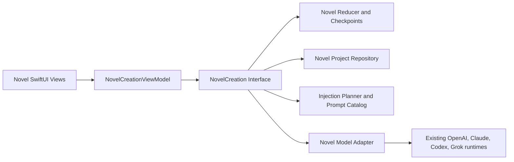
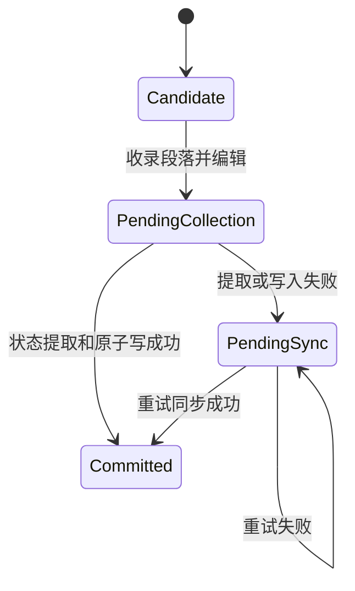

# 小说创作完整实施计划

> Status: Phase A-F implemented; simplification S1-S3 completed, S4 gated by V2 migration
> Date: 2026-07-12
> Product contract: `docs/NOVEL_CREATION_SPEC.md`
> Domain language: `CONTEXT.md`
> Ownership decision: `docs/adr/0007-novel-creation-owns-project-state.md`

## Success Definition

从 Session 首页进入「小说创作」后，用户可以创建多个小说项目，在独立的聊天式创作 Session 中讨论或生成正文候选，把选定段落收录进章节，自动更新当前剧情分支的人物经历和剧情状态，从任意已提交检查点 Fork 平行剧情，并完成整章润色、版本恢复及项目导入导出。普通聊天的会话、上下文、消息分支和存储行为必须保持不变。

完成不以“页面能打开”或“模型能回字”为准。以下闭环必须同时成立：

- 未收录候选永不进入正式正文或分支状态。
- 收录要么原子提交正文与状态，要么留下可恢复的待同步草稿。
- 手动编辑、润色、撤销和 Fork 都有不可变检查点，不改写历史。
- 模型、注入资料、Prompt 版本和状态变更可追溯。
- cancel、error、background、retry、重复 terminal 和重启恢复不会重复提交或丢正文。
- 项目包往返后，项目、分支、章节版本、Session 和待处理操作语义一致。

## Non-Negotiable Boundaries

- 小说项目是唯一权威来源；普通 `IOSConversationStore`、Memory、Lorebook 和 Workspace 都不是小说存储。
- 不扩展现有 `MessageNode` variant 来表示剧情分支。
- 不把小说逻辑堆进 `ChatView`、`ChatViewModel` 或 `PlaceholderViews.swift`。
- 不修改现有聊天滚动、viewport、Markdown vendor 或 KMP conversation storage 来换取接线便利。
- 新功能主体放在独立 `NovelCreation/` 目录；导航入口在最后阶段才接通。
- 第一版使用本地 JSON 和 Foundation 原子写，不引入数据库、通用事件溯源框架、embedding 或新的网络依赖。
- 项目规模按个人娱乐创作优化；优先保证语义清楚、可恢复和可测试，而不是提前优化极大项目。

## Architecture Simplification

当前 V1 功能闭环保留，但实现复杂度已经偏离“个人娱乐创作”边界。精简按以下主次推进，不以删除行数替代领域完整性：

- 保留项目设定与分支状态分权、候选收录、`needsSync`、不可变章节版本、准确 checkpoint Fork、整章润色约束、原子文件保存和 V1 项目包兼容。
- 优先删除确定死状态、仅测试使用的生产代码、旧导航 wrapper 和源码字符串 canary；测试替身只进入 test target，Preview 代码只进入 Debug。
- V1 不再扩大 command 的内部 identity、revision、receipt 和 checkpoint 表面积；把这些参数彻底收回 actor 属于 V2 interface migration，不能用一层新 wrapper 伪装完成。
- Workspace 是唯一 UI 操作状态所有者；Session 只投影消息和发出意图，不直接写另一个 ViewModel 的 busy 状态。
- 同一可信 transition 不叠加完全相同的全量校验；进一步把完整文档校验收窄到 load、import、migration、staged decode 等边界，需要先补 reducer 局部不变量测试，不能直接删保护。
- 单进程 V1 使用一个共享 `DefaultNovelCreation` actor。进程级 fact/polish lease 已删除，因为它只防御明确不支持的第二模块实例；operation ledger 与跨文件 lifecycle replay 仍需迁移和恢复测试后才能压缩。
- 后续 V2 把单书规范、世界观、人物档案、总纲和分支连续性提升为明确 aggregate；V1 先保持可读并提供确定性迁移，不能原地破坏已有项目。

当前进度：

- S1 完成：死状态、测试专用实现、旧导航 wrapper 和有等价行为覆盖的源码字符串 canary 已清理。
- S2 完成：Workspace 用单一 exact-owner operation token 管理 busy；Session、Quick Start 和普通 mutation 只能释放自己的 owner。
- S3 完成当前安全部分：删除两处重复 transition 校验，并统一两条模型管线的 request hash 与参数 evidence；其余 validator 和运行时编排不为减行数强拆。
- S4 延期：V2 schema/migration 尚未定义，不删除 operation ledger、lifecycle journal、checkpoint、pending work 或 V1 package 字段。

## Architecture

### Current V1 Module Interface

小说领域向 SwiftUI 暴露三个主入口和三个 lifecycle control，但 V1 的 `NovelAction` / `NovelRunRequest` 仍携带较多内部事务参数，因此目前只是命名入口少，尚不能称为真正的 deep module。为保持项目包、重试和现有测试兼容，本轮不再叠加一层 facade；V2 应以用户 intent 替换这些 command，并删除旧 interface，而不是两层并存。

```swift
protocol NovelCreation: Sendable {
    func snapshot(_ scope: NovelSnapshotScope) async throws -> NovelSnapshot
    func perform(_ action: NovelAction) async throws -> NovelOutcome
    func start(_ request: NovelRunRequest) async throws -> NovelRun
    func interruptRun(_ command: NovelCancelRunCommand) async throws
    func interruptForBackground(
        projectID: NovelProjectID,
        deadline: Date,
        runID: NovelRunID?
    ) async
    func retryPendingTerminal(runID: NovelRunID) async throws
}

struct NovelRun: Sendable {
    let id: NovelRunID
    let events: AsyncStream<NovelRunEvent>
}

enum NovelRunEvent: Sendable {
    case started(NovelRunReceipt)
    case delta(String)
    case completed(NovelSessionMessageSnapshot)
    case interrupted(NovelSessionMessageSnapshot?)
    case failed(NovelFailure)
}
```

- `snapshot`：读取项目列表、工作区、Session、章节、分支、注入预览和导出内容。
- `perform`：执行所有会改变领域事实的动作，包括资料修订、收录、同步、撤销、Fork、润色采用和导入。
- `start`：启动快速开始、讨论规划、正文候选和整章润色等用户可见的流式运行。状态提取与漂移检查由 `perform` 对应动作在模块内部调用，不暴露给 UI 编排。
- `interruptRun` / `interruptForBackground`：跨越尚未进入 actor、pre-durable reservation 和 durable runtime 三个阶段收口运行；`runID` handshake 与 actor tombstone 保证取消先到时迟到 start 也不能成为隐藏运行。
- `retryPendingTerminal`：只重试同一 run 已声明但未完成的 terminal 持久化，不创建新正文候选。
- 所有写动作携带 `operationID` 和预期 revision；UI 不直接回写可变 `NovelProject` 快照。
- `NovelRunRequest`、`NovelSnapshot`、`NovelOutcome` 和所有 run event 都是纯数据且 `Sendable`。UI 取消走 `interruptRun`，内部 durable terminal 仍归一到同一个 cancel reducer；不把 closure、Kotlin `Job` 或 Swift `Task` 暴露到 actor seam 外。

`DefaultNovelCreation` 使用 actor 串行化项目写入。生产 composition root 在单个 iOS app 进程内只创建并共享一个 `NovelProjectPersisting` 实例和一个 `DefaultNovelCreation`；不支持第二个 module actor、第二个 repository actor 或两个进程同时写同一项目根。这里用 composition 保证单写者，不再维护一个只为未支持拓扑服务的全局 lease registry。SwiftUI 的 `NovelCreationViewModel` 负责工作区选择、加载和唯一 UI operation owner；`NovelSessionViewModel` 投影 Session 状态并通过显式 acquire/release 协议发起操作，不直接改写 Workspace busy 状态。领域可行性仍由 actor/reducer 判断。



### Internal Seams

- `NovelProjectPersisting`：local-substitutable。生产 adapter 使用原子文件；测试 adapter 使用内存或临时目录并可注入写失败。
- `NovelModelRunning`：true external。生产 adapter 复用现有 provider 配置与流式协议；测试 adapter 使用 scripted responses。Grok Web 的 `@MainActor` Swift `Task` 和 OpenAI/Claude 的 Kotlin job 都由生产 adapter 内部持有，并统一响应模块取消。
- Reducer、Prompt 组合、智能筛选、段落解析、schema 校验和摘要折叠属于 in-process implementation，不为它们建立浅层 protocol。

### Provider Integration

新增 `NovelLiveModelAdapter`，不直接包装高耦合的 `ChatGenerationCoordinator`：

- 从 `IOSSharedSettingsStore` 解析全局或项目固定模型。
- 使用 `ChatProviderConfiguration.issue` 做 provider、模型、凭据和登录态校验。
- Codex 请求继续经过 `IOSCodexProviderResolver.resolved` 和参数增强。
- OpenAI/Claude 使用现有 `IOSAgentTextProvider` / `IOSAgentStreamingProvider` 与 `OpenAIKmpProviderAdapter`。
- Grok Web 按现有三路 dispatch 规则调用 `IOSGrokWebClient`。
- 小说调用禁用工具，不注入普通 Memory、Skills、MCP、Workspace policy 或普通 Assistant system prompt。
- 流式 accumulator、取消和 terminal 只在新 adapter 内实现；不修改普通聊天 coordinator。

## File Shape

建议生产文件按职责拆分，单文件目标低于 1000 行：

```text
iosApp/iosApp/NovelCreation/
  NovelDomainModels.swift
  NovelActions.swift
  NovelCreation.swift
  NovelReducer.swift
  NovelProjectRepository.swift
  NovelInjectionPlanner.swift
  NovelPromptCatalog.swift
  NovelModelAdapter.swift
  NovelProjectPackage.swift
  NovelProjectFileDocument.swift
  NovelCreationViewModel.swift
  NovelProjectListView.swift
  NovelProjectWorkspaceView.swift
  NovelSessionView.swift
  NovelSessionBubble.swift
  NovelCollectSheet.swift
  NovelMaterialsView.swift
  NovelBranchesView.swift
  NovelChapterViews.swift
```

测试文件与行为域对应，不做一个巨型测试类：

```text
iosApp/iosAppTests/
  NovelReducerTests.swift
  NovelProjectRepositoryTests.swift
  NovelInjectionPlannerTests.swift
  NovelModelAdapterTests.swift
  NovelGenerationLifecycleTests.swift
  NovelCollectionTests.swift
  NovelForkTests.swift
  NovelPolishTests.swift
  NovelProjectPackageTests.swift
  NovelCreationViewModelTests.swift
  IOSNovelCreationWiringTests.swift
```

工程的受控源是 `iosApp/project.yml`，`AmberAgent.xcodeproj/project.pbxproj` 是被 Git 忽略的 XcodeGen 产物。`project.yml` 对 `iosApp/` 和 `iosAppTests/` 使用递归 sources；每个 WP 新增文件后运行 `xcodegen generate`，并审计生成结果：生产文件必须进入稳定与 Experimental 两个 app Sources phase，测试文件必须进入 `iosAppTests`。不得手工维护或只依赖未重新生成的 PBX。

## Persistence V1

### Layout

```text
Library/Application Support/AmberAgent/NovelCreation/
  index.json
  projects/<project-id>.json
  projects/<project-id>.previous.json
  recovery/<project-id>-<run-id>.json
```

- `projects/<id>.json` 是单个项目唯一权威文档。
- `index.json` 只保存列表摘要，可由项目文件重建。
- `previous.json` 只在正式文件原子替换成功时轮换为上一个已验证版本。主文件损坏时只能以 degraded/read-only 方式加载 previous；用户明确执行恢复前禁止写入，避免覆盖唯一好副本。
- `recovery` 侧车只保存进行中流式文本，不成为正式正文。

### Project Document

`NovelProjectDocumentV1` 至少包含：

- `schemaVersion`、项目记录、项目 revision 和 config revision。
- 世界观、人物档案、总纲、写作要求和自定义资料的不可变 revisions。
- 分支记录、分支覆盖、主分支和 parent/fork origin。
- 章节、章节版本和当前 working versions。
- 创作 Session 消息、正文候选、润色候选和生成 receipts。
- 创作节点、分支检查点和完整状态 snapshots。
- pending operations、active run 和 applied operation ledger。

章节版本、资料 revision、状态 snapshot 和检查点都是 project-global immutable records；分支只保存引用。V1 删除分支时不回收这些记录，因此子分支引用不会因删除父分支而悬空。状态 snapshot 不以 branch ID 作为所有权约束，Fork 后可共享到子分支第一次产生新状态为止。

V1 的每个状态 snapshot 保存完整有序事件集合和当前摘要，不做运行时 parent-delta replay。它会增加少量磁盘占用，但让 Fork、撤销、损坏诊断和项目包恢复保持直接可验证。

使用分开的 revision：

- `project.revision`：任意成功写入。
- `configRevision`：项目设定、模型和润色偏好。
- `branch.headRevision`：正式正文或检查点变化。
- `branch.workingRevision`：手动 working chapter 变化；不冒充正式 head revision。
- `session.revision`：聊天消息和候选变化。

普通聊天消息不能让正文候选误判为剧情 stale；候选只绑定 `baseCheckpointID` 和 `baseHeadRevision`。

### Immutable Checkpoints

每个 `NovelBranchCheckpoint` 锁定：

- 当时每章采用的 `chapterVersionID`。
- `stateSnapshotID`。
- Session cursor。
- 生效的分支覆盖 revision IDs。
- parent checkpoint、operation ID、类型和时间。

每个新项目的初始主分支内部先有一个不在 UI 暴露、不可由用户 Fork 的 `initial` 检查点，用于锁定空正文、空状态与 Session 起点，避免“尚无 base checkpoint”的特殊分支；之后 Fork 的子分支直接引用来源检查点。用户可见检查点类型至少包括 `collection`、`manualSync`、`polish`、`restore`。产品只把 `collection` 称为创作节点，但 Fork 可以指向任意用户可见的已提交检查点。旧检查点、章节版本和状态 snapshot 一经提交不可变。

### Atomic Writes And Idempotency

所有同步 mutation 使用 copy-on-write：验证 guard，生成 next document，全量校验，编码到同目录临时文件，重新 decode 校验，再原子替换正式文件；只有写盘成功后才发布内存状态。索引写失败不推翻项目成功写入，下次重建。

幂等规则：

- 同 `operationID + payloadSHA256` 返回原 outcome，不重复执行。
- 同 operation ID、不同 payload 返回 `idempotencyConflict`。
- `payloadSHA256` 由 `NovelAction` 的稳定 canonical payload 在模块内计算，排除 expected revisions；UI 或其他调用方不得声明或伪造该 hash。
- 同一小说项目内 operation ID 唯一，replay lookup 只读取目标项目；不同项目允许独立使用同一 UUID，任何损坏项目不得因全库扫描阻塞健康项目 mutation。
- checkpoint、章节版本、state snapshot 和候选 ID 在操作开始时预生成，重试不得换 ID。
- 相同 candidate ID 只能关联一个收录检查点。撤销后若用户从旧气泡再次收录，模块先克隆出新的 candidate/collect-attempt ID；旧检查点和旧候选关联保持不可变。
- 任何模型 await 返回后必须重新核对该操作真正依赖的 guard，禁止旧结果覆盖较新领域事实。

await 后按操作需要核对最小 guard，避免无关修改丢掉合法结果：生成 terminal 核对 `activeRunID` 和目标 Session；收录 finalization 核对 pending ID、payload hash 与 base checkpoint；资料或普通 Session revision 的无关变化不能让正文气泡消失。

### Project Package Envelope

`.ambernovel` 是单 JSON envelope，不依赖新的 ZIP 库：

```text
format, envelopeVersion, projectSchemaVersion, projectID,
projectByteCount, projectSHA256, projectJSONBase64
```

SHA-256 和 byte count 针对 base64 解码后的原始 project JSON bytes，不能依赖 decode 后再次编码的字节顺序。导出 active run 时返回 `projectBusy`，不偷偷取消，也不生成缺 partial 的包。导入时把遗留 running run 正规化为 interrupted；未知更高 schema 在任何写盘前拒绝。`keepBoth` 必须重映射所有 projectID 引用并重新执行完整文档校验。

iOS 文件闭环使用自定义 `UTType`、`FileDocument`、`fileExporter` 和 `fileImporter`。导入从 security-scoped URL 完整读取数据并及时停止访问，不经过 Workspace 截断预览。项目包设置合理大小上限（V1 为 100 MB），且不包含 API Key、OAuth token、cookie、base URL 或其他 credential。

## Runtime State Machines

### Chat Generation

1. 解析项目模型与最新分支检查点。
2. 计算本次注入，先持久化用户消息、run marker、模型 receipt 和注入 receipt。
3. 启动流式模型调用；UI 只更新活动尾消息。
4. 成功 terminal 保存讨论消息、正文候选或润色候选；候选生成本身不改变正文和分支状态。
5. cancel、error 或后台中断立即 flush partial，保存为不可收录的 interrupted draft，并恰好收口一次。

每个 run 持久化 `running -> completed | interrupted | failed` compare-and-set 状态机。complete、error、cancel 和 background 竞争时只有第一个 terminal 有权写 Session；先原子写 terminal 项目文档，再删除 recovery sidecar。项目或分支存在活动 run 时，删除和 replace import 返回 `projectBusy`，必须先显式取消并等待 terminal；迟到 callback 只能 no-op，不能复活已删除目标。

### Collect And State Sync



阶段一先耐久保存最终选中文本、章节目标、候选、base checkpoint、operation ID 和 proposed chapter version。此时内容：

- 不进入正式 manuscript。
- 不进入正式生成的注入上下文。
- 不进入默认 Markdown 导出。
- 不可 Fork。
- 必须进入完整项目包和重启恢复。

状态提取输出版本化 `NovelStateDeltaV1`。实现校验实体引用、事件、关系、伏笔和 `branchOutlinePatch`，再由确定性 reducer 追加事件并生成新状态 snapshot。项目级总纲只能形成用户确认的 revision proposal。成功时一次原子写同时晋升章节版本、事件、摘要、创作节点和分支检查点。

模型发现新的世界规则或人物档案时，只生成项目设定建议；不能自动写项目资料。未知新人物可以先作为分支事件中的未解析实体，并提供“建立人物档案”建议。

### Manual Edit

- 手动编辑先保存 working chapter version，分支标记 `needsSync`。
- 讨论规划继续可用；正式正文生成、收录和从当前 working head Fork 被阻止。历史已提交检查点始终仍可 Fork。
- 同步不能复用普通收录的 append-only delta。实现定位最早受影响正文之前的检查点，从其状态 snapshot 开始，按正式章节顺序重新提取并替换派生事件后缀；被删除或改写的旧事件不会继续留在新 head。
- 同步成功后创建 `manualSync` 检查点和新完整状态 snapshot，不修改旧创作节点。同步中断时保存进度并保持 `needsSync`，可从同一 operation 重试。
- 旧检查点 Fork 仍看到旧正文；新检查点 Fork 看到编辑后的正文。

### Undo

- 第一版只允许撤销当前分支最新检查点。撤销只把 branch head 移到 parent checkpoint，并在 operation ledger 记录动作；旧检查点、章节版本和状态 snapshot 保持不可变，不创建额外 undo checkpoint。
- 撤销 collection 时，活动正文、事件和状态随 head 一起回退；原气泡保留。再次收录时克隆新的 candidate/attempt ID，不能复写旧候选关联。
- 撤销 polish/restore 时 head 回到 parent，从而恢复旧章节版本并复用原状态 snapshot。
- 需要回到更早历史时从历史检查点 Fork，不重写后续历史。

### Fork

- Fork 只接受已提交检查点。
- 子分支引用指定检查点的 project-global manuscript versions、状态 snapshot 和分支覆盖，并复制对应 Session 前缀；V1 不在删除分支时 GC 共享 immutable records。
- collection 检查点 cursor 取来源候选消息 sequence；polish 取润色候选 sequence；manualSync 取同步启动时已提交 Session tail。候选之后才出现的讨论不会因晚收录被带入 Fork。
- 子分支继承的旧候选只读，不自动获得可收录资格。
- 源分支不写入；父子分支状态独立演化，但仍随同一项目文档原子落盘。
- 唯一分支不可删除；主分支删除前必须先改主分支；删除父分支不级联删除子分支。

### Whole-Chapter Polish

- 固定润色约束与项目可编辑偏好组合成版本化 Prompt。
- 润色候选绑定源 `chapterVersionID`；采用前要求源版本仍是当前版本。
- 每个章节版本保存 `factCompatibilityID`。语义检查通过后创建同一 compatibility lineage 的 polish chapter version 和检查点，复用原 state snapshot。
- 发现剧情事实漂移时禁用“采用润色版”；只能转为手动剧情改写并进入 `needsSync`。
- 漂移检查失败、超时或无合法结构化结果一律 fail closed。
- 只有同一 `factCompatibilityID` 的安全润色版本可以直接 restore；恢复 collected/manual 等可能改变剧情的旧版本必须转为手动编辑并同步。安全恢复创建 restore 检查点，不覆写历史。

### Background And Recovery

- 第一版后台契约是“保存最新 partial、取消底层请求、标记 interrupted”，不静默继续付费生成。
- `NovelProjectWorkspaceView` 独立监听 `scenePhase` 和路由离开。进入后台时申请短时 `UIApplication` background task，并调用 actor 内唯一的幂等 `interruptForBackground`：捕获最后 partial，通过 terminal CAS 将 run、partial 和 `interrupted` 原子写入项目文档；底层 provider cancel 只做 best effort，不得位于 terminal 持久化的等待链上。离开项目时也复用同一 interrupt 收口。ViewModel deinit 不是唯一生命周期保证。
- 后台收口从 `scenePhase` 变化起最多等待 5 秒或系统 expiration，以先发生者为准。expiration handler 与超时任务都调用同一个幂等收口；无论持久化成功、失败或超时，都必须恰好一次 `endBackgroundTask`。provider 迟到 delta/terminal 由 run CAS 丢弃，不得恢复已 interrupted 的 run。
- 流式 recovery sidecar 每约 2 秒或新增约 8 KB 覆盖一次；background、cancel、error、complete 时立即 flush。
- 启动时将遗留 running run 归一为 interrupted，按确定性 message/candidate ID 恢复一次 partial。
- 已完成项目写入但侧车未删除时，只删除侧车，不重复消息。
- `pendingCollection` 和 `needsSync` 原样恢复并继续阻止正式生成。
- recovery tests 覆盖 marker 写后、partial sidecar 写后、terminal 项目写后但 sidecar 删除前、sidecar 已删除四个 crash points。

## Context And Prompt Policy

### Injection Budget

每次请求按优先级编译：

1. 固定小说模式 Prompt 和润色约束。
2. 当前分支紧凑状态摘要。
3. 当前章节尾部和最近创作 Session 消息。
4. 常驻项目资料。
5. 本次临时加入资料。
6. 智能命中的人物、世界观、事件和伏笔。

智能选择第一版使用确定性的标签、名字和文本相关性评分，不引入 embedding。优先级规则固定为：固定约束和当前状态不可排除；`forceExclude` 可覆盖常驻/智能；`forceInclude` 可仅本次加入默认关闭资料，但不改变其持久模式。常驻资料与用户显式 force-include 资料不可被静默裁剪；它们自身超出预算时直接失败并展示占用明细。预算不足时只裁剪较旧 Session 和低分智能材料，不裁掉固定约束、当前状态和用户本次输入。

每次生成保存 `InjectionReceipt`：资料 revision、选择理由、临时增删、内容 hash、Prompt 版本、模型/provider/参数和 token 估算。不得保存 API Key、OAuth token 或 cookie。

### Prompt Catalog

内置 Prompt 全部版本化并有 snapshot tests：

- 快速开始建议。
- 讨论规划。
- 续写片段。
- 生成整章。
- 状态提取 JSON schema。
- 手动编辑后状态重建。
- 整章润色固定约束。
- 润色语义漂移检查。

## UI Plan

### Entry And Project List

- Session 首页只把快捷区的「核心记忆」替换为「小说创作」，位置保持在「小应用」和 `WebMount` 之间。
- 保留设置页及其他位置的 `.memory` 入口，不删除核心记忆功能。
- `AppShell.Route` 新增 `.novelCreation` 与 `.novelProject(id:)`，destination 只做窄接线。
- 项目列表使用原生 `List`：项目标题、主分支、更新时间；支持新建、导入、重命名、导出和确认删除。

### Project Workspace

- 默认打开「创作」，并提供「创作 / 设定 / 分支」三个稳定标签。
- 顶部紧凑显示项目、当前分支和模型，不做仪表盘或卡片首页。
- 「设定」按世界观、人物、总纲、写作要求和自定义资料组织；每条资料提供三态注入控制。
- 「分支」显示来源、分叉点、主分支、状态摘要、事件记录和分支操作；第一版不画复杂自由布局树。

### Chat-First Session

- 新建 `NovelSessionView` 和专用 rows，不修改 `MessageBubbleView` 或普通聊天 action 链。
- 复用 `ChatUserBubble`、`ChatAssistantText` 和 `ChatAssistantMarkdownView` 的视觉渲染能力。
- 正文候选气泡 terminal 后显示「收录正文」；润色候选显示「采用润色版」或漂移警告；讨论消息没有收录动作。
- 收录 Sheet 按稳定 paragraph IDs 多选，默认全选，提供编辑预览和章节目标选择。
- Composer 使用模式 segmented control、粒度菜单、上下文入口和发送/取消图标；控件保持稳定尺寸、支持 Dynamic Type 和键盘安全区。
- 新列表使用稳定 turn identity 和尾行 digest，仅活动尾消息随流式 delta 变化；用户查看历史时不得被拉回底部。

### Existing UI Reuse Contract

小说创作不另造一套视觉和输入基础设施。WP9-WP10 优先直接组合当前 target 内已有的通用组件：

- 气泡与正文：`ChatUserBubble`、`ChatAssistantStack`、`ChatAssistantText`、`ChatAssistantPendingResponseView`、`ChatAssistantMarkdownView`。`NovelSessionBubble` 只增加候选类型、收录、润色和漂移等领域动作，不复制 Markdown renderer。
- 输入与键盘：`composerDockGlass`、`ComposerInputController`、`ComposerInputTextView`、`ComposerDockSendButton`、`ComposerIconButton` 和 `ChatScrollToBottomButton`，保留中文 IME marked-text、发送/停止和键盘收口语义。
- 模型选择：直接使用 `ComposerModelSheet` 的 provider 分组与稳定 model option；回调写入小说项目的 global/fixed model policy，不能改普通聊天当前模型，也不能退化为仅保存可能重名的 model ID。
- Amber 外观：直接使用 `AmberTheme`、`AmberGlassCircleButton`、`AmberGlassIconButton`、`AmberSectionLabel`、`AmberFormGroup` 和 `AmberFormRow`，保持聊天、Sheet、设置页与深浅色风格一致。
- 交互模式借鉴模型议会：采用真正居中的可点击 header、单一 `Identifiable` active-sheet router、segmented mode picker、运行中只读设置和独立完整设置页。只借组合方式，不复用 Council 的 ViewModel、runner、store 或消息类型。

以下内容明确禁止以“复用”为由接入：

- 不把小说消息伪装成 `UIMessage` 后交给 `MessageBubbleView`、`ChatSwiftUIMessageList`、`ChatCollectionMessageList` 或 Native Timeline；这些类型绑定普通 Conversation variant、Workspace、tool/widget 和 Chat action 语义。
- 不复用 `ChatViewModel`、`ChatGenerationCoordinator`、`IOSConversationStore`、Council runner/transcript/settings store 或普通 Chat context event。
- V1 不为复用先重构高冲突 Chat 文件。现有通用组件在同 target 内可直接引用；只有出现经测试证明的真实重复后，才把纯 presentation policy 做无行为变化提取，并追加普通聊天回归。

复用审查必须同时证明两件事：视觉与交互使用了现有 Amber primitives；小说领域数据没有反向进入普通 Chat/Council 的状态和运行时。

视觉实现以 `swiftui-ui-patterns` 为结构指南、`amberagent-ios-taste` 为视觉门禁：不做嵌套卡片、营销式空页面或大面积单色装饰；沿用 Amber theme、Liquid Glass 顶部按钮和原生列表行为。

## Work Packages

每个 WP 的 owned paths 默认仅包含当期新增的 `NovelCreation/` 文件和对应测试；普通新增文件由现有 `iosApp/project.yml` 递归 sources 收录，不应产生 YAML hunk。只有明确列出的集成文件例外：WP8 的共享 `Info.plist`，以及 WP11 的 `AppShell.swift`、`PlaceholderViews.swift`。每个 WP 都重新生成并审计 PBX membership，保证阶段测试可编译；WP11 只做最终 target audit 并接导航，不首次批量接文件。

### WP0: Baseline And Contract Freeze

**Scope**

- 固定本规格、领域词汇和 ADR。
- 记录当前 `git status`、staged/unstaged name-status；分别保存 `AppShell.swift`、`PlaceholderViews.swift`、`Info.plist` 的 staged/unstaged patch 与 hash，同时保存受控 `iosApp/project.yml` 和当前被忽略的生成 `project.pbxproj` 全文件 hash/副本基线。
- 为每个 WP 建立 owned-path manifest；阶段结束只核对 owned paths，并确认高冲突文件原有 hunk 未改变。
- 记录适用测试的既有红/绿基线，避免把原有失败归因给新功能。
- 确认新目录文件命名，运行 XcodeGen，并核对稳定、Experimental 与测试 target membership。

**Exit**

- 不存在“正文正式但状态旧”的合法状态。
- 普通聊天、Memory、Workspace 和小说领域所有权无歧义。
- 未开始导航接线或 UI 暴露。

### WP1: Domain Types, Reducer, And In-Memory Module

**Scope**

- 建立 IDs、records、actions、outcomes、errors、revision guards 和三入口 Interface。
- 实现纯 reducer、检查点、资料修订、主分支和幂等 operation ledger。
- 使用 in-memory repository 跑完整领域状态迁移。

**Tests**

- `NovelReducerTests`
- `NovelCreationModuleTests`

**Exit**

- 多项目隔离、项目设定共享、分支状态隔离、stale revision 和 operation 幂等全绿。
- 此阶段不接模型或现有产品源文件；只允许新增 Novel 文件和测试，随后重新生成并核对 PBX，不手改生成工程。

### WP2: File Repository And Recovery

**Scope**

- 实现项目 JSON、派生 index、previous fallback、文档全量校验和 recovery sidecar。
- 支持重启、损坏保护、index 重建和失败注入。

**Tests**

- `NovelProjectRepositoryTests`
- `NovelDocumentValidationTests`

**Exit**

- 原子写失败时正式文件和已发布内存状态均保持旧值。
- 重启后项目、分支、Session、pending 和 checkpoint hash 一致。

### WP3: Injection, Prompt Catalog, And Scripted Generation

**Scope**

- 实现三态注入、临时覆盖、预算、receipt 和 Prompt catalog。
- 先用 scripted model adapter 完成快速开始、讨论、片段、整章和润色候选状态机。
- 完成 cancel/error/background/duplicate terminal 的恢复契约；scripted adapter 必须能模拟不响应 cancel 的 provider、5 秒 deadline、expiration 和迟到 callback。

**Tests**

- `NovelInjectionPlannerTests`
- `NovelPromptCatalogTests`
- `NovelGenerationLifecycleTests`

**Exit**

- fake model 收到的上下文与持久化 receipt 一致。
- 所有 terminal 路径恰好收口一次；后台 expiration 不等待 provider cancel，迟到 callback 无副作用，候选生成不改变正文或状态。

### WP4: Live Model Adapter

**Scope**

- 接入全局/项目固定模型解析。
- 完成 OpenAI、Claude、Codex OAuth 和 Grok Web 三路流式 dispatch。
- 为状态提取和漂移检查实现严格 JSON 输出、schema 校验和用户可见失败。

**Tests**

- `NovelModelAdapterTests`
- provider request-body/cancellation canaries
- `IOSCodexProviderResolverTests`

**Exit**

- scripted 与 live adapter 通过同一 Interface 契约。
- 不修改 `ChatGenerationCoordinator`、`ChatViewModel` 或普通 runtime context builder。

### WP5: Collection, State Sync, And Manual Reconciliation

**Scope**

- 实现稳定 paragraph IDs、收录 selection、目标章节和 proposed chapter version。
- 实现两阶段 pending collection、状态提取、严格 schema、确定性 reducer、摘要、项目设定建议和重试同步。
- 实现手动编辑 working version、`needsSync`，以及从最早受影响检查点开始的事件后缀重建。
- 新人物、新世界事实和项目总纲变化只形成建议，不越权修改项目设定。

**Tests**

- `NovelCollectionTests`
- `NovelManualEditSyncTests`
- extraction schema/error/write-failure/retry tests
- `collect -> pending -> restart -> retry`、stale candidate、duplicate operation tests
- 编辑第一章且后面已有多个检查点时，替换新 head 的派生事件后缀，旧检查点仍保留旧事件

**Exit**

- 成功收录只产生一个创作节点；失败保留最终选中文本。
- `manualSync` 后正文与完整事件集合一致，过期状态不会参与下一次正式生成。

### WP6: Checkpoints, Fork, Undo, And Branch Lifecycle

**Scope**

- 实现 project-global immutable records、检查点、精确 Fork 和按检查点类型定义的 Session cursor。
- 实现 head-move undo、旧候选 clone/recollect、分支重命名/删除/设主分支。
- 活动 run 时拒绝删除；删除父分支不 GC 共享 records，也不级联子分支。
- 待同步分支只禁止从 working/pending head Fork，历史检查点仍可 Fork。

**Tests**

- `NovelForkTests`
- `NovelBranchLifecycleTests`
- `collect -> undo -> clone/recollect -> restart`
- 晚收录旧候选后 Fork 的 Session 精确前缀
- `fork -> delete parent -> restart -> export child`

**Exit**

- 历史检查点 Fork 后父分支语义 hash 不变，父子后续状态独立演化。
- 删除父分支、撤销和重启都不会产生悬空引用或复活旧 run。

### WP7: Whole-Chapter Polish And Version Compatibility

**Scope**

- 固定约束、项目润色偏好、整章候选、漂移检查、采用和版本恢复。
- 建立 `factCompatibilityID`；安全润色/恢复复用状态，其他版本转为手动剧情改写并同步。
- 漂移检查失败、超时或非法 JSON 全部 fail closed。

**Tests**

- `NovelPolishTests`
- source-version conflict、compatibility lineage、fail-closed 和 idempotent adoption tests

**Exit**

- 安全润色只改变章节版本，事件与摘要 hash 不变。
- 任意可能改变剧情的恢复都不能绕过 `needsSync`。

### WP8: Project Package, Markdown, And File Integration

**Scope**

- 实现带原始 payload bytes hash 的单 JSON `.ambernovel` envelope。
- Markdown 只导出当前分支 head checkpoint 的正式章节；pending/working 默认排除。
- 实现 keep-both、显式 replace、reject、running import 归一化和 higher-schema no-write。
- 实现 `UTType`、`FileDocument`、`fileExporter`、`fileImporter` 和 security-scoped URL 完整读取。
- 在两个主 app target 共用的 `iosApp/iosApp/Info.plist` 注册 `UTExportedTypeDeclarations`：稳定 UTI、`public.data` conformance、`ambernovel` filename-extension tag 和专用 MIME type；同时用 `CFBundleDocumentTypes` 注册可打开的小说项目文档。Swift `UTType` 常量必须与 plist identifier 完全一致。

**Tests**

- `NovelProjectPackageTests`
- 多分支、版本、pending、Session 和 receipts round-trip
- active-run export、size limit、exact-byte checksum、higher schema、keep-both remap 和 corrupt package tests
- plist/Swift UTI identifier 一致性测试，以及 stable/experimental 构建产物中 exported type 与 document type 的 plist 断言

**Exit**

- 导出、删除本地、重新导入后的语义 snapshot 完全一致。
- stable 与 experimental 两个 app 均能在 Files 中识别、导出并重新打开 `.ambernovel`；包内无 credential。

### WP9: ViewModel, Project List, Materials, And Branch UI

**Scope**

- 实现薄 `NovelCreationViewModel`、项目列表、快速开始、空白项目、项目模型和导入导出。
- 实现「创作 / 设定 / 分支」workspace、资料 CRUD、三态注入、本次上下文预览和所有分支操作。
- 所有控件此阶段已有 WP1-WP8 的真实行为，不放死按钮。
- 使用测试 route，不接 Session 首页快捷入口。

**Tests**

- `NovelCreationViewModelTests`
- materials/model policy/branch/package wiring tests
- SwiftUI previews for empty, populated, pending, degraded, error and Dynamic Type states

**Exit**

- 测试 route 可完成创建、资料、分支、版本和包操作；普通 Session 首页尚未变化。

### WP10: Chat-First Session UI

**Scope**

- 实现专用 Novel Session 数据/list owner，并直接组合既有 Chat 气泡排版、Markdown、composer、IME、发送/停止、模型 Sheet、回底与 Amber Glass/Form primitives；不复制普通 Chat runtime。
- 顶栏与多 Sheet 切换采用模型议会已经验证的 centered clickable header、单一 active-sheet router 和 segmented mode pattern，但所有写入只走 `NovelCreationViewModel -> NovelCreation`。
- 保存讨论、正文候选、润色候选、partial 和 receipts，并接通收录、同步、Fork 与润色动作。
- 实现历史浏览不被自动拉底、取消、interrupted 恢复、键盘安全区和稳定 tail rendering。

**Tests And Evidence**

- `NovelSessionViewModelTests`
- `NovelSessionReplayTests`
- long prose/whole-chapter streaming execution canary
- 断言历史 row digest 不变、只有活动尾行失效、follow-bottom offset 不反向跳变
- 当期模拟器键盘、历史滚动、取消和收录流程截图/执行证据

**Exit**

- Agent 以完整聊天气泡生成正文候选；未收录时 manuscript/state hash 不变。
- 自动化 canary 无历史重建或反向跳变，模拟器键盘与安全区不遮挡 composer。

### WP11: Navigation, Lifecycle, Target Audit, And Final Integration

**Scope**

- 最后修改 `PlaceholderViews.swift` 的一个快捷入口和 `AppShell.swift` 的 Route/destination。
- 从 `iosApp/project.yml` 重新生成工程，审计全部 PBX group/build phase membership，更新项目状态和测试清单。
- 接通 `scenePhase`、路由离开与短时 background flush；验证 5 秒 deadline、expiration handler、provider cancel 不阻塞持久化以及迟到 callback no-op，完成重启恢复和真实 provider smoke。
- 审计两个主 app target 的构建产物 `Info.plist`，确认 `.ambernovel` exported/document type 注册均实际存在。
- 删除/replace/export 与 active run 的 `projectBusy -> cancel -> terminal -> retry` UI 闭环。

**Tests And Evidence**

- `IOSNovelCreationWiringTests`
- 完整 `iosAppTests`
- `IOSConversationStoreTests`、`IOSConversationStoreBranchingTests`
- `IOSSettingsWiringTests`、`IOSAgentToolEngineTests`、`IOSCodexProviderResolverTests`
- `ChatStreamReplayTests`、`ChatSwiftUIStreamReplayTests`
- simulator: 入口、建项目、生成、收录、同步、Fork、润色、Files 导出导入、重启
- device: 长章流式、键盘、后台中断、文件导出和真实 provider
- stable `iosApp` 与 `iosAppExperimentalGPL` 两个 scheme build

**Exit**

- Session 首页顺序为「小应用 / 小说创作 / WebMount」，设置页核心记忆仍可进入。
- 普通会话 summaries、消息 variant、上下文注入和滚动回放无回归。
- owned-path diff、原有 staged/unstaged hunk 和两个 target membership 全部核对。
- 构建、签名、安装、启动、模拟器流程和真机手感分别报告，不互相代替。

## Verification Commands

定点测试按阶段收窄，最终合并门禁：

```bash
env JAVA_HOME=/opt/homebrew/opt/openjdk@17 xcodebuild -quiet \
  -project iosApp/AmberAgent.xcodeproj -scheme iosApp \
  -destination 'platform=iOS Simulator,name=iPhone 17 Pro' \
  -parallel-testing-enabled NO test
```

完整 `iosAppTests` 是最终门禁；各 WP 使用对应 `-only-testing` 类加速迭代。若全量存在已记录基线失败，必须原样复跑定点 Novel 与普通聊天门禁并单独归因，不能把“其他测试失败”写成全绿。

```bash
env JAVA_HOME=/opt/homebrew/opt/openjdk@17 xcodebuild -quiet \
  -project iosApp/AmberAgent.xcodeproj -scheme iosApp \
  -destination 'platform=iOS Simulator,name=iPhone 17 Pro' \
  -parallel-testing-enabled NO \
  -only-testing:iosAppTests/IOSSettingsWiringTests \
  -only-testing:iosAppTests/IOSAgentToolEngineTests \
  -only-testing:iosAppTests/IOSCodexProviderResolverTests \
  -only-testing:iosAppTests/ChatStreamReplayTests \
  -only-testing:iosAppTests/ChatSwiftUIStreamReplayTests test
```

```bash
env JAVA_HOME=/opt/homebrew/opt/openjdk@17 xcodebuild -quiet \
  -project iosApp/AmberAgent.xcodeproj -scheme iosApp \
  -destination 'generic/platform=iOS Simulator' build
```

```bash
env JAVA_HOME=/opt/homebrew/opt/openjdk@17 xcodebuild -quiet \
  -project iosApp/AmberAgent.xcodeproj -scheme iosAppExperimentalGPL \
  -destination 'generic/platform=iOS Simulator' build
```

```bash
git diff --check
git diff --cached --check
```

如果实现实际触碰普通 `ChatGenerationCoordinator`、`ChatViewModel`、消息投影、滚动或 Markdown renderer，必须追加对应 `IOSParityRedLightTests`、`ChatViewModelSelectedFileContextTests`、`ChatMessageProjectionTests` 和 viewport 回放；不能用 Novel 测试替代普通聊天回归。

## Implementation Discipline

- 每次只推进一个 WP：先定点测试或可证伪契约，再最小实现，再跑本阶段门禁。
- 每个 WP 开始前声明 owned paths，结束时分别检查 staged/unstaged diff、XcodeGen 后的 PBX membership、受控 `project.yml` 与原有高冲突文件 patch/hash；全仓 diff 只用于最终卫生检查，不能替代本轮归因。
- 在 WP11 前不暴露首页入口，避免半成品替换用户现有功能入口。
- 不在当前 dirty worktree 上做顺手重构、格式化或 provider/chat 清理。
- 同文件已有用户改动时先读 diff，只增加最小 hunk；无法隔离就停下报告冲突。
- 不为追求“共用”而让小说 Module 依赖普通 ChatViewModel；只复用稳定的底层 provider 和 Markdown 渲染能力。
- 任何模型输出都视为不可信：先 schema 校验、引用校验、revision 校验，再提交领域状态。
- 不静默放宽状态、漂移、Fork 或恢复测试；契约改变必须先更新规格和 ADR。

## Completion Evidence

功能完成时，最终报告必须分别列出：

- 已完成的 WP 与触及文件。
- 领域/持久化/模型/生命周期测试结果。
- 普通聊天回归结果。
- 模拟器 UI 流程证据。
- 真机构建、安装、启动和交互证据。
- 真实 provider 覆盖了哪些路径，哪些仅由 scripted adapter 验证。
- 尚未验证的外部条件或残余风险。

只有上述 Success Definition 和 `docs/NOVEL_CREATION_SPEC.md` 的 Acceptance Criteria 全部有自动化证据或明确真机证据时，才能把小说创作标记为完成。
