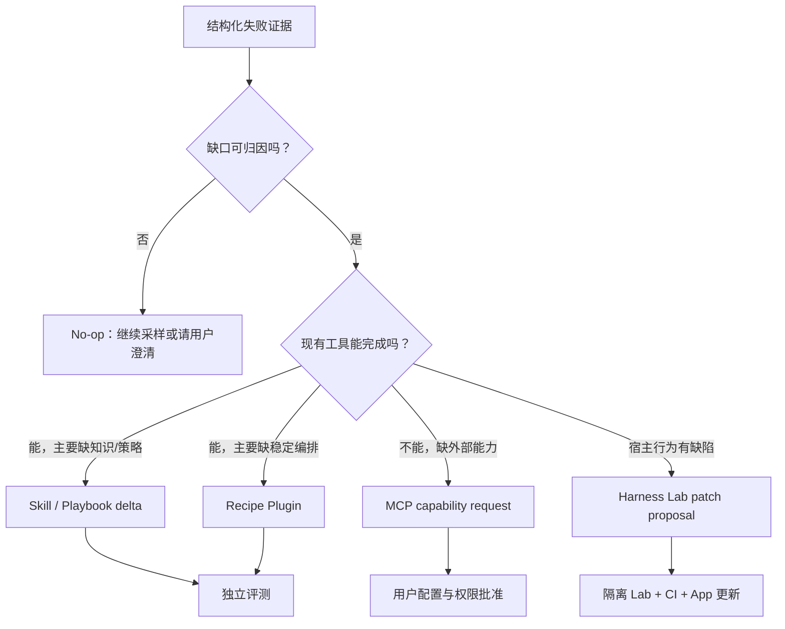
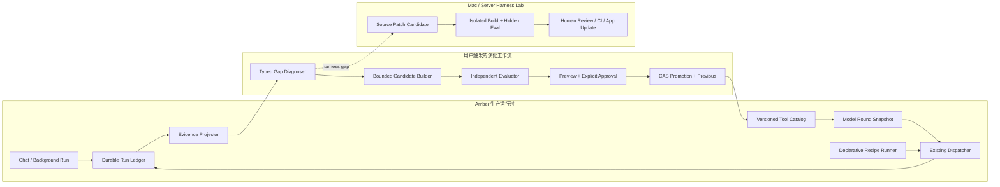

# Amber 自进化与热重载落地计划

- **Status:** Implemented through Phase 4 and closure Slices A–C
- **Last updated:** 2026-08-12
- **Implementation baseline:** `be5b956645bd` (`feat(ios): complete safe skill promotion loop`)
- **Primary scope:** iOS production runtime；必要的数据契约放在 KMP 共享层
- **Relationship to existing plans:** 本计划扩展当前 Skill 安全发布闭环，不取代 [`AGENT_ORCHESTRATION_ADOPTION_PLAN.md`](AGENT_ORCHESTRATION_ADOPTION_PLAN.md)，也不以重写 Agent Kernel 为前提。

> 本文保留实施背景、边界与验收设计；当前落地事实与验证状态以 [`PROJECT_STATE.md`](PROJECT_STATE.md) 为准。任意代码插件与 Harness 自改仍不在 iOS 生产范围内。

## 1. 结论先行

Amber 当前拥有的是一条可靠的 **Skill 候选发布通道**：模型可以在 Workspace 准备 Skill 包，用户看到只读变更，批准后用稳定哈希和 CAS 应用，并能回退上一次导入。它解决的是“怎样安全地修改一个扩展包”，没有解决以下问题：

1. Amber 如何从真实失败中判断自己缺少什么；
2. 应该修改知识、组合现有工具，还是请求新的外部能力；
3. 候选是否真的改善了失败，同时没有破坏原来会做的事；
4. 新能力如何在不重启 App、不替换正在执行的工具的前提下进入下一轮对话；
5. 上线后效果变差时，怎样根据证据撤回，而不是继续“自我感觉良好”。

真正的自进化不是“让模型多写一点反思”，而是一个有边界的闭环：

```text
真实运行事实
  → 可归因的能力缺口
  → 选择正确的扩展载体
  → 生成受约束候选
  → 独立评测与回归保护
  → 显式批准和版本化发布
  → 下一模型轮热加载
  → 部署后观察与回退
```

本计划建议 Amber 先实现 **声明式 Recipe Plugin**。它把已经随 App 发布的工具组合成一个新的、可被模型直接调用的工具，因此首次真正扩展的是“可调用能力”，而不只是提示词。任意可执行代码插件、自改 Agent Kernel 和自动改 Harness 留在隔离的 Mac/服务器实验室，不进入 iOS 生产运行时。

## 2. 前因后果

### 2.1 为什么现有 Skill MVP 不等于自进化

当前 `skill_import` 闭环提供了四个关键基础能力：

- 对有效候选包生成只读 preview；
- 对 installed base 和 Workspace candidate 计算稳定 package hash；
- 批准时重新读取候选，并用 base/candidate CAS 拒绝陈旧目标；
- 原子替换 live package，保留单槽 previous，详情页可显式回退。

这条链很重要，因为任何自进化最终都需要可信的 promotion/rollback。但它仍然依赖模型或用户先知道“应该写哪个 Skill、内容应该是什么”，而且 Skill 主要改变系统提示和操作流程，不能凭空获得新的传感器、执行器或稳定的复合工具。

因此当前能力应准确命名为：

> **安全的扩展制品发布底座**，而不是自进化引擎。

### 2.2 “学习”“能力扩展”“自进化”不是一回事

| 层级 | 发生了什么 | 用户能感受到什么 | 是否属于本计划的自进化 |
| --- | --- | --- | --- |
| 对话记忆 | 记住偏好、事实和上下文 | 下次少问一遍 | 否；这是个性化记忆 |
| Skill / Playbook | 改进说明、方法和决策经验 | 同一工具做得更稳 | 是，但只覆盖知识与策略层 |
| Recipe Plugin | 将现有工具组合成新的 typed tool | 模型真的多出一个可调用动作 | 是；首个生产级能力扩展载体 |
| MCP binding/request | 连接新的外部服务或声明缺失能力 | 获得新传感器/执行器 | 是，但必须由用户提供或批准外部能力 |
| Harness patch | 修改调度、恢复、工具循环或运行时代码 | Agent 本身的工作方式改变 | 是，但只能在隔离 Lab 中评测并随 App 更新发布 |
| 模型升级 | 更换 backbone/model | 推理上限提高 | 不是制品自进化，但有时是唯一正确答案 |

### 2.3 用户真正想要的行为

以“每周把几个 RSS 源整理成中文简报并保存”为例，目标行为不是 Amber 写下一段“以后要记得整理 RSS”的反思，而是：

1. 发现这类请求反复需要抓取、提取、总结、落盘；
2. 判断现有工具已经足够，只缺稳定编排；
3. 生成一个声明式 `rss_digest` Recipe；
4. 用失败样例和旧成功样例验证；
5. 用户看到输入、步骤、权限、变更和评测结果后批准；
6. 下一次模型请求中，`tool_search` 能发现 `recipe__rss_digest`；
7. 工具失败时形成结构化证据，候选可再次修订或回退。

若真实缺口是“没有该 RSS 服务的认证 API”，Amber 必须生成 MCP capability request 或明确告诉用户缺少连接，不能把不存在的能力包装成 Recipe。

## 3. 当前 Amber 基线与可复用接缝

以下是计划编写时基于 `be5b956645bd` 的代码事实；开工时仍须重新核对实时代码和 Git 状态。

### 3.1 已有能力

- `IOSSkillMcpToolService` 和 `IOSSkillFileStore` 已形成 preview → approval → CAS apply → previous rollback 的真实生产路径。
- `IOSAgentRunLedger` 已记录工具开始、结束、效果类别和终态，可作为证据投影的事实来源。
- `IOSAgentToolEngine` 支持在工具批次完成后、下一模型轮开始前刷新生成参数和执行器表，但两者均为 opt-in，且执行器表重建目前只有后台协调器接线（`IOSChatBackgroundGenerationCoordinator`）。前台 Chat 没有 executor table，走 `ChatToolRuntime` kind switch；每轮只在 `ChatGenerationCoordinator.continueAfterToolResult` 从固定的 per-run catalog 重算可见子集。因此 round 边界是现成的，但让新制品进入同一会话下一模型轮所需的前台 catalog 重建是新代码。
- `IosToolExposureBridge` 已支持 deferred exposure / `tool_search`，但一个 run 内的完整 `allTools` 仍是初始化快照；要让新工具进入同一会话的下一模型轮，需要一个最小的目录刷新接缝。
- MCP 展平工具已经证明“动态 descriptor + 通用前缀路由”可以接入现有 Chat，不必为 Recipe 再造一套 Agent loop。
- `ToolSession.kt` 已有 `ToolId`、`ToolVersion`、`ToolSource.Custom` 和权限概念，可逐步对齐新制品身份；当前 iOS 生产路径并未完整使用它，Phase 1 不以 ToolSession 重构为前置条件。

### 3.2 不能误用的现有组件

- `IOSJsSandboxEngine` 每次求值会创建新的 JavaScript VM/Context，但超时主要是放弃等待，不能证明失控脚本已经停止消耗 CPU；它不是生产插件沙箱。
- Chat 前台工具 dispatch 仍有大量显式分支。Recipe 只应增加一个清楚的通用路由，不借机重写 `ChatToolRuntime`、Provider 或 Kernel。
- Ledger 事件是运行事实，不等于“失败原因”。归因必须产生独立的 `GapHypothesis`，并保留证据引用和不确定性。

### 3.3 当前缺口

| 闭环阶段 | 当前状态 | 本计划所需能力 |
| --- | --- | --- |
| Observe | 有 run/tool ledger，但不是演化证据模型 | 从 ledger、tool result、terminal、用户纠正投影 typed evidence |
| Diagnose | 依赖模型自由发挥 | 有限 gap taxonomy、证据引用、允许 no-op |
| Propose | 能写 Skill | 增加声明式 Recipe；后续增加受约束 Playbook delta |
| Evaluate | 只有包结构/生产契约测试 | failure replay、protected success、sealed holdout、预算和报告 |
| Promote | Skill 已有安全闭环 | Recipe 复用同一安全原则，但先保持独立 store，避免过早泛化 |
| Reload | MCP/工具目录可动态构造，但无版本化热发布协议 | catalog revision、round snapshot、executor lease |
| Observe after deploy | 无 candidate outcome 关联 | promotion receipt → 后续 run outcome → rollback recommendation |

## 4. 开源调研结论：采用什么，拒绝什么

调研固定在下列源码快照，避免把移动分支的行为当成稳定事实：

| 项目 | 审阅快照 | 已走通的路 | Amber 应避免的坑 |
| --- | --- | --- | --- |
| [Voyager](https://github.com/MineDojo/Voyager/tree/55e45a8) | `55e45a8` | 从成功轨迹提炼 executable skills，并按环境检索复用 | JSON、向量库、代码文件多份真相容易漂移；生成后立即覆盖；critic 与 actor 同源；缺少可靠 holdout/rollback |
| [ACE](https://github.com/ace-agent/ace/tree/bcb7cea) | `bcb7cea` | 用稳定 bullet ID、helpful/harmful 计数和结构化 playbook 保存经验 | 源码的更新/合并/删除路径仍不完整，容易退化成 append-only 经验污染 |
| [Self-Harness](https://github.com/qzzqzzb/Self-Harness/tree/2720dbb) | `2720dbb` | 用失败诊断、passing regression、hidden holdout、candidate lineage 和 no-op 约束自改 harness | 固定重复次数和“任意正增益”不适合随机性较强的真实产品指标 |
| [GEPA](https://github.com/gepa-ai/gepa/tree/8a2bed9) | `8a2bed9` | 内容哈希、评测缓存、预算、Pareto 搜索适合离线实验 | 搜索池接纳不等于生产晋升；minibatch 变好后全量变差的候选仍可留在 archive |
| [Darwin Gödel Machine](https://github.com/jennyzzt/dgm/tree/a565fd2) | `a565fd2` | patch → benchmark → archive 的真实自修改研究路径 | 依赖 Docker、网络、密钥和离线 benchmark；`keep_all` 式探索绝不能直接映射为生产发布 |
| [LLM-ToolMaker](https://github.com/ctlllll/LLM-ToolMaker/tree/4169219) | `4169219` | maker/user 分工让工具生成和工具使用职责分离 | 直接 `exec` 生成 Python、同模型按已知答案出测试，既不安全也容易 false-green |
| [Harness Self-Improvement](https://github.com/TailinZhou/hsi/tree/f62a8e0) | `f62a8e0` | 强调“执行字节 = 磁盘字节 = 被哈希字节”、fresh import、冻结外部 anchor、随机评测置信度 | 最优单次成绩会放大幸运样本；模型 backbone 的能力上限仍无法靠 harness 修补 |
| [Pi](https://github.com/earendil-works/pi/tree/53fa77c) | `53fa77c` | 工具可在 session 内注册；完整 reload 明确执行 shutdown → invalidate → reload → start | 扩展与宿主同用户权限运行，项目明确不提供内建沙箱；不能把它照搬到 iOS 生产插件 |

“DeepSeek harness 可以在对话里自己写插件并热加载”的说法需要收窄：与本计划最接近、且本次能核对源码的是第三方 HSI 研究仓库，它使用 DeepSeek 模型作为冻结 backbone，不是 DeepSeek 官方发布的通用生产 Harness。其核心价值是评测与制品一致性，不是证明 iOS 可以安全执行下载代码。

综合这些项目，本计划采用五条成熟经验：

1. 训练证据、评测证据和生产晋升是三个不同阶段；
2. 候选必须有内容哈希、父版本、评测报告和清楚的 lineage；
3. 旧的成功样例必须成为保护性回归，不只重放失败；
4. “没有足够证据，不生成候选”是有效结果；
5. 研究 archive 可以保留探索候选，生产 active 只能有一个明确版本并可回退。

## 5. 目标、非目标与产品边界

### 5.1 目标

- 从 durable run facts 生成可审计的演化证据，而不是把自由文本反思当事实。
- 将缺口分类为 Skill/Playbook、Recipe、MCP、Harness 或 model ceiling。
- 让 Amber 可以创建一个由既有工具组成的新 typed Recipe tool。
- 在下一模型轮安全发布新工具，不中断会话、不替换正在执行的 executor。
- 在 promotion 前执行独立、可重复、含旧成功样例的评测。
- 保留 active + previous，任何生产晋升都能明确回退。
- 能力扩展授权按风险分级：T0/T1 由 host 侧 Promotion Policy Engine 自动授权，T2 高危保留人工批准；自治级别用户可配并带全局 kill switch（见 §13.4）。

### 5.2 非目标

- 不在 iOS 下载或执行任意 Swift、JavaScript、Python、Wasm 或 shell 插件。
- 不把 `IOSJsSandboxEngine` 包装成安全 plugin host。
- 不在第一阶段重构 Kernel、Provider、Chat loop 或统一所有工具框架。
- 不先建通用 “Evolution Engine”、候选数据库、Pareto archive 或多版本历史 UI。
- 不用同一个模型的主观 judge 作为唯一晋升依据。
- 不把每次失败都写成长久记忆，也不让 append-only 经验无限增长。
- 不在缺少可靠评测时自动发布副作用能力。
- 不在第一阶段实现 Harness 自改、自改评测器或 meta-evolution。

### 5.3 iOS 与 App Store 边界

Apple 当前审核规则要求 App 不下载、安装或执行会引入或改变 App 功能的代码。生产 iOS 路径因此只允许：

- 声明式 Skill/Playbook 文本；
- 声明式 Recipe，且只能引用 App 已发布的 ToolId；
- 用户配置或批准的 MCP server 描述与连接；
- 数据、模板和非可执行资源。

任意源码 patch、动态脚本、依赖安装和 Harness 自改只能进入 Mac/服务器 Lab。通过 Lab 验证的宿主变更仍需走正常代码审查、CI、签名和 App 更新。

参考：[App Review Guidelines 2.5.2](https://developer.apple.com/app-store/review/guidelines/#software-requirements)。正式上线前仍需由发布负责人重新核对当时有效规则。

## 6. 关键概念与制品路由

### 6.1 Gap taxonomy

诊断器只能从有限类型中选择；不能用一个笼统的 “需要学习” 吞掉所有失败。

| Gap kind | 判定条件 | 候选制品 | 不能做什么 |
| --- | --- | --- | --- |
| `knowledge_or_procedure` | 工具足够，缺领域知识、顺序或判断规则 | Skill / Playbook delta | 不新增虚构工具 |
| `composition` | 现有工具足够，但重复编排不稳定或成本高 | Recipe Plugin | 不执行任意代码 |
| `missing_external_capability` | 缺少 API、权限、认证、传感器或执行器 | MCP capability request/binding | 不用 prompt 假装已经连接 |
| `harness_behavior` | 问题来自调度、恢复、上下文、权限或工具循环 | Harness Lab patch proposal | 不在 iOS 生产中热改宿主代码 |
| `model_ceiling` | 同样证据下，多种 harness/recipe 尝试仍无法可靠完成 | no-op / model escalation | 不制造无效 Skill 掩盖上限 |
| `insufficient_evidence` | 失败不能稳定复现或无法归因 | no candidate | 不强行“自省” |

### 6.2 制品选择决策



## 7. 总体架构



架构上要保持两个闭环分离：

- **生产制品闭环**：Skill、Playbook、Recipe、MCP 配置；可以在 App 内 preview、评测、批准和下一轮热加载。
- **宿主代码闭环**：Harness/Kernel/Provider 代码；只在隔离 Lab 中修改，不能从生产对话直接热执行。

## 8. 核心不变量

所有 Phase 都必须守住以下不变量；任何实现若需要绕过其中一条，应停下重新设计。

1. **Evidence before hypothesis**：诊断必须引用已持久化 run/tool/terminal/user-action 事实。
2. **Hypothesis is not fact**：`GapHypothesis` 明确保存置信度、反证和替代解释。
3. **No evidence, no candidate**：证据不足时返回 no-op，不用“更主动”掩盖不确定性。
4. **Artifact matches the gap**：缺 API 就请求 MCP，不能写一段 Skill 假装有 API。
5. **Executed = stored = hashed**：评测、preview 和执行必须使用同一组 canonical bytes。
6. **One production active version**：设备上只维护 active + previous；探索 archive 不进入生产 store。
7. **Promotion is versioned and CAS-guarded**：授权绑定 base hash、candidate hash、evaluation report hash；授权者身份（用户或 policy engine + 策略版本）记入 receipt。
8. **Reload only at a safe boundary**：工具调用和审批完全收口后，才允许新 catalog revision 进入下一模型轮。
9. **In-flight execution is pinned**：已声明/已调用工具绑定 ToolId、version 和 executor lease，不受后续 promotion 影响。
10. **Permission does not silently widen**：Recipe 的权限包络是其所有 primitive steps 的保守并集。
11. **No blanket approval**：Phase 1 Recipe 不获得绕过内部 mutation gate 的通行证；每个副作用步骤继续走现有审批。
12. **Evaluator is separated from proposer**：sealed holdout 内容不进入候选生成 prompt；同模型 judge 只能是辅助信号。
13. **Protected successes cannot regress silently**：过去通过的代表性样例是晋升硬门禁。
14. **Post-deploy outcome remains attributable**：运行结果记录 active artifact version 和 promotion receipt。
15. **Privacy and budget are explicit**：证据默认保存引用和结构化摘要，不复制整段私密对话；每轮有 token、时间、工具和存储预算。
16. **Autonomous promotion is policy-gated**：自动晋升只能由 host 侧 policy engine 在全部硬门禁通过后授权；proposer/evaluator 模型永远不批准自己的候选。
17. **Every autonomous action is reversible and visible**：自动发布的制品必须有 receipt、用户可见通知和一键回退；不可逆动作不走自动通道。

## 9. 最小数据契约

类型名用于明确 owner 和边界，最终可按现有命名风格调整。Phase 0 只实现真实使用到的字段，不为未来预建通用平台。

### 9.1 EvolutionEvidence

```kotlin
data class EvolutionEvidence(
    val id: String,
    val runId: String,
    val sourceRefs: List<EvidenceRef>,
    val observedOutcome: OutcomeKind,
    val toolId: String?,
    val toolVersion: String?,
    val terminalReason: String?,
    val userSignal: UserSignal?,
    val redactedSummary: String,
    val createdAtEpochMs: Long,
)
```

- `sourceRefs` 指向 ledger event、tool result、message 或审批决定的稳定标识。
- `redactedSummary` 只用于浏览；评测重放从 source owner 取授权数据。
- 第一版只投影明确事实：工具结构化错误、终态、用户拒绝/重试/纠正标记、promotion 后结果。
- 不让模型直接写 `observedOutcome=success`；它必须来自运行时 owner。

### 9.2 GapHypothesis

```kotlin
data class GapHypothesis(
    val id: String,
    val evidenceIds: List<String>,
    val kind: GapKind,
    val claim: String,
    val confidence: Double,
    val alternatives: List<String>,
    val falsifier: String,
    val recommendedArtifact: ArtifactKind?,
)
```

`falsifier` 强迫诊断器说明什么证据会推翻自己。若 `kind=insufficient_evidence`，`recommendedArtifact` 必须为空。

### 9.3 EvolutionCandidateManifest

```kotlin
data class EvolutionCandidateManifest(
    val candidateId: String,
    val artifactKind: ArtifactKind,
    val artifactName: String,
    val parentVersion: String?,
    val baseHash: String?,
    val candidateHash: String,
    val hypothesisId: String,
    val evaluationCaseRefs: List<String>,
    val permissionEnvelope: List<String>,
    val createdAtEpochMs: Long,
)
```

Manifest 只描述 candidate identity。内容继续保存在 Workspace 的候选包中；Phase 1 不新增候选数据库。

### 9.4 EvaluationReport

```kotlin
data class EvaluationReport(
    val reportId: String,
    val candidateHash: String,
    val evaluatorVersion: String,
    val suiteHash: String,
    val results: List<EvaluationCaseResult>,
    val protectedRegressions: Int,
    val unresolvedRisks: List<String>,
    val recommendation: PromotionRecommendation,
    val reportHash: String,
)
```

批准时必须同时绑定 `candidateHash` 与 `reportHash`。修改 candidate 后旧报告立即失效。

### 9.5 ToolCatalogSnapshot 与 ToolLease

```kotlin
data class ToolCatalogSnapshot(
    val revision: Long,
    val descriptors: List<ToolDescriptor>,
    val contentHash: String,
)

data class ToolLease(
    val toolId: String,
    val toolVersion: String,
    val catalogRevision: Long,
    val executorKey: String,
)
```

- 每个模型 round 固定一个 snapshot。
- tool call 使用 round snapshot 取得 lease。
- promotion 只发布新 revision，不修改旧 lease 指向的 executor。
- round 结束且没有引用后，旧 revision 才可释放。

### 9.6 PromotionReceipt

```kotlin
data class PromotionReceipt(
    val artifactId: String,
    val fromHash: String?,
    val toHash: String,
    val evaluationReportHash: String,
    val catalogRevision: Long,
    val approvedBy: String,
    val promotedAtEpochMs: Long,
)
```

receipt 是后部署归因和回退的桥梁，不是多版本历史系统。设备只保留 active receipt 和 previous receipt。

## 10. 声明式 Recipe Plugin

### 10.1 为什么 Recipe 是第一个能力扩展载体

Skill 改变“模型应该怎么做”；Recipe 则为模型提供一个新工具定义和确定的执行图。它既能产生用户可感知的新能力，又能满足 iOS 不执行下载代码的边界。

第一版 Recipe 只支持：

- 有限个顺序 steps；
- 每步引用 App 已发布的 `ToolId` 和最低版本；
- 输入参数、常量和前序 step output 的 typed binding；
- 每步超时和总 step 数上限；
- 明确的输出 schema；
- 无循环、无递归、无动态代码、无 recipe 调 recipe；
- 不允许候选自行注册新的 primitive executor。

### 10.2 示例 manifest

```yaml
schema: amber.recipe.v1
name: rss_digest
version: 1.0.0
description: 抓取一个 RSS 源，整理成中文简报并保存到 Workspace
inputs:
  feed_url:
    type: string
  output_path:
    type: string
steps:
  - id: fetch
    tool: scrape_web
    arguments:
      url: ${input.feed_url}
  - id: summarize
    tool: summarize_text
    arguments:
      text: ${step.fetch.output.text}
      language: zh-CN
  - id: save
    tool: workspace_file_write
    arguments:
      path: ${input.output_path}
      content: ${step.summarize.output.text}
outputs:
  file_path: ${step.save.output.path}
```

这只是语义示例，实际 ToolId 和 schema 以开工时的生产 catalog 为准。

### 10.3 执行语义

1. 调用前按 recipe version、输入和当前 primitive catalog 解析出 immutable execution plan。
2. 校验所有 ToolId 存在、版本满足、参数 binding 能静态解析。
3. 为本次调用创建 recipe execution id，并把每个 step 正常写入现有 ledger。
4. 每个 primitive 继续通过现有 dispatcher 执行，不复制工具实现。
5. 任何 mutation step 继续使用现有批准机制；Phase 1 不提供 recipe 级 blanket approval。
6. step 失败后默认停止，返回失败 step、结构化错误和已完成副作用；不自动补偿不可逆外部动作。
7. Recipe 的整体 effect class 取所有可能 steps 的保守上界，用于声明和 UI 提示，但不替代 step 自身权限检查。

### 10.4 Store 与发布

不要立即把 `IOSSkillFileStore` 泛化成“所有演化制品 store”。第一版新增独立、很小的 `IOSRecipeFileStore`，复用相同原则：

- canonical package bytes 和稳定 hash；
- read-only preview；
- base/candidate CAS；
- active + previous；
- 同卷 staging 和 replace；
- rollback 再验 expected manifest。

等第二类制品也证明需要同样实现后，再考虑提取共享 package primitive。这样避免为抽象而抽象，也避免破坏已验证的 Skill 路径。

## 11. 证据、诊断与经验沉淀

### 11.1 Evidence Projector

推荐新增 iOS owner `IOSEvolutionEvidenceProjector`，从以下事实源按需投影：

- `IOSAgentRunLedger` 的 tool started/finished/effect/terminal；
- tool result 的结构化错误码和证据引用；
- 用户明确动作：拒绝批准、点击重试、选择回退、显式标记结果错误；
- promotion receipt 和其后同类任务结果。

第一版不要自动把任意自然语言里的“你错了”永久化。可将候选纠正显示给用户确认，或者只作为低置信 hypothesis 输入。

### 11.2 Gap Diagnoser

诊断可以由模型辅助，但输出必须通过 host schema 校验：

- 至少一个 evidence reference；
- 只能选择定义好的 gap kind；
- 必须给出 alternative 和 falsifier；
- 不能声明不存在的 ToolId/MCP connection；
- 证据不足时输出 no-op。

诊断器本身不拥有文件写权限，也不能直接 promotion。

### 11.3 Experience / Playbook

经验层在 Recipe 跑通后再做，避免先造一个只会无限追加“教训”的记忆池。

每条 experience 至少包含：

- 稳定 ID；
- 适用条件与反例；
- 来源 evidence refs；
- helpful/harmful 计数；
- `active / superseded / rejected` 状态；
- 与其它规则的冲突关系。

Curator 必须同时支持 add、merge、update、supersede 和 delete。检索只取与当前任务相关的有限 top-k，不把全部经验塞进 system prompt。

## 12. 独立评测设计

### 12.1 评测套件组成

一个候选的 suite 至少由三类 case 组成：

1. **Failure replay**：触发此次 hypothesis 的失败样例；候选必须解决它或明确缩小失败面。
2. **Protected success**：相同领域过去已经通过的代表性样例；不得产生关键回归。
3. **Sealed holdout**：由 host/用户/固定 fixture 持有、对 proposer 不可见的样例；防止候选只对着失败样例写答案。

没有 sealed holdout 时，报告必须明确降级为“人工判断候选”，不得进入自动 promotion。

### 12.2 评测层级

| 层级 | 检查内容 | 失败处理 |
| --- | --- | --- |
| Static | schema、路径、ToolId、版本、binding、权限包络、资源预算 | 直接拒绝 candidate |
| Deterministic contract | fake primitive 下的步骤、参数、错误传播、ledger、hash 一致性 | 直接拒绝 candidate |
| Failure replay | 原失败是否修复 | 报告为不建议晋升 |
| Protected regression | 旧成功是否被破坏 | 硬拒绝，除非用户明确改变产品契约并更新 suite |
| Sealed holdout | 未见样例上的效果 | 纳入晋升建议 |
| Stochastic repeat | 模型参与时的稳定性、成本、延迟分布 | 展示原始样本和不确定性，不取最好单次 |

### 12.3 评分原则

- deterministic case 必须全过，不做加权平均掩盖硬失败；
- protected case 的关键断言不可回归；
- 模型参与的 case 使用成对重复，报告均值、离散度和最差样本；
- 不在没有真实分布基线前写死“重复 2 次”或“提升 1% 即晋升”等魔法阈值；
- LLM judge 只能评估软质量，并与结构化结果、用户选择、成本和延迟并列展示；
- proposer 不读取 sealed expected answer，也不根据 holdout 结果循环修补同一个 candidate；失败后创建新 candidate lineage。

## 13. Promotion 与热重载协议

### 13.1 Promotion 流程

```text
prepare candidate
  → canonicalize + hash
  → evaluate exact bytes
  → create immutable evaluation report
  → policy evaluation（T0/T1 自动授权；T2 展示 artifact diff + permissions + report 后人工批准）
  → re-read candidate
  → verify base/candidate/report CAS
  → publish package active + previous
  → publish new catalog revision
  → next model round acquires new snapshot
```

候选文件、评测文件或 live base 任一发生变化，批准必须 fail closed，重新 preview，而不是“尽量应用”。

### 13.2 安全热加载边界

“对话中热加载”在 Amber 中应定义为：

> 当前工具调用和审批收口后，新制品在同一会话的**下一模型轮**可见；不要求正在生成的 token stream 或正在执行的工具中途改变。

最小实现接缝：

1. 新增 versioned `IOSDynamicToolRegistry`，持有 immutable catalog snapshots 和 recipe executor leases。
2. `IOSAgentToolEngine` 在每个 model round 开始前读取一次 snapshot，并同时刷新 declarations 与 executor table。
3. 给 `IosToolExposureBridge` 增加受控的 catalog refresh，或在 round 边界重建 bridge；选择改动更小且能维持 exposure 语义的方案。
4. 新工具默认 deferred，通过 `tool_search` 暴露；避免每个 recipe 都占据主 prompt。
5. `ChatToolRuntime` 只新增一个 `recipe__*` 通用路由，解析后交给 recipe runner；不为每个 recipe 生成 Swift 分支。
6. foreground 和 background 只有在同时具备 descriptor 与 executor 时才声明 recipe；未完成后台 parity 前宁可不暴露，不能声明后无法执行。

### 13.3 In-flight pinning

- 模型在 round R 看到 `recipe__rss_digest@1`，此次调用始终使用 R 的 executor lease。
- 即使用户同时把 active 晋升到 v2，v1 调用也完成或取消后才释放。
- 下一 round 可以看到 v2；旧 tool call 不重路由到 v2。
- rollback 发布的是新 catalog revision，不原地修改旧 snapshot。

这比“替换全局字典中的 closure”稍复杂，但能消除最危险的调用中途换实现问题。

### 13.4 Promotion Policy Engine 与风险分级

授权决定由 host 侧确定性 policy engine 做出，不由 proposer 模型做出；模型只能像 Codex `on-request` 那样主动声明候选需要提权。分级映射到现有 `IOSToolEffectClassMapping` 的 effect class：

| 层级 | 制品范围 | 授权方式 |
| --- | --- | --- |
| T0 | Skill/Playbook 纯文本 delta；全部 step 为 `pure` 的 Recipe（`networkRead` step 升入 T1） | policy engine 自动授权，事后通知 |
| T1 | 仅含 `networkRead` 出网读取 step、或含本地可逆副作用 step（如 Workspace 写入）、权限包络不扩大的 Recipe | 自动授权 + 通知卡 + 一键回退 |
| T2 | 外部副作用、破坏性操作、权限包络扩大、新 MCP server 绑定 | 人工批准 |
| 永不自动 | 无 sealed holdout、任一 deterministic/protected 门禁失败、预算耗尽、该制品处于熔断期 | 拒绝或降级为人工草稿 |

- 发布自治不等于调用自治：不变量 11 不变，Recipe 内 mutation step 每次调用仍走现有审批。
- 自动授权 receipt 的 `approvedBy` 记录 policy engine 标识与策略版本，CAS 语义与人工批准一致。
- 熔断：同一制品连续两次 rollback 或评测漂移，自动关闭该制品自治并通知用户。
- 设置提供自治级别（全部人工 / T0+T1 自动（默认） / 仅通知）与全局 kill switch。
- Phase 1 开工前必须先审计现有 primitive 的 effect class 标注；错标先修再开自治。

## 14. 用户体验

### 14.1 用户触发方式

Phase 1–2 只提供显式入口：

- 对失败回答选择“分析并改进”；
- 在 Skill/Recipe 详情中选择“用最近失败生成候选”；
- 对话中由 Amber 建议“我发现这是可复用缺口，是否准备扩展候选？”，用户确认后才开始。

不在后台静默生成候选。T0/T1 自动晋升发布后必须产生用户可见通知与一键回退入口，不静默换版。

### 14.2 候选审批卡必须展示（T2 人工批准）

- 这次观察到了什么，引用哪些 run/case；
- 诊断为哪类 gap，替代解释是什么；
- 新建还是更新哪个 artifact；
- 变更文件、前后摘要和完整 diff 入口；
- 新增/扩大了哪些权限；
- failure replay、protected cases、holdout 的结果；
- base、candidate、report 的短 hash；
- “批准后从下一模型轮生效”的明确文案；
- 回退入口和已知未验证项。

可以复用现有 MCP/Skill approval card 的视觉结构，但不要把评测摘要塞进不可滚动的大卡；详细报告进入可滚动 disclosure 或独立 sheet。T0/T1 自动晋升使用同一视觉结构的精简通知卡：发生了什么、评测摘要、短 hash、一键回退。

### 14.3 用户可见例子

#### 例 1：组合能力扩展

Amber 连续两次人工完成“抓网页 → 提取 → 总结 → 保存”。用户点“分析并改进”后，Amber 生成 `web_digest` Recipe。批准后无需重启，下一轮 `tool_search` 返回新工具，模型可直接调用。

#### 例 2：识别真正缺失的能力

用户要读取一个需要 OAuth 的企业系统。诊断发现没有连接和 token，Amber 不生成假 Recipe，而是创建 MCP capability request，列出所需 server、权限和认证步骤。

#### 例 3：从失败中修正策略

某个 Recipe 在网页为空时仍继续写空文件。证据指向 step error propagation，候选 v2 增加“fetch 无正文则停止”。failure replay 通过、旧成功样例不回归，批准后 v2 在下一轮生效；已经开始的 v1 调用不被替换。

#### 例 4：诚实 no-op

一次回答不好，但既没有稳定复现，也无法判断是模型能力、提示、工具还是网络。诊断输出 `insufficient_evidence`，建议收集一个对照样例，而不是写一条“以后更认真”的 Skill。

## 15. 分阶段实施计划

每个 Phase 都是独立可交付闭环。后一个 Phase 不应成为前一个 Phase 无限扩张的理由。

### Phase 0：证据与身份契约

**目标：** 让“为什么要改、改了哪个版本、结果怎样”可被机器和人追溯。

**改动范围：**

- 在 KMP tools/runtime API 增加最小 `ArtifactId/Version`、`EvolutionEvidence`、`GapKind`、`PromotionReceipt` 契约；若只被 iOS 使用，先保留在 iOS，直到第二个 consumer 出现。
- 给 `IOSAgentRunLedger` 的 tool finished/terminal payload 补 artifact version、结构化 outcome 和 source reference；不复制完整私密正文。
- 新增按需 evidence projector，不新增长期候选 DB。
- 为当前 Skill promotion 写 receipt，使后续结果能关联到具体 candidate hash。

**预计主要 owner：**

- `iosApp/iosApp/IOSAgentRunLedger.swift`
- `iosApp/iosApp/IOSSkillMcpTools.swift`
- `iosApp/iosApp/IOSSkillFileStore.swift`
- 必要时 `feature/tools/api` 的小型共享数据契约

**验收：**

1. 一次真实 scripted tool run 结束后，可从 ledger 投影出带 source refs 的 evidence。
2. Skill promotion receipt 的 hash 与实际 live package 一致。
3. 用户消息正文不被复制进新 evidence store。
4. 旧 ledger 可读取；新增字段向后兼容。

**停止条件：** 如果 ledger 无法稳定引用 tool result/message owner，先修引用契约，不要另建一份全量演化日志。

### Phase 1：手工候选 Recipe + 下一轮热加载

**目标：** 首次让 Amber 真正获得一个新的 callable tool，但候选仍由用户明确触发和批准。

**改动范围：**

- 定义 `amber.recipe.v1` 和 validator。
- 新增 `IOSRecipeFileStore`，实现 preview/base-candidate hash/CAS/active-previous/rollback。
- 新增顺序 Recipe runner，只组合既有 ToolId。
- 新增 versioned dynamic tool registry 和 round snapshot/lease。
- `ChatToolRuntime` 增加一个 recipe 前缀路由。
- `IOSAgentToolEngine` 在下一 model round 获取新 catalog snapshot。
- 审批 UI 展示 manifest diff、permissions、hash 和“下一轮生效”。

**预计主要 owner：**

- 新增 `iosApp/iosApp/IOSRecipeModels.swift`
- 新增 `iosApp/iosApp/IOSRecipeFileStore.swift`
- 新增 `iosApp/iosApp/IOSRecipeRunner.swift`
- 新增 `iosApp/iosApp/IOSDynamicToolRegistry.swift`
- `iosApp/iosApp/IOSAgentToolEngine.swift`（后台 round 边界）
- `iosApp/iosApp/ChatGenerationCoordinator.swift`（前台 round 边界接缝：`continueAfterToolResult`）
- `iosApp/iosApp/ChatViewModel.swift`（catalog 目前每 run 只组装一次处：`makeTextGenerationParams`）
- `iosApp/iosApp/ChatToolRuntime.swift`
- `feature/tools/api/.../IosToolExposureBridge.kt`
- 复用 `ChatToolSupport.swift` / 现有审批卡的最小扩展

**真实契约测试：**

1. 导入一个由 read-only primitive 组成的 Recipe；preview 零写，批准后 active package 与 hash 一致。
2. 不重启同一 Chat，在当前工具批次结束后进入下一 model round；scripted provider 先 `tool_search`，再调用新 Recipe 并得到真实 primitive result。
3. v1 调用持有 lease 时晋升 v2；v1 完成使用旧实现，下一 round 才看到 v2。
4. stale base/candidate/report 任一变化都零写拒绝。
5. rollback 后下一 round 看到 previous；已开始调用不被中途替换。
6. Recipe 含 mutation step 时仍触发现有 mutation approval，不能借 Recipe 绕过。
7. 现有 primitive 的 effect class 标注审计完成，错标已修正（自治前置条件）。

**不在本 Phase 做：** 自动诊断、自动写候选、Playbook、后台自动演化、任意脚本。

### Phase 2：用户触发的诊断、候选与独立评测

**目标：** 从选定失败出发，形成“证据 → diagnosis → candidate → evaluation → approval”的完整人工监督闭环。

**改动范围：**

- 新增 typed gap diagnoser；无证据时必须 no-op。
- Candidate Builder 只生成 Skill delta 或 Recipe manifest；MCP/harness 缺口生成 request，不直接安装。
- 新增本地 evaluator：static、deterministic fixture、failure replay、protected success、sealed holdout。
- Evaluation report 使用 exact candidate bytes，并与 approval CAS 绑定。
- UI 增加“分析并改进”和评测报告展示。
- 新增 host 侧 Promotion Policy Engine：T0/T1 自动授权、T2 人工批准、预算/冷却/熔断（§13.4）。

**预计主要 owner：**

- 新增 `IOSEvolutionEvidenceProjector.swift`
- 新增 `IOSEvolutionDiagnoser.swift`
- 新增 `IOSEvolutionCandidateBuilder.swift`
- 新增 `IOSArtifactEvaluator.swift`
- 现有 Skill/Recipe service 的 prepared approval context
- `ChatGenerationCoordinator` 只接最小工作流状态，不改 generation loop

**真实契约测试：**

1. 可归因 composition failure 生成 Recipe；missing capability 生成 MCP request；证据不足返回 no-op。
2. proposer 看不到 sealed case 内容；修改 candidate 后旧 report 失效。
3. failure replay 变好但 protected success 回归时，promotion 被拒绝。
4. 同模型 judge 给高分但 deterministic contract 失败时，promotion 仍被拒绝。
5. 用户拒绝候选后不写 active，不偷偷重试发布。

**停止条件：** 如果无法构造至少一个 failure replay 和一个 protected success，不做自动 promotion，只允许把候选作为人工草稿打开。

### Phase 3：可治理的 Experience / Playbook

**目标：** 将跨任务的稳定经验沉淀为可更新、可冲突检测、可删除的 Playbook，而不是无限追加记忆。

**改动范围：**

- Experience stable ID、evidence provenance、状态和 helpful/harmful 计数。
- Curator 完整支持 add/merge/update/supersede/delete。
- 按当前任务检索有限 top-k；与现有 Skill 注入预算一起核算。
- 对规则冲突、长期无帮助和引发失败的条目提出 supersede/delete 候选。

**验收：**

1. 同一经验重复出现时更新原 ID，不新增近义垃圾条目。
2. 冲突规则不会同时无提示注入。
3. harmful 达到人工定义条件时产生删除/降级建议，但仍需批准。
4. system prompt 大小有稳定预算；经验数量增长不会线性撑爆每轮上下文。

### Phase 4：有限自治扩面

**目标：** 在 T0/T1 发布自治已上线的基础上，自动完成低风险的证据聚合与 candidate preparation，并按真实数据评估是否放宽自治范围。

**建议默认策略：**

- 后台可自动聚合证据和准备候选（发布仍走 §13.4 分级授权）；
- T2 中新工具、权限扩大、mutation、MCP 和外部写入始终保持人工批准；
- 每个自动动作有日/周预算、冷却时间和 kill switch；
- 连续两次 rollback 或评测漂移后自动关闭该 artifact 的自治更新。

**进入条件：** Phase 2 已积累真实 promotion/rollback 数据，能够量化 false-positive、回归率和用户拒绝率。没有这些数据不得凭感觉扩大。

### Phase 5：Harness Self-Improvement Lab

**目标：** 在 Mac/服务器隔离环境研究 Amber Harness 源码改进，不把实验代码直接注入 iOS。

**最小 Lab 流程：**

1. 从生产证据生成 harness gap proposal；
2. 在独立 branch/worktree 生成 source patch；
3. 在无用户凭证、默认无网络的 container/microVM 构建；
4. 执行固定 runtime canary、passing regression 和 hidden holdout；
5. 验证构建字节、评测字节和 commit hash 一致；
6. 人工 review、CI、签名、正常 App 更新；
7. release telemetry 关联 patch lineage，必要时版本回滚。

**禁止：** 生产 iPhone 自己修改并加载 Amber 可执行代码；Lab 修改 evaluator 后继续用同一评测结果；候选访问生产 keychain、SSH key、provider token 或用户私密文件。

### Phase 6：Meta-evolution 研究闸门

只有 Phase 5 长期稳定后，才能研究“改进候选生成器/评测器本身”。它不是已承诺路线。进入前必须有：

- evaluator version 冻结和双轨对照；
- 防 reward hacking 的外部 holdout；
- 独立 human/CI owner；
- 可复现实验预算；
- 明确的停止和回滚协议。

## 16. 生产调用链落点

### 16.1 Foreground Chat

```text
ChatGenerationCoordinator（前台 round 循环为蹦床式递归，不经 IOSAgentToolEngine）
  → continueAfterToolResult 的 round 边界
  → acquire ToolCatalogSnapshot(revision R)
  → build declarations + recipe lease context from the same snapshot
  → model emits recipe__name call
  → ChatToolRuntime generic recipe route
  → IOSRecipeRunner resolves immutable plan（调用时钉住 recipe version）
  → existing primitive dispatch + approval + ledger
  → tool batch settles
  → optional promotion publishes revision R+1
  → next model round acquires R+1
```

声明和执行器必须来自同一个 snapshot，避免“模型看见工具但执行表没有”或“执行器已换而 schema 仍旧”。

### 16.2 Background

后台路径必须单独证明 parity。Phase 1 可以先不向 background catalog 声明 Recipe，但不能复用 foreground descriptor 后在执行时返回“unsupported”。进入后台支持前要验证：

- 相同 registry snapshot；
- 相同 permission/effect policy；
- 审批需要回 App 时能耐久化恢复；
- task expiration/cancel 后 lease 和 ledger 正确收口；
- promotion 不发生在未完成 tool batch 中间。

### 16.3 Tool search

Recipe 默认 deferred。`tool_search` 返回 descriptor、version、permission summary 和 source=`custom.recipe`。搜索结果不携带 manifest 正文；模型只有在调用时才使用 schema。这样控制主 prompt 大小，也复用现有 exposure 机制。

## 17. 测试与验证矩阵

测试坚持少量真实生产路径，不用源码字符串锚点，不建大而空的矩阵。

| 风险 | 最小证据 | 不足以证明什么 |
| --- | --- | --- |
| Manifest/Store | isolated real file store：preview/apply/rollback/stale CAS/crash cut | 不能证明 Chat 真能发现和调用 |
| Dynamic registry | round snapshot + lease contract | 不能证明 provider loop 串接正确 |
| Foreground E2E | scripted provider：search → call Recipe → primitive result → next turn terminal | 不能证明真实 provider 质量 |
| Approval | 真实 Coordinator prepared context、拒绝/陈旧 request id、durable pause | UI snapshot 不替代调用链测试 |
| Evaluation | proposer/holdout 隔离、exact bytes/hash、protected regression | 同模型高分不等于生产收益 |
| Background | expiration/cancel/recovery canary | 前台通过不代表后台通过 |
| UI | Simulator 小屏/横屏/大字号/VoiceOver；真机至少一次审批与回退 | parse/build 不证明布局和辅助功能 |
| Release | App Store policy review、真实 provider、设备资源与隐私审计 | 本地测试不证明上架合规 |

### 17.1 Phase 1 必跑门禁

- KMP：受影响 tools/runtime API 的 JVM test 与 iOS simulator compile。
- Swift：Recipe store/runner/registry 定点测试。
- iOS：`build-for-testing` 后运行 scripted provider 热加载 canary。
- Simulator：审批卡大 diff、Recipe 详情、回退、小屏和辅助字号。
- `git diff --check`，并确认生成工程/DerivedData 没有污染工作区。

### 17.2 真机和真实 provider

以下只能在相应阶段诚实标记为未验证，不能用模拟器结果代替：

- 后台挂起、强杀和恢复；
- Watch/iPhone 双端审批时序；
- 大 Recipe 的内存、耗电和延迟；
- 真实 provider 对新 deferred tool 的发现和正确调用；
- App Store/TestFlight 行为与审核解释。

## 18. 存储、隐私与资源预算

### 18.1 设备存储

- Production store：每个 artifact 只保留 `active`、`previous`、manifest/receipt。
- Workspace：最多一个待批准 candidate；新 candidate 替换旧 candidate 前需明确提示。
- Evaluation cache：按 candidate hash + suite hash，可有总大小和 LRU；不是候选历史库。
- 完整实验 archive 只在 Lab/开发环境保存。

### 18.2 隐私

- Evidence 默认保存 source refs、错误码和脱敏摘要，不复制整段聊天。
- 将真实输入加入 evaluation case 前必须显示数据范围；涉及敏感内容时只允许本地评测。
- 不把用户数据自动发送到第三方 judge/model。
- Harness Lab fixture 必须脱敏；生产凭证不可挂载。

### 18.3 预算

每次演化任务至少要有：

- proposer token budget；
- evaluator token/case/repeat budget；
- tool call 和 wall-clock 上限；
- artifact 文件数/总字节/step 数上限；
- 每日候选和后台尝试上限。

预算耗尽返回 typed terminal outcome，不静默降低评测标准后发布。

## 19. 观测指标

上线后优先记录可解释的率，而不是一个模糊“智能度”分数：

- evidence → no-op / candidate 的比例；
- candidate static fail、evaluation fail、用户拒绝、用户批准比例；
- protected regression 拦截次数；
- promotion 后同类任务成功率、成本和延迟变化；
- 7/30 天 rollback 率；
- recipe step 失败分布和权限拒绝分布；
- stale CAS 发生率；
- catalog revision 与执行 lease 不一致应恒为 0；
- 用户认为“确实多了能力”与“只是更谨慎”的反馈比例。

这些指标用于决定是否进入 Phase 4，不用于奖励模型制造更多候选。

## 20. 已知风险与明确取舍

| 风险 | 本计划的取舍 |
| --- | --- |
| 把反思当事实 | 只从 durable owner 投影 evidence；模型输出是 hypothesis |
| 同模型出题、答题、判卷 | sealed case 不给 proposer；judge 不是唯一门禁 |
| 经验池无限膨胀 | Phase 3 才做，并要求 merge/supersede/delete 与注入预算 |
| Recipe 变成绕审批脚本 | 无代码、无递归；primitive 正常 dispatch 和 approval |
| 热重载造成 schema/executor 错位 | round snapshot 同时提供声明与 lease |
| 正在执行时被替换 | publish 新 revision，不原地替换旧 executor |
| 为了统一而重构整套 runtime | 只加 registry seam 和一个 recipe route |
| iOS 动态代码合规风险 | 生产只运行声明式制品；代码 patch 留在 Lab/App update |
| 研究搜索策略直接进入生产 | archive 与 active 分离；生产必须显式 promotion |
| 随机评测选中幸运样本 | 报告分布与最差样本，不用最好单次决定 |
| 文件与 Settings 跨介质强杀窗口 | 保留为当前 MVP 边界；若真实 crash 证据出现，再单独设计 journal，不预建恢复框架 |
| 模型能力上限被误判为 Skill 缺口 | taxonomy 包含 `model_ceiling` 和 no-op |
| 自治发布抖动或垃圾候选 | 评测硬门禁 + 无 sealed holdout 不自动 + 预算/冷却/熔断 + 一键回退 |
| effect class 错标导致“只读”组合实际外泄 | 开自治前审计全部 primitive 标注；网络读取类默认升一级处理 |

## 21. 提交边界建议

实施时按可独立 review/回退的领域提交，不把整份计划一次性铺开：

1. `evolution evidence contract`：ledger refs、artifact identity、receipt 和真实投影测试；
2. `declarative recipe store`：schema、validator、hash/CAS/rollback；
3. `recipe runner`：只串已有 dispatcher，含 mutation approval 契约；
4. `versioned tool registry`：round snapshot、lease、tool_search、foreground canary；
5. `recipe approval UI`：preview/report/rollback，完成 Simulator 可访问性验证；
6. `evaluator`：failure/protected/sealed case 与 report binding；
7. `user-triggered evolution flow`：diagnose → candidate → evaluate → approve；
8. 之后才分别做 Experience Curator、后台 parity、有限自治和 Harness Lab。

每个提交都必须保持工作区 owner 清楚；不要在同一提交夹带 Provider、Kernel、Novel、Android UI 或 vendor 清理。

## 22. 开工顺序与首个垂直切口

推荐第一个真正开工的切口不是“自动自省”，而是：

> **用户手工提供一个合法 Recipe 候选 → preview → 明确批准 → CAS 发布 → 同一会话下一模型轮通过 tool_search 发现并调用 → rollback 后下一轮恢复 previous。**

这条链先证明三个最关键但当前不存在的事实：

1. Amber 的可调用工具集确实能扩展；
2. 热加载不会打断或串换正在执行的工具；
3. 动态制品仍服从现有审批、账本和回退。

只有这条链跑通，才值得把诊断器和候选生成器接上去。否则“自我反思”只会更快地产生无法可靠执行的文件。

## 23. Definition of Done

### Recipe 热加载 MVP 完成

> 验收状态（2026-08-10，最终整体复核）：18/19 满足；唯一未勾项为模拟器视觉/无障碍验证（无代码证据可替代，需真机/模拟器人工过一遍）。

- [x] Recipe 是声明式、typed、无任意代码的制品。（`amber.recipe.v1` manifest + 纯函数 validator，≤8 步、无循环/递归/任意代码）
- [x] preview/apply/rollback/stale CAS 走真实生产路径。（`IOSRecipeToolService.recipe_import` preview→CAS→apply→registry.refresh→receipt；Recipes UI 回退）
- [x] candidate exact bytes 与评测/哈希/执行一致。（store 保留 canonical bytes，报告 `matches(candidateHash:)` 硬校验）
- [x] 同一会话下一模型轮能 search 并调用新 Recipe。（round 边界 bridge 重建 + 引擎级热加载 canary 测试）
- [x] in-flight v1 不被 v2 promotion 替换。（snapshot 内嵌 manifest，ARC 钉住在飞 revision）
- [x] mutation step 不绕过现有批准。（step 级 gate + checkpoint 暂停/恢复 + `skipGateForFirstStep` 防重复 gate）
- [x] foreground declaration/executor 不错位；background 未支持时不声明。（后台 handoff 过滤 `recipe__*`）
- [x] scripted provider canary 走到 durable terminal。（`IOSRecipeIntegrationTests` 引擎级 canary）
- [ ] Simulator 完成小屏、大字号、VoiceOver、长 diff 验证。（未做：无任何视觉/无障碍验证证据）

### 用户监督的自进化闭环完成

- [x] evidence 来自 durable owners，并可追到原 run/tool result。（ledger Room 行 + sourceRefs；projector 按需投影不落第二份事实）
- [x] diagnosis 使用有限 taxonomy，支持 no-op 和反证。（host-schema 校验 `IOSGapHypothesis` + falsifier 字段 + 证据不足 no-op）
- [x] candidate artifact 与 gap kind 匹配。（candidate builder 按 kind 路由；recipe 候选先 validate + canonicalize）
- [x] evaluation 同时含 failure replay、protected success 和 sealed holdout，或明确降级。（五层确定性评测；无 sealed holdout → `manualJudgmentRequired`，永不自动晋升）
- [x] approval 绑定 base/candidate/report hash。（批准卡三 hash；policy engine `report_candidate_hash_mismatch` 硬门禁）
- [x] promotion 后 outcome 可归因到 receipt/version。（receipt store active+previous；ledger payload 带 artifactId/artifactVersion）
- [x] rollback 能恢复制品和下一轮 catalog 行为。（store 回退重验 manifest + registry 重刷；详情页与通知卡回退走同一 workflow 方法）
- [x] T0/T1 自动晋升经 policy engine 硬门禁，T2 保留人工批准。（§13.4 分级矩阵 + 冷却/日预算/熔断；protected 回归任何档位硬拒绝）
- [x] 自动发布有 receipt、通知与一键回退；熔断与 kill switch 生效。（通知卡一键回退；连续回退触发熔断通知；kill switch 全局降级人工）
- [x] 没有候选数据库、后台自治或 Kernel 重写等越界实现。（最终整体复核逐条采样 17 条不变量通过）

## 24. 开工前仍需确认的产品决策

以下问题不阻塞写计划，但会影响对应 Phase；本文给出推荐默认值：

| 决策 | 推荐默认值 |
| --- | --- |
| Recipe 是否跨设备同步 | Phase 1 不同步；先证明本机 identity/rollback |
| Android 何时支持 | iOS 跑通 schema 后再共享解释器契约，不提前做双端 UI |
| Watch 是否能批准新 Recipe | 初期只能拒绝或“在 iPhone 查看”；完整权限和评测需在 iPhone 审阅 |
| 自动 promotion | T0/T1 自 Phase 2 起默认自动（全局可关）；T2 始终人工；扩面按 Phase 4 数据闸门 |
| 评测调用哪个模型 | 与 proposer 可同 provider，但 prompt/context 隔离；关键门禁仍靠结构化和 sealed evidence |
| Lab 部署位置 | 开发 Mac 或受控服务器；无生产凭证、默认无网络 |
| 多版本历史 | 不做；设备仅 active + previous，Lab 才保存 lineage archive |

## 25. 参考资料

- [Apple App Review Guidelines 2.5.2](https://developer.apple.com/app-store/review/guidelines/#software-requirements)
- [Voyager](https://github.com/MineDojo/Voyager/tree/55e45a8)
- [ACE](https://github.com/ace-agent/ace/tree/bcb7cea)
- [Self-Harness](https://github.com/qzzqzzb/Self-Harness/tree/2720dbb)
- [GEPA](https://github.com/gepa-ai/gepa/tree/8a2bed9)
- [Darwin Gödel Machine](https://github.com/jennyzzt/dgm/tree/a565fd2)
- [LLM-ToolMaker](https://github.com/ctlllll/LLM-ToolMaker/tree/4169219)
- [Harness Self-Improvement](https://github.com/TailinZhou/hsi/tree/f62a8e0)
- [Pi](https://github.com/earendil-works/pi/tree/53fa77c)
