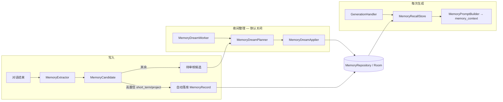
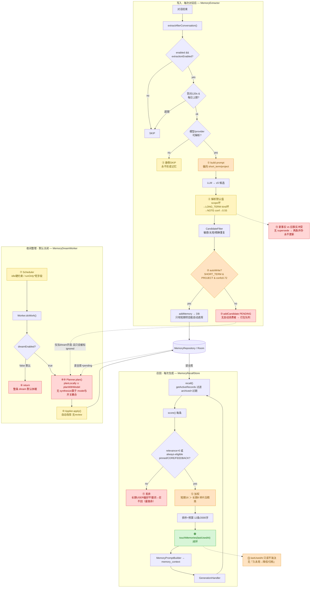
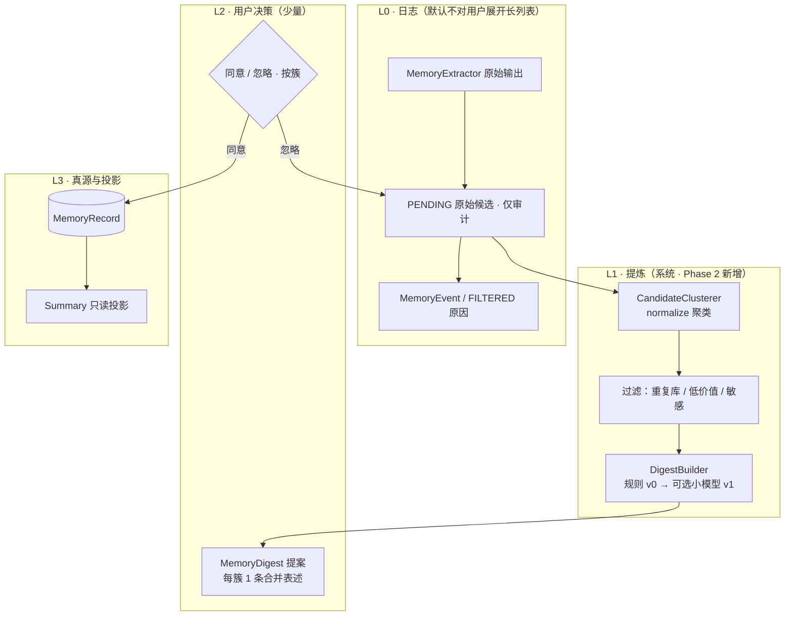
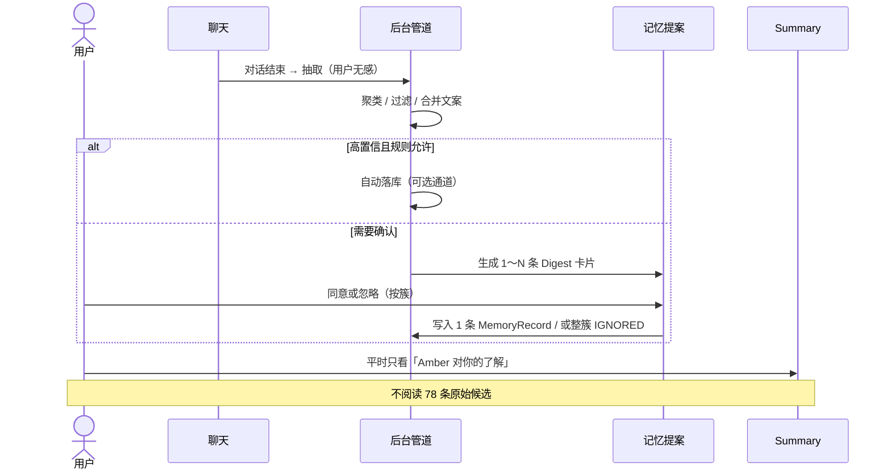

# AmberAgent 记忆系统 × OpenAI Dreaming：三方讨论稿

> **用途：** 供 **人类（产品/工程负责人）**、**Codex**、**Claude** 三方异步讨论与拍板。  
> **状态：** Draft · 2026-06-05  
> **范围：** 仅讨论与设计；**本稿不承诺任何代码变更**。实现须另开 plan / PR。  
> **参考：** [OpenAI — Dreaming: Better memory for a more helpful ChatGPT](https://openai.com/index/chatgpt-memory-dreaming/)（2026-06-04 发布）

---

## 0. 如何使用本文档

### 0.1 阅读顺序（建议）

1. §1 背景与讨论目标  
2. §2 OpenAI 文章要点（共识基线）  
3. §3 AmberAgent 现状（代码锚点）  
4. §4 差距对照  
5. §5 候选改进（含取舍）  
6. §6 **待三方回答的问题**（请 Codex / Claude 在回复中按编号作答）  
7. **§10 Phase 2 专项：记忆提案（Memory Digest）**（请 Claude 优先回复 §10.10）  
8. §7 建议的 eval 与里程碑  

### 0.2 回复格式（请 Codex / Claude 遵守）

在各自回复顶部注明：

```text
Reviewer: Codex | Claude
Doc version: 2026-06-05
HEAD assumption: main @ 8e57c3cf 或你实际 checkout 的 commit
```

对 §6 每个问题使用：

```text
### Q6.x
立场: 同意 | 部分同意 | 反对 | 需更多信息
结论: （一两句话）
理由: （要点列表）
风险/替代: （如有）
```

若发现文档与代码不一致，**以代码为准**并注明行号/文件路径。

### 0.3 工程约束（讨论时默认遵守）

- **最小 diff**；不做无关重构。  
- **暂不默认上向量库**（端侧 embedding / 云端 RAG 均视为 P2+，需单独论证）。  
- **AssistantMemory（助手配置）** 与 **MemoryRecord（Agent runtime 记忆子系统）** 分开讨论，避免混池。  
- DeepRead 后台 Worker 等近期已合并能力 **不在本文范围**。

---

## 1. 背景与讨论目标

### 1.1 为什么现在讨论

OpenAI 在 2026-06 将 ChatGPT 记忆升级为 **Dreaming V3**，强调：

- 后台 **综合（synthesize）** 多轮对话后的记忆状态，而非仅靠用户说「记住」；  
- 解决 **staleness（过时）**、**correctness（错误）**、**scale（规模）**；  
- 提供 **Memory Summary** 页，让用户可读、可改、可补；  
- 用三条 eval 维度衡量：携带上下文、遵循偏好、随时间保鲜。

AmberAgent **已有一套可运行的记忆流水线**（抽取 → 候选 → 可选夜间 dream → 召回注入），但产品形态更接近「**候选 + 规则清理**」，尚未达到 OpenAI 描述的「**可解释的用户状态综合**」。

### 1.2 本次讨论要产出什么

| 产出 | 说明 |
|------|------|
| **共识** | 与 OpenAI 对齐的「好记忆」定义在 Amber 上如何落地 |
| **优先级** | P0 / P1 / P2 各 1～3 条，且写明**不做**什么 |
| **方案分歧** | 对 §5 每条候选改进的赞成/反对及替代 |
| **下一步** | 是否写 `docs/plans/…`、是否建 eval fixture、是否改默认开关 |

**明确不做：** 在本讨论中直接写实现 PR。

---

## 2. OpenAI 文章要点（讨论基线）

### 2.1 三代演进（简化）

| 阶段 | 机制 | 主要问题 |
|------|------|----------|
| 2024 Saved memories | 对话内显式记住 | 像便签；未写下就忘；易过时 |
| 2025 Saved + Dreaming V0 | 后台读历史、整理记忆 | 补新鲜度，但长期不足以单独支撑 |
| 2026 Dreaming V3 | 统一、可扩展的合成架构 + Summary UI | 面向海量用户与多年对话 |

### 2.2 「好记忆」三条 eval（文章原文精神）

1. **Carry forward useful context** — 说一次，后续对话能复用（例：水下摄影器材链 → TTL 购物建议）。  
2. **Follow preferences and constraints** — 偏好/约束持续生效（素食、别提某人、回复风格指令等）。  
3. **Stay current over time** — 时间推进后记忆应更新（「下周去新加坡」→ 行程结束后不应仍按新加坡给外卖）。

### 2.3 产品层关键能力（非实现细节）

- **Dreaming**：后台进程，跨多会话学习并 **合成** 当前记忆状态。  
- **Memory Summary**：高层概览 + 增删改，而非只有工程师视角的原始列表。  
- **自然写入**：不依赖每次用户说「记住」。  
- **效率**：V3 强调 compute 降本（对 Free  tier 扩展有意义）；Amber 可类比为「本地规则 + 可选 LLM」分层。

---

## 3. AmberAgent 现状（代码锚点）

> 路径相对于仓库根目录 `AmberAgent/`。若你 checkout 的 commit 不同，请先 `git grep` 核对。

### 3.1 流水线总览



### 3.2 核心模块

| 模块 | 路径 | 职责摘要 |
|------|------|----------|
| 对话后抽取 | `app/.../memory/extraction/MemoryExtractor.kt` | 最近 16 条消息 → LLM JSON 候选；2min 防抖；每日 `maxDailyRuns` |
| 抽取 Prompt | `app/.../memory/prompt/MemoryExtractionPrompt.kt` | 最多 5 候选；scope/kind/confidence/expires |
| 夜间 Worker | `app/.../memory/dream/MemoryDreamWorker.kt` | WorkManager；本地时区 00:00–06:00；可手动触发 |
| 计划 | `app/.../memory/dream/MemoryDreamPlanner.kt` | **本地规则** `planLocally` + 可选 **LLM** `planWithModel` |
| 应用 | `app/.../memory/dream/MemoryDreamApplier.kt` | merge 重复、ST→LT promote、archive、忽略噪声候选 |
| Dream Prompt | `app/.../memory/prompt/MemoryDreamPrompt.kt` | JSON diff：merge / promote / archive / delete_suggestions |
| 召回 | `app/.../memory/recall/MemoryRecallStore.kt` | 关键词 + CJK 4-gram；pinned/kind/scope 加权 |
| 注入 | `app/.../memory/prompt/MemoryPromptBuilder.kt` | `<memory_context>`；冲突时以当前用户消息为准 |
| 生成入口 | `app/.../core/ai/GenerationHandler.kt` | `memoryRecallStore.buildPrompt(settings, messages)` |
| 数据模型 | `core/memory/api/.../MemoryModels.kt` | `MemoryRecord` / `MemoryCandidate` / scopes / kinds |
| 设置 UI | `app/.../pages/setting/SettingAgentMemoryPage.kt` | 列表、候选、dream plan、事件、调试 |

### 3.3 默认开关（重要）

`MemoryWorkerSetting`（`core/memory/api/.../MemoryModels.kt`）：

| 字段 | 默认值 | 含义 |
|------|--------|------|
| `extractionEnabled` | `true` | 对话后抽取 |
| `dreamEnabled` | **`false`** | LLM + 夜间 dream 整理 |
| `runOnlyOnIdle` / `runOnlyOnCharging` | `true` | 省电策略 |
| `dreamMaxDailyRuns` | `1` | 自动 dream 每日上限 |

→ **Dreaming 在代码里存在，但不是产品默认主路径。**

### 3.4 与 OpenAI 已对齐之处

- 后台整理（merge / archive / promote）与「便签列表」分离。  
- 候选队列 + 过滤 + 高置信短期项目可自动写入。  
- 分层 scope（CORE / SHORT_TERM / LONG_TERM）与 kind。  
- 召回注入 system/context，且声明与用户当前消息冲突时以用户为准。  
- 工程可观测：事件日志、dream plan 预览、debug 召回 id。

### 3.5 与 OpenAI 差距（初稿 — 供辩论）

| 维度 | Amber 现状 | OpenAI V3 方向 |
|------|------------|----------------|
| 记忆形态 | 多条 `MemoryRecord` + 候选 | 强调 **合成后的用户状态** + Summary 叙事 |
| 时间保鲜 | `expiresAt` + 归档过期 ST 项目 | **改写事实**（旅行结束、地点回到本地） |
| 召回 | 关键词启发式 | 语义级「my setup」类指代（文章 eval） |
| 透明度 | 设置页列表 / 候选 / plan | **Memory Summary** 面向普通用户 |
| Dreaming 默认 | `dreamEnabled=false` | 记忆主机制，V3 全员扩展 |
| 跨会话 | Extractor 单会话；Dream 读全库 | 明确「many conversations synthesize」 |

### 3.6 勿混淆：AssistantMemory

`AssistantMemory`（助手详情/设置里的记忆条目）与 `MemoryRepository` 的 **Agent runtime 记忆** 是不同概念。  
本文 **§3～§7 主要针对后者**；若要把助手记忆并入 dreaming，需单独开题（高噪声风险）。

### 3.7 现状流程与断点图（Claude 复核 · 2026-06-05）

> 本节是 §3.1 流水线的**断点标注版**：按 main @ 8e57c3cf 的真实代码，标出三类问题。
> 图例：🔴 逻辑不闭环 · 🟡 调用断裂/静默失败风险 · 🟠 改进点 · 🟢 已闭环（对照）。

**现状机制速读（代码事实，看图前先对齐）**

- **入库**：自动进库只有一种——`scope==SHORT_TERM && kind==PROJECT && conf≥0.72`（`MemoryExtractor.kt:130-132`）；其余全进 PENDING 候选队列。抽取 prompt 又主动偏向 short_term/project（`MemoryExtractionPrompt.kt:35`）。逐条原文写入，**无提炼步骤**。
- **召回**：短/长不分流，同一条 keyword+权重管线。不撞词且非 pinned/CORE/FEEDBACK → `score=0` 被丢（`MemoryRecallStore.kt:63-66`）；scope 权重 短期16 ＞ 长期8（`:78-82`）。过期短期在 `getActiveRecords` 已被过滤。
- **更新**：仅 touch(`lastUsedAt`)、手动编辑、dream 的精确去重/promote/archive；**无"冲突改写(supersede)"**——搬家只新增不替换。
- **整理(dreaming)**：只做去重/提升/归档，**无 synthesize 算子**，不能把碎片提炼成长期画像；且默认关（`dreamEnabled=false`）。



#### 🔴 逻辑不闭环（写了进不去 / 进去出不来 / 永远转不动）

| # | 位置 | 不闭环在哪 |
|---|------|-----------|
| ③ | `MemoryExtractor.kt:151` 写 PENDING；唯一读者 `MemoryDreamPlanner.kt:36` | 候选队列**无"自动转正"路径**——dream 只会把候选标 `ignored`，从不把它变成记忆。不进 UI 手动审就永远烂着 |
| ⑥ | `MemoryDreamWorker.kt:26` + 默认 `dreamEnabled=false` | 整条 dream（去重/提升/归档/未来的提炼）**默认休眠**。写入端拼命产出，整理端没开 |
| ⑧ | `MemoryDreamPlanner.kt:172` + Dream prompt merge="same fact" | **无 synthesize 算子**：能去重/提升/归档，就是不能把一簇相关碎片**提炼成一条长期画像** |
| ⑪ | `MemoryRecallStore.kt:63-66` | 不撞词 & 非 pinned/CORE/FEEDBACK → `score=0` 被丢。抽取端把稳定偏好写成 long_term/USER，召回端又把它关在关键词门外——**写入意图与召回逻辑直接断开，最致命** |
| ⑬ | 全系统缺失（最近似仅 `:184` 精确去重） | 冲突事实**无 supersede**：搬家只新增不替换，记忆只累积不更新 |

#### 🟡 调用断裂 / 静默失败风险

| # | 位置 | 风险 |
|---|------|------|
| ④ | `MemoryEnums.kt:27,53` + `MemoryExtractor.kt:209` | 坏 JSON → scope 静默变 `LONG_TERM`、kind 变 `NOTE`（权重最低、几乎召不回）→ **静默垃圾沉淀** |
| ⑤ | `MemoryExtractor.kt:78-87` | 无可用 memory 模型/provider → **静默 SKIP**，用户以为在记其实没记；dream 模型同理 |
| ⑦ | `MemoryDreamScheduler.kt:45,49` + `MemoryModels.kt:138-139` | idle 硬编码要求（文案说不要）、`runOnly*` 死字段 → **配置与行为脱节**，设置页"撒谎" |
| ⑨ | `MemoryDreamPlanner.kt:37-42,59` | `planWithModel` 与 `dreamEnabled` 耦合，**无 local-only 模式**，§4.7"默认只跑本地"当前不可表达 |
| ⑩ | `MemoryDreamWorker.kt:53-55` | 自动路径**直接 apply 改库、无 review**；叠加多设备无同步 → 同一条可能两端各自归档/合并 |

#### 🟠 改进点（能跑，但拖低质量）

| # | 位置 | 改进 |
|---|------|------|
| ① | `MemoryExtractionPrompt.kt:35` | prompt 偏向 short_term/project，是"短期一堆碎片"的源头偏置 |
| ② | `MemoryExtractor.kt:130-132` | 自动进库口子只开给短期项目；高置信耐久 USER/FEEDBACK 进不来，只能堆候选 |
| ⑫ | `MemoryRecallStore.kt:78-82` | scope 权重 短期16 ＞ 长期8，精炼长期结构性地被碎片压过 |
| ⑭ | `MemoryRepository.kt:147` 写 / `MemoryRecallStore.kt:84` 读 | `lastUsedAt` 只用于加分，**从不触发"久未使用→降权/归档"**，衰减回路缺一半 |

🟢 **唯一闭合回路**：`buildPrompt → touchMemories → 下次 score 的新鲜度`（`:17 → :147 → :84`）。但它只奖励"用过的"，不淘汰"没用的"（见 ⑭）。

**一句话看图**：写入端持续产出原子碎片 → DREAM 默认关、开了也不提炼（③⑥⑧）→ 碎片堆库 → RECALL 又把没撞词的长期记忆挡在门外（⑪）。三段各自有理，**接起来不闭环**：产出的进不了精炼层，精炼层就算有也读不出来。

**最高杠杆**：不依赖 dream、零数据迁移的一刀是 ⑪（`MemoryRecallStore.kt:63-66` 的关键词门）。改它，长期记忆立刻能召回。

---

## 4. 差距 → 候选改进（供赞成/反对）

以下每条含：**建议**、**为什么**、**代价**、**最小实现形态**。

### 4.1 [P0] Dream 规则：时间保鲜与事实改写

**建议：** 在 `MemoryDreamPrompt` + `planLocally` 增加显式规则：

- 含时间锚点的记忆（旅行、截止日、「下周」）过期后 → **rewrite 表述** 或 archive，而非仅依赖 `expiresAt`；  
- 同一主题新旧冲突 → merge 时 **以新为准**，可选 `supersedes` 注记。

**为什么：** 直接对应 OpenAI eval #3；否则 recall 仍可能注入「用户在新加坡」类过时句。

**代价：** LLM dream 成本略增；错误改写需用户可纠错（见 4.2）。

**最小形态：** 仅 Prompt + planner 规则扩展；schema 可不变或只加可选 `rewrite` 字段。

---

### 4.2 [P0] Memory Summary 页（用户叙事层）

**建议：** 在现有 `SettingAgentMemoryPage` 之上增加 **「Amber 对你的了解」** 摘要视图：

- 几段自然语言（偏好 / 长期项目 / 当前约束）；  
- 每条链到具体 `MemoryRecord` 编辑/删除/pin；  
- 与「待审核候选」分 Tab，降低认知负担。

**为什么：** OpenAI 把 Summary 作为信任与纠错入口；没有它用户只能工程师式翻列表。

**代价：** 需生成摘要（规则拼接 vs 便宜模型 nightly）；隐私文案与导出合规。

**最小形态：** 只读摘要 MVP + 跳转现有编辑；生成可先规则化（CORE + LONG_TERM + 高 pin）。

---

### 4.3 [P0] 召回可解释性

**建议：** 用户可见「本次回复使用了哪些记忆」+ 简短命中原因（关键词、pinned、kind 权重）；支持「本次排除此条」。

**为什么：** 关键词召回误伤率高；不可解释则用户只会关掉整个 memory worker。

**代价：** UI 与一次生成绑定的元数据传递。

**最小形态：** 设置里「上次生成记忆快照」+ debug 已有字段扩展。

---

### 4.4 [P1] 轻量 retrieval hints（非向量）

**建议：** 抽取 JSON 增加可选 `tags[]`、`active_until`、否定约束字段；召回先 filter 再 score。

**为什么：** 改善「my photography setup」类指代，无需 embedding。

**代价：** 迁移/回填；抽取 prompt 变复杂。

---

### 4.5 [P1] 指令型 / 约束型记忆

**建议：** 明确 `instruction` / `constraint` kind（或强化 `FEEDBACK` 语义），dream **禁止自动 archive**。

**为什么：** 对应 OpenAI preferences #1（如何回复）与 #2（个人约束）。

**代价：** kind 枚举与 UI 文案；与现有 `MemoryKind` 协调。

---

### 4.6 [P1] 跨会话综合：加强 Dream 输入

**建议：** Dream planner 除 records/candidates 外，可选附带「近 N 天活跃会话摘要」（非全文），减少跨会话重复抽取。

**为什么：** 对齐 OpenAI「many conversations synthesize」；Extractor 仅单会话 16 条是已知瓶颈。

**代价：** 摘要生成成本；隐私边界。

---

### 4.7 [P2] 默认开启 dreaming（温和路径）

**建议：** 默认仅跑 **`planLocally`（零 API）**；LLM `planWithModel` 仍可选/需显式开启。

**为什么：** 代码能力在，体验上却像「隐藏功能」；与 OpenAI 产品方向一致但控成本。

**代价：** 用户预期、通知、电量；需明确「自动合并/归档」说明。

---

### 4.8 [明确后置] 向量库 / 端侧 embedding

**建议：** 本轮 **不做** 主召回向量库；待 P0 eval 仍不达标再论证。

**为什么：** 成本、隐私、同步；文章 V3 强调的是 **合成架构效率**，不是先 RAG。

---

## 5. 方案对比表（快速投票用）

| ID | 改进项 | 优先级 | 预期收益 | 实现成本 | 默认推荐 |
|----|--------|--------|----------|----------|----------|
| 4.1 | Dream 时间保鲜/改写 | P0 | 高（保鲜 eval） | 低～中 | ✅ 先做 |
| 4.2 | Memory Summary 页 | P0 | 高（信任/纠错） | 中 | ✅ 先做 |
| 4.3 | 召回可解释 | P0 | 中～高 | 中 | ✅ 先做 |
| 4.4 | tags / temporal hints | P1 | 中 | 中 | 视 eval |
| 4.5 | 指令型记忆 | P1 | 中 | 低～中 | ✅ |
| 4.6 | Dream 跨会话摘要 | P1 | 中 | 中～高 | 需讨论 |
| 4.7 | 默认本地 dream | P2 | 中（产品） | 低（开关） | 需讨论 |
| 4.8 | 向量库 | P2+ | 不确定 | 高 | ❌ 本轮不做 |

---

## 6. 待三方回答的问题

### Q6.1 产品定位

Amber 记忆应更接近：

- **A)** OpenAI 式「统一合成用户状态 + Summary」  
- **B)** 开发者工具式「可审计 record 列表 + 候选队列」  
- **C)** 混合：B 为底，A 为只读叙事层  

你选哪项？是否需要 per-assistant 隔离记忆？

---

### Q6.2 P0 排序

在 **4.1 / 4.2 / 4.3** 中，若只能做一个迭代（约 1 周），排序是什么？为什么？

---

### Q6.3 时间保鲜：改写 vs 归档

旅行结束后，对「用户将去新加坡」类记忆，优先：

- **改写**为「2026-07 去过新加坡」  
- **归档**不再召回  
- **降权**仍可能召回但分数低  

是否存在 **必须保留历史** 的场景（如用户要写游记）？

---

### Q6.4 Summary 生成方式

摘要来源优先：

- 规则拼接（CORE + LONG_TERM + pinned）  
- 每晚便宜模型生成  
- 用户手动编辑为主、模型建议为辅  

隐私与「幻觉摘要」如何防？

---

### Q6.5 召回：何时才需要向量？

请给出 **可量化的触发条件**（例如：某 eval 集 Top-3 命中率 < X% 且 tags 方案已上线）。

---

### Q6.6 `dreamEnabled` 默认值

是否同意 **默认开启仅本地 `planLocally`**？  
反对方请说明：电量、惊吓式自动合并、多设备同步等风险。

---

### Q6.7 AssistantMemory 边界

是否永远禁止与 `MemoryRecord` 混池？若否，合并策略是什么？

---

### Q6.8 评测集

是否同意先建 **20～30 条** 中英文 fixture（含：摄影 setup 指代、旅行前后地点、素食偏好、否定指令「别提 X」）？  
谁维护：app 单元测试 vs `docs/eval/` 纯文本？

---

## 6.9 Codex 回复

Reviewer: Codex
Doc version: 2026-06-05
HEAD assumption: main @ 8e57c3cf

代码核对备注：

- 当前代码没有“默认仅跑本地 `planLocally`、绝不调用模型”的独立模式：`MemoryDreamPlanner.plan()` 会先算本地规则，再尝试合并 `planWithModel()`；后者由 `dreamEnabled` 和模型/provider 可用性决定（`app/src/main/java/app/amber/core/memory/dream/MemoryDreamPlanner.kt:33`、`:37`、`:53`、`:59`）。
- 当前自动 Daydream Worker 会直接 apply 有变更的 plan，并保存为 `AUTO`（`app/src/main/java/app/amber/core/memory/dream/MemoryDreamWorker.kt:50`、`:52`、`:53`、`:55`）。所以“默认开启”不能只理解为“生成建议”。
- 设置页文案/注释说“不再受充电/空闲限制”以及 scheduler ignores flags（`app/src/main/java/app/amber/feature/ui/pages/setting/SettingAgentMemoryPage.kt:436`、`:437`、`:450`、`:454`、`:455`），但当前夜间调度仍要求联网、电量不低，并在 Android M+ 要求 device idle（`app/src/main/java/app/amber/core/memory/dream/MemoryDreamScheduler.kt:42`、`:44`、`:45`、`:46`、`:49`）。手动运行才跳过电量/idle 约束（`app/src/main/java/app/amber/core/memory/dream/MemoryDreamScheduler.kt:85`）。

### Q6.1
立场: 同意
结论: 选择 **C：B 为底，A 为只读叙事层**。不建议默认 per-assistant 隔离 Agent runtime 记忆，但可以保留显式的 assistant/project namespace 作为过滤条件。
理由:
- Amber 现在已经有可审计 record/candidate/event/dream plan 底座，直接丢掉 B 会损失调试和用户纠错能力。
- OpenAI 式 Summary 的价值在于把底层记录合成为用户能理解的状态，而不是替代底层记录。
- `MemoryRecord` 已有 `assistantId`、`sourceConversationId`、`sourceMessageIds`、`scope`、`kind` 等字段，足够先做软隔离和可追溯，不必把所有记忆硬切成 assistant silo（`core/memory/api/src/main/kotlin/app/amber/core/memory/model/MemoryModels.kt:73`、`:78`、`:79`、`:80`）。
风险/替代: 若某些 assistant 是强人格/强保密场景，可以做 per-assistant opt-in scope 或 project tag；不要把 `AssistantMemory` 自动混进 runtime 记忆池。

### Q6.2
立场: 部分同意
结论: 一周迭代排序建议为 **4.3 召回可解释性 → 4.1 时间保鲜/改写 → 4.2 Summary 页**。如果目标是产品演示，可把 4.2 提前；如果目标是降低记忆误伤，4.3 应先做。
理由:
- 当前召回是关键词/CJK 4-gram + scope/kind/pinned/时间权重，先解释“为什么召回”能立刻暴露误召回和漏召回（`app/src/main/java/app/amber/core/memory/recall/MemoryRecallStore.kt:32`、`:34`、`:39`、`:41`、`:63`）。
- 时间保鲜会涉及 rewrite/archive 的安全边界，先有召回快照更容易验证它有没有改善 E3。
- Summary 页很重要，但若没有召回解释和来源链，它容易变成另一层不可解释摘要。
风险/替代: 如果只做 4.2，建议 MVP 必须只读且每条可跳转原始 record；不要让模型摘要直接写回事实。

### Q6.3
立场: 同意
结论: 优先 **改写稳定历史事实**，其次归档短期执行性事实；单纯降权不够。必须保留历史的场景存在，例如游记、复盘、偏好归纳和长期项目背景。
理由:
- “用户将去新加坡”过期后仍可能是有用历史，但不能再作为当前位置或今晚决策依据。
- 当前本地 dream 只归档过期 `SHORT_TERM/PROJECT`，没有把未来时态改写成历史时态（`app/src/main/java/app/amber/core/memory/dream/MemoryDreamPlanner.kt:178`、`:180`、`:181`、`:220`）。
- `sourceConversationId` / `sourceMessageIds` 可以保留证据链，支持用户需要历史时回查（`core/memory/api/src/main/kotlin/app/amber/core/memory/model/MemoryModels.kt:79`、`:80`）。
风险/替代: 对低置信或缺少明确时间锚的内容只归档或降权，不自动改写；rewrite 必须保留原来源，并避免写成“用户现在在 X”。

### Q6.4
立场: 同意
结论: Summary MVP 应先用 **规则拼接 + 用户手动编辑/确认**；每晚模型生成只能作为建议，不应无来源地覆盖摘要。
理由:
- CORE、LONG_TERM、pinned、高 confidence 记录已经能拼出第一版“Amber 对你的了解”，成本低且可控。
- 模型摘要最大风险是幻觉或过度推断；要求每句摘要绑定 record id/source，才能让用户编辑和删除。
- 当前 prompt 注入已明确“与当前用户消息冲突，以当前用户消息为准”，Summary 也应继承这个冲突原则（`app/src/main/java/app/amber/core/memory/prompt/MemoryPromptBuilder.kt:9`、`:10`）。
风险/替代: Nightly 模型可输出 `summary_suggestions`，但进入 pending review；禁止从候选或聊天历史直接生成不可追溯的正式摘要。

### Q6.5
立场: 同意
结论: 向量库触发条件建议量化为：在 tags/retrieval hints 和时间规则上线后，20～30 条 eval 的 Top-3 相关记忆命中率仍低于 **80%**，或关键 E1/E3/E4 单项低于 **75%**，且误召回率高于 **15%**，再进入向量方案论证。
理由:
- 当前召回仍是启发式文本匹配，先用 tags、实体、active_until、否定约束能覆盖大量可解释问题。
- Amber 是 Android app，端侧 embedding/云端 RAG 都有隐私、体积、同步、成本问题。
- OpenAI 文章强调的是合成和保鲜架构，不等价于“先上向量库”。
风险/替代: 若用户记忆规模超过约 500～1000 条 active records，或跨语言/别名/指代 eval 长期失败，可以先做 hybrid retrieval 的离线实验，不直接改默认主路径。

### Q6.6
立场: 部分同意
结论: 同意默认开启 **local-only dream** 的方向，但当前代码需要先新增明确 local-only/plan-only 护栏；否则打开 `dreamEnabled` 可能触发模型 plan，并由 Worker 自动应用。
理由:
- `dreamEnabled` 当前默认是 `false`（`core/memory/api/src/main/kotlin/app/amber/core/memory/model/MemoryModels.kt:136`、`:137`）。
- `planLocally` 已能零 API 发现重复、过期短期项目、可提升短期项目和噪声候选（`app/src/main/java/app/amber/core/memory/dream/MemoryDreamPlanner.kt:172`、`:178`、`:183`、`:201`、`:210`）。
- 但 Worker 自动 apply，且 `planWithModel` 没有独立禁用开关；默认开启前必须把“本地规则”和“LLM dream”拆开。
风险/替代: 默认只允许自动忽略低价值候选、归档已过期未 pinned 的 short-term；merge、promote、rewrite 进入待审核。多设备同步前要避免同一条记忆被多端重复归档/合并。

### Q6.7
立场: 部分同意
结论: 不应“永远禁止”两者交互，但应禁止默认混池。`AssistantMemory` 是助手配置/人设上下文，`MemoryRecord` 是 agent runtime 记忆；二者最多通过显式导入、引用或迁移桥接。
理由:
- Assistant 记忆通常代表某个助手的配置或手动条目，runtime 记忆代表跨会话提取/整理出的用户状态；自动混池会扩大噪声和隐私风险。
- Runtime 侧已经有 `scope/kind/confidence/expiresAt/source`，适合做 Dream；AssistantMemory 不一定具备同等来源语义。
- 生成链路已经有新的 `MemoryRecallStore.buildPrompt()` 注入 runtime memory，不需要为了 Summary 把 AssistantMemory 混进同一池（`app/src/main/java/app/amber/core/ai/GenerationHandler.kt:414`）。
风险/替代: 可做“从 AssistantMemory 复制到 Core Memory”的显式按钮，生成新 `MemoryRecord` 并标记 source；也可在 prompt 中分两个区块注入，禁止互相改写。

### Q6.8
立场: 同意
结论: 同意先建 **20～30 条** 中英文 fixture。维护方式建议“双轨”：`docs/eval/` 保存产品可读案例，app 单元测试覆盖 deterministic scoring、dream planning 和 prompt 解析。
理由:
- 记忆系统的风险是“看似更聪明但更会误记”；没有 eval 很难判断 tags、时间 rewrite、Summary 是否真的提升。
- 纯文本 fixture 方便产品/设计补场景；JUnit 负责锁住算法行为和回归。
- Amber 已有 memory 相关单测目录，继续补 `MemoryRecallStore`、`MemoryDreamPlanner`、`MemoryPromptBuilder` 的基线更自然。
风险/替代: fixture 不要只写成功样例，必须包含无关记忆、冲突记忆、过期地点、否定指令和敏感信息拒存。

---

## 6.10 Claude 回复

Reviewer: Claude
Doc version: 2026-06-05
HEAD assumption: main @ 8e57c3cf

### 代码核对（独立复核 — 含 Codex 三点之外的新发现）

**Codex① 无独立 local-only dream 开关 — 确认。** `MemoryDreamWorker.doWork()` 在 `!dreamEnabled` 时直接早退（`MemoryDreamWorker.kt:26`）；一旦 `dreamEnabled=true`，`MemoryDreamPlanner.plan()` 必然先跑 `planLocally`、再 `runCatching { planWithModel() }`（`MemoryDreamPlanner.kt:37-42`），`planWithModel` 只在模型/provider 不可用时返回 null（`:60-61`）。即"开了 dream 必尝试调模型"，没有夜间只跑本地的路径。`planLocally` 是纯静态函数（`:172`，`now` 可注入）——能力在，接线不在。落地 4.7 必须先拆开关（如 `dreamLocalEnabled`/`dreamModelEnabled` 或 mode 枚举）。

**Codex② 自动 Worker 直接 apply — 确认。** `MemoryDreamWorker.kt:53` 直接 `get<MemoryDreamApplier>().apply(plan)`、`:55` 存 `AUTO`，无 review gate。自动路径会真实改库（改写 content、归档副本、ST→LT、归档过期、忽略候选），不是"只生成建议"。

**Codex③ 文案 vs 约束矛盾 — 确认，但需精确化。** 真实约束 `MemoryDreamScheduler.kt:44-49` = `CONNECTED` + `setRequiresBatteryNotLow(true)` +（API 23+）`setRequiresDeviceIdle(true)`。逐句对文案（`SettingAgentMemoryPage.kt:436-437`）：「电量不低」✔ 一致；「不再受充电限制」✔ 一致（代码确无 `setRequiresCharging`）；「不再受空闲限制」✘ **矛盾**——M+ 硬要求 device idle。代码注释 `:455`「runOnlyOnIdle → scheduler ignores; runs whenever」自身也错。**含义：默认开启后，dream 实际只在"息屏非交互(idle)+电量不低+联网"时才跑，对很多用户近乎不触发。**

**新发现 A：`runOnlyOnCharging`/`runOnlyOnIdle` 是死字段。** 全仓库仅有声明（`MemoryModels.kt:138-139`，默认 true）+ 两行注释引用，无任何逻辑读取（scheduler 硬编码约束）。文档 §3.3 把它们列为生效中的"省电策略默认值"是误导——当前**无效果**。

**新发现 B：`SettingAgentMemoryPage.kt` 有两份。** live 的是 `app/.../pages/setting/SettingAgentMemoryPage.kt`（`RouteActivity.kt:113` import、`:548` 调用）；`app/.../pages/setting/memory/SettingAgentMemoryPage.kt` 是 7 行壳转调前者。文档 §3.2 锚点指向 live 那份（正确），但 `setting/memory/` 目录并存一批 section，存在新旧两套并行的代码卫生问题（本轮之外，后续清理留意）。

### Q6.1
立场: 部分同意
结论: 同意落 **C**，但重点不是"A 还是 B"，而是 A 为 B 之上的**只读投影（read-model）**，二者非互斥。per-assistant：**按 kind 语义决定共享，而非按 assistant 隔离**——USER/FEEDBACK（关于"人"）默认全局共享，PROJECT/REFERENCE 可按项目/助手 opt-in 加 scope。
理由:
- A（合成状态）与 B（记录）是不同层：没有 B 就无法编辑/审计/dream；A 只是 B 的渲染。真正要拍的是 A **按需计算 vs 物化落库**——我主张先按需计算（无 summary 自身陈旧问题、最小 diff），性能逼近再物化。
- 隐式偏好（"我吃素"）若被 assistant 隔离，换助手就丢，正是 OpenAI eval #2 要避免的。person-level 事实默认全局更稳。
- 现有 `assistantId` 分桶（全局/长期等命名桶）已是"按语义而非按助手"的雏形，顺势收紧即可。
风险/替代: 强保密人格场景可对 person-level 提供 per-assistant opt-out；但默认全局。

### Q6.2
立场: 部分同意（排序与 Codex 不同）
结论: 一周迭代排 **4.1（召回期切片）→ 4.3 → 4.2**，关键是把 4.1 拆两半：**先做"召回期保鲜"（在 `MemoryRecallStore.score()` 对时间锚已过的记忆降权/标注），把"dream 期事实改写"推迟**到 Q6.6 的 review 护栏落地之后。
理由:
- 4.3 是**诊断**：暴露问题但不修复；一周内只交付诊断、来不及修，用户价值低于先修一个看得见的错。
- 4.1 直击 E3 这种**错误答案**（还以为你在新加坡），错误答案比召回不全更伤。
- 复核发现：dream 默认关且自动 apply 无 review——保鲜放进 dream 只惠及极少数开了 dream 的人，还伴随自动改库风险；**放进召回期**则人人受益、零 mutation、可逆、最小 diff。这是 Codex 与原文都没点出的岔口：**保鲜可在召回期（便宜/可逆/不改库）或 dream 期（持久改写/改库/需 review）二选一，应先做前者。**
风险/替代: 若目标是产品 demo，4.2 可提前；若目标是少出错，按上排。

### Q6.3
立场: 部分同意
结论: 对耐久事实优先 **supersede（新建更新事实 + 归档旧条 + `supersedes` 链），而非原地 rewrite**；短期执行性事实直接归档；召回期降权作廉价过渡。把"可选 supersedes"由可选**升为推荐机制**。
理由:
- 原地改写销毁原始表述；仅靠 `sourceConversationId/sourceMessageIds` 保历史不可靠——原始会话可能被截断/删除。把历史留在**记忆库内**（superseded 旧条）才稳。
- supersede（新建+归档）比"原地改 content"更可审计、可回滚，正好缓解 auto-apply 的不可逆风险。
- dream 期**无法可靠判断**哪条历史有长期价值，保守默认应是"保留+supersede"而非破坏性改写。
- 代码现实：`planLocally` 只归档"显式 `expiresAt` 已过的 SHORT_TERM"（`MemoryDreamPlanner.kt:178-181`），**没有**对"内容内时间锚已过"的处理；而"七月去新加坡"多半没设 `expiresAt`。保鲜真正缺的是**抽取期把时间锚推断成 `expiresAt`** 或 **召回/dream 期解析内容时间**——文档 4.1 略过了这点。
风险/替代: 低置信或无明确时间锚的只降权/归档，不自动改写；改写须保留来源且禁止写成"用户现在在 X"。

### Q6.4
立场: 同意（补更硬护栏）
结论: v1 = **确定性投影（规则拼接）+ 用户编辑**，不引入 LLM；若上 nightly 模型，只能做 `summary_suggestions` 进 pending，且必须**抽取式（extractive）而非改写式（abstractive）**。
理由:
- 生成式摘要制造"第二真相源"，与 records 漂移，引入 summary↔records 同步问题；纯投影按构造无漂移（同 Q6.1 read-model 论点）。
- 仅"每句绑定 record id"不够：模型仍可能跨多条**错误综合**（"爱吃辣"+"花生过敏"合成错误论断）。约束成"只挑选/分组既有记录原句、不改写措辞"才真正防幻觉。
- 隐私：Summary 把系统所知集中到一屏，是偷窥/导出的最高价值目标。复用抽取期已有的敏感分类器（`sensitive`/`containsSensitiveHint`）同样过滤 Summary 呈现，并对导出加鉴权。
风险/替代: nightly 建议必须可逐条拒绝；禁止从候选/聊天历史直接生成不可追溯的正式摘要。

### Q6.5
立场: 部分同意（重构触发条件）
结论: 触发器不该是绝对命中率，而应是**失败归因**：在 always-eligible-by-kind + tags + 时间规则都上线后，若 eval 的召回 miss 中**"词汇鸿沟型（语义同、词不同）"占主导**且廉价手段已用尽，才论证向量。并明确：**Amber 体量下 scale 不是上向量的理由**。
理由:
- 向量只修一类病：paraphrase/语义错配。绝对 Top-3<80% 可能由 staleness 或排序错驱动，向量修不了，会误触发一个没用的向量工程。
- Amber 已有半个语义桥被低估：**always-eligible**（CORE/FEEDBACK/pinned 绕过关键词，`MemoryRecallStore` 现已实现）。扩到 USER 偏好类即可在**不上向量**下解决大半"吃素"类。
- 500–1000 条 active records 的关键词扫描端侧毫秒级——scale 是**性能**维度，向量解决的是**质量**维度，Codex 把两者混了；此规模下向量纯属质量杠杆、绝非性能杠杆。
风险/替代: 跨语言/别名/指代长期失败，可先做离线 hybrid retrieval 实验，不动默认主路径。

### Q6.6
立场: 部分同意（比 Codex 更保守）
结论: **不建议把 dream 默认开**；改为把 dream 中**非 mutating、绝对安全的本地子集（去重检测、过期/时间锚降权）上移到召回期/抽取期常驻执行**，让安全收益人人可得，把"后台 dream"维持为 opt-in 的重综合。若仍要默认开，须前置三件：拆 local/model 开关、给 mutating 操作加 review gate、重新接线 `runOnly*` 真实约束。
理由:
- 复核确认：无 local-only 模式（①）、auto-apply 无 review（②）、idle 硬约束（③）使默认开后对很多用户**近乎不触发**，却新增"半夜记忆被改"的支持面与惊吓面。
- 4.7 原文"默认仅跑 planLocally"在当前代码**不可表达**——必须先拆开关。
- 安全收益（去重、保鲜）不必绑在 opt-in 夜间 worker 上；放在 always-on 的召回/抽取路径，既最小 diff 又全员受益。
风险/替代: 若坚持默认开，自动只允许"忽略低价值候选 + 归档已过期未 pinned 的 ST"；merge/promote/rewrite 一律进 review；多设备同步前防同一条被多端重复归档。`runOnly*` 死字段要么接线要么删，别让设置页继续"撒谎"。

### Q6.7
立场: 部分同意（边界切得更准）
结论: 分歧不在"读"而在"写"：**Dream 的写回必须严格限定在"推断池"（MemoryRecord），永不触碰"作者池"（AssistantMemory）**；而召回**读**两池、以两个带标签区块注入是可取的，甚至应更主动地做。
理由:
- 本质边界是**来源与同意**：MemoryRecord 是被推断的（有 confidence、可能错），AssistantMemory 是作者**手写**的（确定）。混写池真正的危险是 dream 去**归档/改写**用户亲手写的条目；反向让易错推断获得与手写指令同等权威也不对。
- 所以硬规则不是"召回别共享"，而是"**dream 写回只在推断池**"。读取侧两块标签注入（沿用 `MemoryPromptBuilder` 既有"冲突以用户当前消息为准"原则）反而提升一致性。
风险/替代: 提供"从 AssistantMemory 复制到 Core Memory"显式按钮（生成新 MemoryRecord 并标 source），迁移后才纳入 dream。

### Q6.8
立场: 同意（补结构化原则）
结论: 同意 20–30 条中英 fixture + 双轨。关键按**确定性 vs 模型依赖**分层：纯函数层（`MemoryRecallStore.score()`、`planLocally()`、`MemoryPromptBuilder`）进 JUnit 精确断言、CI 卡口；端到端语义层（LLM 是否给出素食答案）进 `docs/eval/`、周期性打分、不做 CI 卡口。
理由:
- 两类 eval 需要不同 harness，混在一起会让确定性回归被 LLM 抖动污染。
- 代码利好：`planLocally(records, candidates, now)` 纯静态、`now` 可注入（`MemoryDreamPlanner.kt:172`），E3 时间逻辑今天就能用假时钟做确定性单测；`score()`、`MemoryPromptBuilder` 同理。
- fixture 必须含干扰记忆、冲突记忆、过期地点、否定指令、敏感信息拒存，且把"当前时间 now"作为显式输入以钉死 E3。
风险/替代: 纯文本 fixture 易腐化，须在 JUnit 锁住 scorer/planner/prompt-builder 基线分，文本案例仅作产品沟通与语义回归。

---

## 10. Phase 2 专项：记忆提案（Memory Digest）

> **状态：** 待 Claude（及 Codex / Composer）讨论 · **实现阶段：** Phase 2（不在 Phase 1 / 今天下午 2h 范围）  
> **人类拍板（2026-06-05）：** 原始候选多重复、多零碎；**不宜**把几十条 PENDING 当用户待办。原始抽取当作**日志**；用户只见**提炼合并后**的少量「记忆提案」，按簇 **同意 / 忽略**。  
> **关联实施计划：** Phase 1 见 `docs/plans/2026-06-05-memory-openai-dreaming-implementation.md`（Codex）；Digest 全文落地另开 plan 或在本 plan 的 Phase 2 章节扩展。

### 10.1 要解决的问题

| 现象 | 根因（代码/产品） |
|------|-------------------|
| 候选堆积到 70～80+，用户「一条也不想看」 | 每轮抽取最多 5 条进 PENDING；自动落库仅 `SHORT_TERM+PROJECT+conf≥0.72`；无候选侧聚类合并 |
| 大量内容高度重复 | `planLocally` 去重面向已入库 `MemoryRecord`，**不合并 PENDING 簇** |
| 零碎句是否算「记忆」难判断 | 抽取偏 project/短句；UI 把判断成本摊到「每条候选一次点击」 |
| 与 OpenAI / Summary 方向冲突 | 用户应看到**综合后的提案**，不是工程师收件箱 |

**Phase 2 目标：** 把「用户决策单元」从 **单条候选** 改为 **一条记忆提案（Digest）**；日常主视图仍是 **Summary（已确认记忆）** + 可选的 **少量待确认提案**。

### 10.2 四层数据模型（共识草案）



| 层 | 用户是否常见 | 条数量级 | 说明 |
|----|--------------|----------|------|
| L0 日志 | 否（高级/Debug） | 可多 | 可追溯「抽了什么、为何丢掉」 |
| L1 提炼 | 否 | N 候选 → M 簇 | 系统责任，零或未读负担 |
| L2 提案 | 有新品时 | **目标 0～10/周** | 唯一需要「同意/忽略」的界面 |
| L3 正式记忆 | 是（Summary） | 稳定、少 | Phase 1 Summary MVP；Digest 同意后写入 |

### 10.3 用户路径（目标态）



**Overview 提示（建议）：** 仅当 `pendingDigestCount > 0` 时显示一行，例如「有 4 条记忆建议待确认」——**禁止**「当前候选 78 条」式未读压力。

### 10.4 「记忆提案」卡片（L2 UI 规格草案）

每条 **Digest** 展示（实现时由 Claude 细化 Compose）：

| 字段 | 说明 |
|------|------|
| `title` | 推断的 kind/scope 标签，如「偏好 · 长期」「项目 · 短期」 |
| `mergedContent` | 簇合并后的一句话（用户判断对象） |
| `sourceCount` | 「合并了 N 条相近记录（最近 X 天）」 |
| `confidence` | 簇内聚合置信度（max 或加权） |
| 主操作 | **[同意记入]** → `acceptDigest`；**[忽略]** → `ignoreDigest` |
| 次要 | **展开来源**（默认折叠）：簇内原始候选摘要 + message_id，仅供较真用户 |

**同意（按簇）：**

- 写入 **1 条** `MemoryRecord`（`mergedContent`）；  
- `sourceConversationId` / `sourceMessageIds` 可挂簇内并集；  
- 簇内其余原始候选标记为已消费（新 status 如 `MERGED` / `CLUSTERED`，或统一 `IGNORED` + `mergedIntoRecordId`——**待 Phase 2 定 schema**）。

**忽略（按簇）：**

- 簇内全部原始候选 → `IGNORED`；  
- 写 `MemoryEvent` 便于日志审计（可选）。

**不要：** 同意一张卡仍生成 6 条独立 record——否则又回到碎片库。

### 10.5 L1 提炼管道（实现导向，供 Claude 拆任务）

**v0（规则，零 API，建议 Phase 2 先做）**

1. 输入：`getPendingCandidates()` + `getActiveRecords()`（去重参照）。  
2. **过滤**（不进簇）：敏感、`length < 12`、`confidence < 0.45`、与库 normalize 重复（复用 `MemoryCandidateFilter` / `MemoryDreamPlanner.normalize`）。  
3. **聚类**：`normalize(content)` 相同或编辑距离 / 包含关系（阈值待讨论）。  
4. **合并文案**：簇内取 **confidence 最高且最长** 的 `content` 为 `mergedContent`；`reason` 可拼接摘要。  
5. 输出：`List<MemoryDigest>` 持久化或按需计算（**待讨论**：Room 新表 `memory_digest` vs 内存 + 仅 UI 态）。

**v1（可选）**

- 用 **压缩/便宜 chat 模型** 对簇内原文做 **extractive** 一句摘要（禁止 abstractive 跨簇推断）；  
- 仅当簇大小 ≥ 3 或文案分散度高于阈值时调用。

**自动通道（与 Digest 并存，减少卡片数）**

| 簇/候选特征 | 行为 | 用户是否看到卡 |
|-------------|------|----------------|
| 与库完全重复 | FILTERED / 丢弃 | 否 |
| 低价值零碎 | auto ignore | 否 |
| `LONG_TERM` + `USER/FEEDBACK` + conf≥0.85 + 非敏感 | auto accept → 1 record | 否（Summary 可见） |
| 中等置信 / 多句合并 / 项目态 | 出 Digest 卡 | 是 |
| 敏感 / 冲突 | 不出卡，仅日志 | 否 |

### 10.6 与现有模块的关系

| 现有组件 | Digest 引入后的角色 |
|----------|---------------------|
| `MemoryExtractor` | 不变；仍写候选/自动条，**不再**驱动用户主列表 |
| `MemoryCandidatesSection` | **替换或降级**为 `MemoryDigestSection`；原列表移至「高级 → 记忆日志」 |
| `MemoryDreamPlanner.planLocally` | 可复用 normalize/重复逻辑；**或** Dream 改为刷新 Digest / 维护正式库，**不再**让用户审 `ignoreCandidateIds` 列表 |
| `MemoryDreamWorker` auto-apply | 仍不默认 mutating；Digest **不**走 Worker 静默改库 |
| `MemoryPromptBuilder` / Summary | Summary = L3 已确认；Digest = L2 待确认，**二者 UI 分区** |
| `acceptCandidate(id)` | 保留给日志/调试；主路径改为 `acceptDigest(digestId)` |

### 10.7 历史积压迁移（78 条一类）

一次性（版本升级或设置内按钮）：

1. 对全部 `PENDING` 跑聚类 → 生成 Digest 卡片（目标 **≤10 张**）；  
2. 无法成簇的零碎 → bulk `IGNORED`；  
3. 与库重复的簇 → 直接丢弃，不出卡；  
4. 用户可 **「全部忽略建议」** 而无需展开原文。

**不要求用户阅读 78 条原文。**

### 10.8 Phase 2 建议任务清单（讨论用，非工时承诺）

- [ ] **D1** 数据模型：`MemoryDigest`、`MemoryCandidateStatus` 扩展（`MERGED`/`CLUSTERED` 等）、可选 `memory_digest` 表  
- [ ] **D2** `CandidateClusterer` + `DigestBuilder`（规则 v0）+ 单测（确定性，`now` 可注入）  
- [ ] **D3** `MemoryDigestRepository`：`buildPendingDigests()`、`acceptDigest`、`ignoreDigest`、迁移 `bulkClusterLegacyPending()`  
- [ ] **D4** UI：`MemoryDigestSection` 置顶；`MemoryCandidatesSection` 移至高级日志；Overview 改 `pendingDigestCount`  
- [ ] **D5** 可选 auto-accept 通道 + 与 eval fixture 对齐（E2、重复簇）  
- [ ] **D6** 文档：`docs/plans/…-memory-digest.md` 或在 Codex plan Phase 2 合并

### 10.9 Non-goals（Digest 专项）

- 不把 Digest 做成第二套 Summary（abstractive 人格画像）。  
- Phase 2 Digest **不依赖** 默认 LLM dream / supersede（可并行，但非前置）。  
- 不在 Digest 卡内做向量检索。  
- 不要求用户逐条审核原始候选。

### 10.10 待 Claude 回答的问题（§10 回复格式）

请 **Claude**（Codex / Composer 可跟帖）在回复顶部注明 `Reviewer: Claude`，并针对下列每条使用：

```text
### Q10.x
立场: 同意 | 部分同意 | 反对 | 需更多信息
结论: …
理由: …
风险/替代: …
```

**Q10.1** `MemoryDigest` 应 **持久化（Room）** 还是 **每次从 PENDING 按需计算**？  
**Q10.2** 聚类 v0：仅 `normalize` 相等，还是加 **包含关系 / 编辑距离**？阈值建议？  
**Q10.3** 合并文案 v0 纯规则是否足够，还是 Phase 2 必须上 **extractive 小模型**？  
**Q10.4** 同意 Digest 时写 **1 条 record** 的 scope/kind 如何定？取簇内众数还是提案级元数据？  
**Q10.5** auto-accept 通道是否与 Digest **同一 PR**，还是 Digest 稳定后再开？  
**Q10.6** `MemoryDreamPlanner` 应 **生成 Digest** 还是 **只维护已入库 record**（二者分工）？  
**Q10.7** 历史 PENDING 迁移：默认 **bulk ignore 全部** 还是 **聚类后最多展示 10 卡**？

回复后请在 **§9.2 讨论历史** 追加一行摘要。

---

## 7. 建议 eval 与里程碑（草案）

### 7.1 Eval 维度（对齐 OpenAI）

| ID | 场景类型 | 通过标准（示例） |
|----|----------|------------------|
| E1 | Carry forward | 用户曾提供器材链，后续「兼容我的 setup」回答含正确品牌/型号 |
| E2 | Preferences | 素食用户要餐食建议，无肉类默认推荐 |
| E3 | Stay current | 旅行结束后「今晚外卖」用 home 时区/地点，非目的地 |
| E4 | Negative instruction | 「别提 Stan」后续回复无 STAN 相关内容 |
| E5 | Recall precision | 无关记忆不因泛词误召回 |

### 7.2 里程碑（待拍板后改日期）

| 阶段 | 交付 | 依赖 |
|------|------|------|
| M0 | Eval fixture + 基线分数（当前 main） | Q6.8 |
| M1 | 4.1 Dream 时间规则 + 单测 | Q6.3 |
| M2 | 4.3 召回解释（设置页 MVP） | — |
| M3 | 4.2 Summary 只读 MVP | Q6.4 |
| M4 | 4.4 / 4.5 视 M1–M3 eval 结果 | Q6.5 |
| **M5** | **§10 记忆提案（Digest）：聚类 / 合并 / 按簇同意·忽略 / 候选降级为日志** | Phase 1 完成；§10 讨论闭合 |
| M6 | Supersede + Dream review + 抽取 `expiresAt` | M5 |

---

## 8. 决策日志（人类填写）

| 日期 | 决策 | 参与者 | 备注 |
|------|------|--------|------|
| 2026-06-05 | 候选队列不对用户展示长列表；改为 Digest 提案（按簇同意/忽略）；原始候选作日志 | 人类 + Composer | 见 §10；Phase 2 实现 |
| | | | |

---

## 9. 附录

### 9.1 相关文件速查

```
app/src/main/java/app/amber/core/memory/
  extraction/MemoryExtractor.kt
  dream/MemoryDream{Planner,Worker,Applier,Scheduler}.kt
  recall/MemoryRecallStore.kt
  prompt/{MemoryExtractionPrompt,MemoryDreamPrompt,MemoryPromptBuilder}.kt
app/src/main/java/app/amber/core/ai/GenerationHandler.kt
app/src/main/java/app/amber/feature/ui/pages/setting/SettingAgentMemoryPage.kt
core/memory/api/src/main/kotlin/app/amber/core/memory/model/MemoryModels.kt
```

### 9.2 讨论历史

| 来源 | 日期 | 摘要 |
|------|------|------|
| Cursor Composer | 2026-06-05 | 初稿：OpenAI 文章对照 Amber 流水线，提出 P0–P2 改进与不做向量库 |
| Codex | 2026-06-05 | 支持 C：record/candidate/event 为可审计底座，Summary 作为只读叙事层；P0 建议先做召回解释、时间保鲜、Summary MVP；默认 local-only dream 需新增开关与审核护栏，暂不上向量库 |
| Claude | 2026-06-05 | 复核 Codex 三点全部成立并精确化（仅"空闲"句与文案矛盾、idle 为硬约束；`runOnly*` 为死字段；设置页有两份、live 在 `setting/`）。独立判断：保鲜应先做"召回期降权"而非 dream 改写；改写优先 supersede 而非原地改；向量按"词汇鸿沟失败归因"而非绝对命中率触发、且 scale≠向量理由；安全本地规则应移出 opt-in dream 改到常驻召回/抽取，dream 不建议默认开；Dream 写回须限定推断池、不碰 AssistantMemory；eval 按确定性/模型依赖分层。另补 §3.7 现状流程与断点图（标注 14 处不闭环/断裂风险/改进点） |

---

*文档结束。§6 三方回复已归档；**Claude 请优先在 §10.10 追加 Digest 专项回复**（格式见 §10.10），并在 §9.2 追加摘要行。Phase 1 实现以 Codex plan 为准，Digest 属 Phase 2（§10.8）。*
