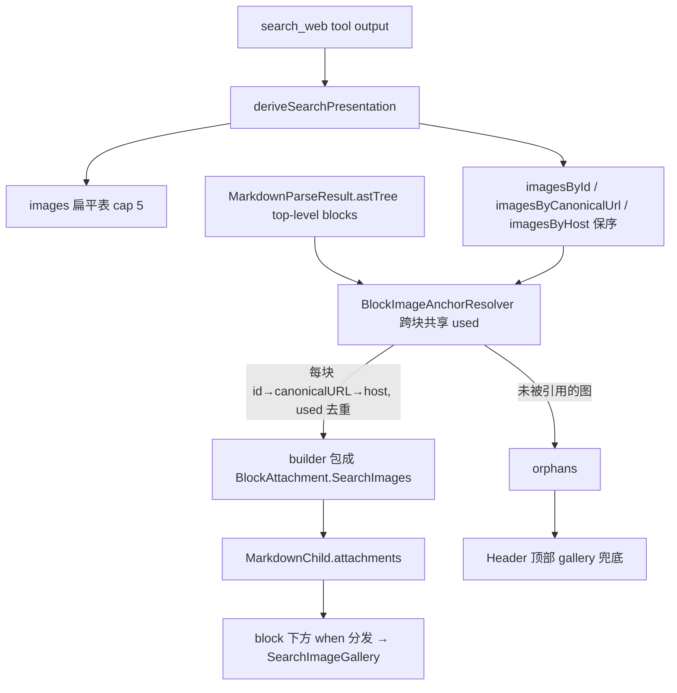

# 搜索图片「图文混排」实现计划（Phase 1 · 仅虚拟路径 · 含 BlockAttachment 扩展接缝）

> **For agentic workers:** REQUIRED SUB-SKILL: 用 superpowers:subagent-driven-development（推荐）或 superpowers:executing-plans 按任务逐条实现。步骤用 `- [ ]` 复选框追踪。
> **说明：** 本计划遵循「先方案、不堆完整代码」约束——给数据结构、函数签名、算法步骤、测试用例与验证标准；完整实现体在执行阶段补。

**Goal:** 把 `search_web` 的图片，从「只在消息顶部集中一排」升级为「正文实际引用过的来源在对应段落下方就近显示；未引用的图保留顶部 gallery 兜底」；同时把承载它的位置抽象成一个**通用、可扩展的「段落锚定附属」接缝 `BlockAttachment`**，让未来的可交互卡片/不同表现形式以最小代价就近接入。全程不向 assistant 文本注入 markdown/fence、不污染 provider input、不改 Markdown 内联渲染器与 pill/citation 逻辑。

**Architecture:** 匹配逻辑放 `SearchPresentation`（纯函数、可单测）；渲染落在 **top-level block 边界**、作为段落兄弟组件、与渲染器解耦；承载物是一个 sealed `BlockAttachment`（今天仅 `SearchImages` 一个 case，沿用本仓库 `MessagePartBlock`/`GenerativeWidgetSegment` 的 sealed+when 惯用法）。Phase 1 只接虚拟路径（长消息）：该路径已按 AST top-level block 切成独立 LazyColumn item，且对正在生成的消息天然关闭——免费获得 streaming 安全。

**Tech Stack:** Kotlin / Jetpack Compose / JetBrains Markdown AST（`org.intellij.markdown`）/ Coil3 / JUnit。

---

## 一、思考路径：为什么是这个设计

方案是从代码里逼出来的，四个观察依次锁定每一层位置。

**观察 1 — 段落是「单个 Text + 行内 pill」，图片进不去文字流。** 段落渲染成 `FlowRow { Text(annotatedString) }`，来源链接/citation 以 `InlineTextContent` 嵌进 AnnotatedString（`appendSearchSourcePill`），要固定 `Placeholder`、随基线流动，适合小药丸不适合响应式大图。
→ **图片只能作为段落的「兄弟组件」渲染在 block 之后。** 否决「在 paragraph 渲染时插图」。

**观察 2 — 两套渲染器唯一共同接缝在 block 边界。** `Markdown.kt` 与 `MarkdownNew.kt` 各有段落渲染，但都消费 `LocalSearchSources`。要对两套都成立又都不改，唯一干净位置是渲染器之外、top-level block 之间。
→ **渲染落在 `MarkdownTopLevelBlock(blockIndex)` 之后，与渲染器解耦。**

**观察 3 — 虚拟路径已切好段落，且对流式天然关闭（决定性）。** `buildChatMessageVirtualItems` 在 `loading && lastMessage` 时返回 `null`（`ChatMessageVirtualItems.kt:147`）——正在生成的消息走非虚拟路径、靠 `MarkdownBlock` 内部逐字渐显（`Markdown.kt:828`）；虚拟路径只在定稿后生效，每块已是带稳定 key 的独立 item。
→ **段内附属只接虚拟路径，可「免费」拿到 streaming 安全**，不必写「等 block 闭合/检测 `\n\n`/末块延迟」防抖。这是选 ① 而非 ② 的关键：② 要么动渲染器、要么牺牲短消息流式渐显（`MarkdownTopLevelBlock` 无 reveal 机制）。

**观察 4 — 顶部 gallery 改「孤儿兜底」即零回归。** 顶部只显示「正文从未引用到的图」：全命中→顶部空；全未命中→orphans=全部=今天行为；非虚拟/子代理不锚定→也=今天。
→ **任何路径、任何匹配失败都不会比现状差。**

**同 host 为何要 canonical URL（采纳 Cursor 修正）。** 自然链接 `[知乎](url)` 无 id，`sina.com.cn` 娱乐/科技两条只靠 host 会串图；canonical URL 是消歧唯一手段且「不中自动回落 host」，故 `id > canonicalURL > host` 严格更优。**归一须保守**：去 query 会让 `watch?v=A`/`?v=B` 撞成同图——规则：去 scheme、host 小写去 www、去 fragment/尾斜杠、**保留 query**（顶多去 `utm_*`）。

**明确不做（守约束）：** 不改 pill lookup（host 折叠对 pill 无可见影响——pill 用品牌名 + 真实 `linkDest`，不读注册表 url，见 `Markdown.kt:2033`）；不注入文本；不动 `sourcePillWidth` 宽字形修复与 `SearchImageBlock` 的 key/失败不塌陷修复。

---

## 二、可扩展性设计：四轴地图与本次定位

作为 Agent-Native 软件，chat 早已不止 Markdown。现状已有四类异构渲染机制，本计划的价值之一是**把"未来表现形式落在哪"说清楚**，并用最小代价立起其中缺失的一根轴。

| 轴 | 何时用 | 落点 | 例子 |
|---|---|---|---|
| **1 独立块** | 内容本身是独立步骤/产物 | `MessagePartBlock` + `ChatMessageVirtualItem` 变体 + `when` 分发（**已有**） | subagent/council 卡；未来独立图表卡 |
| **2 段落锚定附属** | 衍生自 tool 输出/上下文，挂在某段后 | **本计划新引入的 `BlockAttachment` 接缝** | 搜索图；未来「提到地点→地图卡」「行内来源卡」 |
| **3 模型自写卡** | 模型主动用 fence 渲染卡 | `GenerativeWidgetSegment`（**已有**）；注意会进文本 | `show-widget` HTML 卡 |
| **4 有状态交互 surface** | 多轮、有 state/command | `Surface<STATE,COMMAND>` 运行时契约（**已有，长期**） | 可编辑画布、代理驱动表单 |

搜索图属于**轴 2**：render-time 衍生、不进文本、按引用锚定到段落——与轴 1/3/4 都不同（轴 3 会污染文本，正是要避开的）。把它做对 = 给「未来一切就近显示的衍生卡片」开正门。

**最小接缝（不是框架）：** `MarkdownChild` 承载的东西用一个 sealed 类型表达，今天只有一个 case：

```kotlin
internal sealed interface BlockAttachment {
    data class SearchImages(val images: List<SearchImageRef>) : BlockAttachment
    // 未来：data class MapCard(...), data class SourceCards(...), data class Chart(...)
}
```
渲染端 `when` 分发：未来加一种卡 = 加一个 case + 一个分支 + 一个 producer，零重构。

**刻意不做（守 YAGNI，等第二个用例再说）：**
- 不建 producer 注册表/插件系统——一个生产者时 `when` 比注册表清晰。
- 不耦合 `Surface`——它是运行时有状态契约（轴 4），与 render-time 衍生附属正交；将来某附属真要状态，再让其 view 订阅对应 Surface。
- 不抽象多种锚定策略（按实体/按 tool 调用位置）——搜索图按"引用"锚定足够。
- 不把 `BlockAttachment` 提到 core 跨模块——先放 message 包，非 chat 表面要复用再上移。

---

## 三、好处

语义对齐就近显示；零上下文污染；任何失败退化到今天行为（零回归）；为未来段落锚定卡片预留通用接缝且**零额外子系统**；Phase 1 仅 3 生产文件 + 1 测试文件，非虚拟/子代理零改动；不碰渲染器与 pill；streaming 复杂度归零；匹配/去重全纯函数可单测；一个开关可回滚。

---

## 四、数据流



---

## 五、文件结构

| 文件 | 职责 | 改动 |
|---|---|---|
| `SearchPresentation.kt` | 扩索引 + 纯函数匹配/去重 + URL 归一 + 引用提取 | 增量 |
| `ChatMessageVirtualItems.kt` | 定义 `BlockAttachment`；算 anchors 包成附属挂 `MarkdownChild.attachments`；Header 改传 orphans | 增量 |
| `ChatMessageRenderers.kt` | `VirtualizedAssistantText`：块后 `when` 分发附属 | 增量 |
| `PerfFlags.kt`（已存在） | 加 `SEARCH_INLINE_IMAGES` 开关 | 一行 |
| `SearchPresentationAnchorTest.kt` | 匹配/归一/去重/兜底单测 | 新建 |
| `SearchImageBlock.kt` | 保留已接受 bug fix：图片加载失败不永久折叠；LazyRow 以 URL 为 key | 增量 |
| `SearchSourcePillInlineContent.kt` | 保留已接受 bug fix：中文 source pill 单行宽度，避免上下错排/半字截断 | 增量 |

`BlockAttachment` 定义在 `ChatMessageVirtualItems.kt`，与 `ChatMessageVirtualItem` 为同包同层的渲染分类（跟随 `MessagePartBlock` 落在 `ChatMessageCot.kt` 的现有惯例），不新增文件。

**不改**：`Markdown.kt`、`MarkdownNew.kt`、`ChatMessage.kt`、`ChatMessageSubAgentStep.kt`。

---

## 六、数据结构与签名

```kotlin
internal data class SearchImageRef(
    val url: String, val caption: String? = null,
    val sourceId: String? = null, val host: String? = null,   // NEW host
)

internal data class SearchPresentation(
    val images: List<SearchImageRef>,
    val sources: SearchSourcesRegistry,
    val imageUrls: SearchImageUrlRegistry,
    val imagesById: Map<String, List<SearchImageRef>> = emptyMap(),            // NEW
    val imagesByCanonicalUrl: Map<String, List<SearchImageRef>> = emptyMap(),  // NEW
    val imagesByHost: Map<String, List<SearchImageRef>> = emptyMap(),          // NEW 保序
)

// 通用「段落锚定附属」接缝（render 层，message 包）——今天仅一个 case
internal sealed interface BlockAttachment {
    data class SearchImages(val images: List<SearchImageRef>) : BlockAttachment
}

internal sealed interface BlockRef {
    data class Citation(val id: String) : BlockRef
    data class Link(val url: String) : BlockRef
}

// 搜索图专用生产者；返回 SearchImageRef，由 builder 包成 BlockAttachment.SearchImages
internal class BlockImageAnchorResolver(presentation: SearchPresentation) {
    fun resolveBlock(blockNode: ASTNode, content: String): List<SearchImageRef> // 去重+记账
    fun orphans(): List<SearchImageRef>                                          // 未引用 → 兜底
}

internal fun canonicalizeUrl(raw: String): String?                  // 失败 null → 回落 host
internal fun extractBlockReferences(blockNode: ASTNode, content: String): List<BlockRef>

// MarkdownChild 承载附属（替代原 anchoredImages）
data class MarkdownChild(
    val block: MessagePartBlock.ContentBlock,
    val content: String,
    val parseResult: MarkdownParseResult,
    val blockIndex: Int,
    val attachments: List<BlockAttachment> = emptyList(),   // NEW
) : ChatMessageVirtualItem { /* keySuffix 不含 attachments，保持 key 稳定 */ }

// Header 由 data object 改 data class，承载兜底图
data class Header(val galleryImages: List<SearchImageRef> = emptyList()) : ChatMessageVirtualItem {
    override val keySuffix: String = "header"
}
```

---

## 七、匹配算法（resolveBlock 语义）

按文档顺序逐块调用，`used` 跨块累积：每个 ref 取**最多 1 张**未用图（`Citation→imagesById`；`Link→canonical→host` 保序）；每块**最多 2 张**（`perBlockCap`）；全局沿用派生期 5 张 cap；超额或未引用 → `orphans()` → 顶部兜底。优先级 `id > canonicalURL > host`，全部「不中即回落」，最坏退化为孤儿兜底，绝不串图到崩。

---

## 八、任务分解（Phase 1）

纯函数任务 TDD，渲染任务以 Preview + 真机收口。

1. **`canonicalizeUrl`** — 测试（大小写/utm/`?v=`不撞/非http→null）→ 实现（key=`host(小写去www)+path(去尾/)+保留query(去utm_*)`，去 fragment）→ 提交。
2. **派生期建三索引 + `host`** — 测试（同 host 两条按 id/canonical/host 正确分组、`SearchImageRef.host` 正确）→ 在现有 imageRefs 累积处同步写三 map（保留 5 cap 与 url 去重）→ 确认老测试不回归。
3. **`extractBlockReferences`** — 测试（citation/自然链接/代码块不误收/多链接保序）→ 递归遍历 `INLINE_LINK`，复用 `Markdown.kt:2018-2022` 的 citation 判定。
4. **`BlockImageAnchorResolver`** — 测试覆盖第九节全部用例 → 实现 `resolveBlock`/`orphans`。
5. **接入虚拟构建 + 扩展接缝** — 在 `ChatMessageVirtualItems.kt`：
   - 定义 `BlockAttachment`（sealed，单 case `SearchImages`）。
   - `MarkdownChild` 增 `attachments: List<BlockAttachment>`；`Header` 改 `data class(galleryImages)`，`keySuffix` 恒 `"header"`。
   - `buildChatMessageVirtualItems`：开头 `deriveSearchPresentation(message.parts)`；开关关或无图则走老行为。否则建 `resolver`，按 item 添加顺序对每个 `MarkdownChild` 调 `resolveBlock(...)`，把非空结果包成 `listOf(BlockAttachment.SearchImages(it))` 赋给 `attachments`。
   - 末尾 `add(Header(galleryImages = if(开关&有图) resolver.orphans() else presentation.images))`。
   - `ChatMessageVirtualItemContent`：`Header` 用 `item.galleryImages`；`MarkdownChild` 把 `item.attachments` 传进 `VirtualizedAssistantText`。
6. **块后 `when` 分发附属** — `ChatMessageRenderers.kt`：`VirtualizedAssistantText` 加 `attachments: List<BlockAttachment> = emptyList()`；`markdownChild` 分支改为 `Column { MarkdownTopLevelBlock(...); attachments.forEach { when(it){ is BlockAttachment.SearchImages -> SearchImageGallery(it.images) } } }`。
7. **回滚开关** — `PerfFlags.SEARCH_INLINE_IMAGES=true`；置 false 验证回到旧行为。
8. **真机视觉验证** — 跑第十节 7 场景。

---

## 九、单测清单（SearchPresentationAnchorTest.kt，纯 JVM）

| # | 用例 | 期望 |
|---|---|---|
| 1 | citation id 命中 | 该块得对应 item 图 |
| 2 | canonical URL 消歧同 host | `[新浪](/ent/2)` → B（非 A） |
| 3 | URL 带 utm 仍命中 | 归一后匹配成功 |
| 4 | 裸 host 多条按序消费 | 两块 `[知乎](zhihu.com/)` → 块0=A、块1=B 不重复 |
| 5 | 跨块去重 | 同源在块0、块2 → 仅块0 出图 |
| 6 | 孤儿兜底 | 有图无引用 → 进 orphans |
| 7 | 无链接段 | 不出图 |
| 8 | 全局 cap | 6 条各 1 图 → 派生仅 5；anchored+orphans ≤5 |
| 9 | per-block cap | 一段引 3 源 → 该块 ≤2，余者归 orphans |
| 10 | 未知 host | 无匹配、不抛异常 |
| 11 | 归一防撞 | `watch?v=A` ≠ `?v=B` |
| 12 | 签名稳定（回归） | `searchWebOutputsSignature` 忽略纯文本变化 |

---

## 十、真机/视觉验证清单

1. 多来源长答案就近显示无重复、顶部只剩孤儿。
2. 中文 `知乎`/`新浪` pill 仍单行。
3. 长消息快速上下滚动：段内图不消失、不错位。
4. 4+ 图横滑 + 预览返回仍在。
5. 全新流式回答：生成中无抖动；收尾后段内图沉淀。
6. 子代理 live sheet：顶部 gallery 照旧。
7. 三边界：无搜索 / 有图无引用 / 有引用无图 —— 均合理。

---

## 十一、风险与回滚

| 风险 | 对策 |
|---|---|
| block 粒度 ≠ 语义段落 | 图挂整块之后，可接受 |
| 双 Markdown 渲染器 | 提取与渲染都在渲染器外、同源 AST，不受影响 |
| 同 host 串图 | id > canonicalURL > host + 保序 + `used` 去重 |
| URL 过度归一撞 key | 保守归一保留 query，仅去 utm；用例 #11 守护 |
| 顶部 gallery 语义变更 | orphan 兜底，失败即退化为今天行为；开关回滚 |
| Header 由 object 改 class | keySuffix 恒定，key 稳定不重挂；仅两处构造点 |
| `BlockAttachment` 单 case 抽象 | 零额外子系统；sealed+when 为本仓库既有惯用法，不引入新风险 |

**回滚**：`PerfFlags.SEARCH_INLINE_IMAGES=false` 即恢复「顶部全量 gallery」旧行为。

---

## 十二、Phase 2 预览（不在 Phase 1 实现）

- **非虚拟短消息 / 子代理 sheet 的段内附属**：给 `MarkdownBlock` 增一个可选 after-block 插槽（保住流式逐字渐显），三条路径收敛复用 `BlockImageAnchorResolver` 与 `BlockAttachment`；**不要** `\n\n` split（会切进代码围栏/列表，违反「基于 AST」原则）。
- **第二种附属卡（验证扩展接缝）**：如「正文提到地点 → 地图卡」（轴 2，复用 `BlockAttachment` 加一个 `MapCard` case + 一个 producer）。届时若出现第二个 producer，再引入一个 producers 列表替代单一 resolver。

---

## 十三、自检（Spec 覆盖）

- 策略 C 精化（段内优先 + 孤儿兜底）→ Task 5/6 + Header 兜底 ✅
- 匹配 id/canonicalURL/host 分层 + 同 host 消歧 → Task 1/3/4，用例 1-4/11 ✅
- 插入层在 SearchPresentation 产 anchor、block 边界渲染、不碰渲染器 → Task 4/5/6 ✅
- 去重/无跳动/虚拟稳定/失败不空洞 → `used` 去重 + 同 item 同 key + 复用 SearchImageBlock，用例 4-9 ✅
- streaming → 由虚拟路径生命周期天然保证（场景 5）✅
- 扩展性（用户新增诉求）→ 第二节四轴地图 + `BlockAttachment` 接缝 + YAGNI 边界 ✅
- 不注入文本/不污染 history/不破坏 pill 与两处 bug 修复 → 文件「不改」列表 ✅
- 最小改动 + 回滚 → 3 生产文件 + 开关（Task 7）✅
- 单测 + 真机场景 → 第九/十节 ✅

未发现 spec 缺口。
