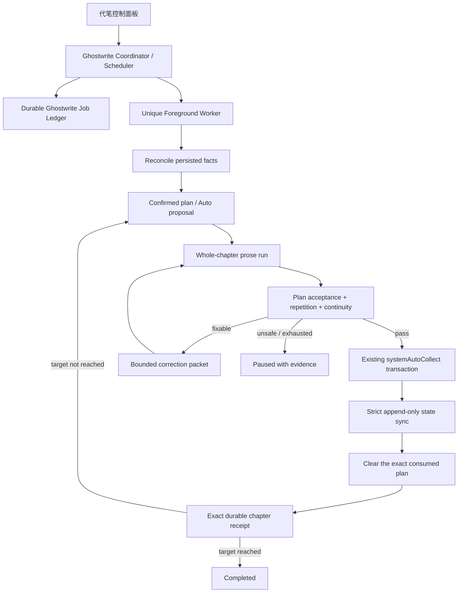

# Android 小说代笔 1–50 章自纠正循环设计

日期：2026-08-09
状态：代码与 JVM/Robolectric 验证已完成，真机后台矩阵待验证

## 目标

在现有单章代笔闭环上增加可暂停、可恢复、可审计的批次执行器，一次目标为 1–50 章。系统可以对当前候选章进行有限次数的自动纠正，但任何未通过验收、明显复读、连续性失败或输出不完整的正文都不得污染下一次尝试、剧情同步或下一章计划。

本设计不把“循环 50 次”当作成功。成功的定义是：每一章都先通过质量门禁，再经既有领域事务收录并完成严格剧情同步；只有持久化的精确收录与同步凭据才能增加完成章数。

## 非目标与能力边界

- 不承诺任意 provider 在 Android 进程被杀后原地续接流。没有服务端 response cursor 时，孤儿正文 run 只能收口为 `Interrupted/Recovery`，保留 partial 并等待显式续跑。
- 不把失败候选全文、reviewer 自由文本或临时会话写入正史上下文。
- 不允许因为网络、鉴权、额度、同步或存储失败而自动重写正文。
- 不绕过现有 collect reducer/CAS 事务直接写章节。
- 不同时使用 WorkManager foreground 与自定义 FGS 作为同一批次的两个 owner。

## 不变量

1. `completedChapterCount == chapterReceipts.size`，并且始终处于 `0..targetChapterCount`。
2. 只有 `candidate → collected → strict sync → clear consumed plan → durable receipt` 的精确链路可以增加完成章数。
3. 一旦候选已收录，恢复流程只能 reconcile、清合同和同步，绝不能回到生成或再次收录。
4. 第 N+1 章只基于第 N 章已同步后的 checkpoint/state 创建。
5. 每次正文尝试都固定在同一个 canonical base 上；失败稿只能进入隔离区，不能成为普通上下文。
6. 所有晚回调必须同时匹配 `jobId + executionEpoch + chapterIndex + attempt + runId`。
7. 相同失败指纹连续出现两次或当前章正文尝试达到三次时立即熔断，等待用户处理。
8. 项目 head、config revision、合同 ID/digest 或材料 revision 发生外部漂移时 fail closed。

## 执行架构

批次账本独立存放在项目根的 `lifecycle/ghostwrite/`，不写入 `NovelProjectDocumentV1`，避免运行态污染小说跨端文档协议。

## 持久账本

`NovelGhostwriteJobV1` 至少记录：

- job/project/branch ID；
- `targetChapterCount`（1–50）、status、phase；
- `ledgerRevision`、`executionEpoch`、lease owner/expiry；
- 已完成的精确 chapter receipts；
- 当前章 index/ordinal；
- 固定的 base checkpoint/head/state/config/material revision；
- plan ID/digest；
- attempt、run ID、candidate ID/hash；
- collect operation、target chapter、collected checkpoint、sync checkpoint；
- 有界 correction packet、failure fingerprint、same-failure count；
- phase-specific infrastructure retry count。

账本不保存候选全文。正文仍由小说项目的 durable run/candidate/sidecar 负责；账本只保存身份、摘要 hash 和结构化失败证据。

每次更新必须采用 revision CAS、execution epoch 校验、临时文件 + fsync + 原子替换，并保留一个 previous 副本。损坏 primary 时可以读取 previous，但不得猜测或跳阶段。

## 状态机与恢复

| Phase | 可以执行的副作用 | 重启后的判定 |
|---|---|---|
| `AwaitingPlan` | 首章读取用户合同；后续拟定合同 | 分支必须 synchronized 且无 pending |
| `Planning` | 严格结构化 plan proposal | malformed/失败有限重试后暂停 |
| `PlanPrepared` | 以预分配 operation 提交自动计划 | 精确 reconcile plan ID/digest/revision |
| `GenerationPrepared` | 固定 run/attempt 身份 | 先写账本，后启动 provider |
| `Generating` | 整章正文流 | 找精确 run/candidate；孤儿 run 收口 Recovery |
| `CandidateReady` | 无 | candidate 必须匹配 base 与 plan digest |
| `Validating` | 合同验收、复读、连续性 | 每次重写后完整重跑所有门禁 |
| `CorrectionReady` | 写入有界纠错包 | 仅 candidate-local 问题可进入 |
| `CollectPrepared` | system auto collect | 收录前已固定 candidate/operation/chapter |
| `CollectedNeedsSync` | reconcile 收录并准备严格同步 | 永远不回写作阶段 |
| `Syncing` | append-only strict sync | 只接受精确同步 checkpoint |
| `ClearPlanPrepared` | 清除已同步章节消费的精确合同 | 绑定 plan ID/digest 与 project/config/head revision |
| `ChapterCommitPrepared` | 写 receipt | candidate/chapter/checkpoint 幂等去重 |
| `ChapterCommitted` | 下一章或完成 | 此阶段才允许 index + 1 |
| 终态 | pause/fail/cancel/complete | 无自动副作用 |

每个有副作用阶段统一采用 write-ahead 顺序：

1. CAS 写 `Prepared`，预先固定身份；
2. 执行领域命令；
3. 重新加载项目，以 durable fact 判断是否已经成功；
4. CAS 推进账本。

这使进程可以在 collect 已成功但 ledger 尚未推进、同步已成功但合同尚未清除、合同已清除但 receipt 未写等窗口安全恢复。

## 上下文隔离

每章开始时创建不可变的 canonical context：

- 上一章完成后的 synced checkpoint；
- 对应的 chapter selections 与 state snapshot；
- 总纲、人物、写作要求和必要材料；
- upcoming arc 与 recent accepted highlights；
- 最近少量已收录章节/末章尾部；
- 当前 confirmed plan 与 digest。

以下内容永远不进入普通生成、严格剧情同步或下一章 proposal：

- `Available`、`Interrupted`、`Failed` 的候选正文；
- 验收未通过的候选；
- reviewer 的自由文本；
- 旧 attempt 的 correction prompt；
- checkpoint session ceiling 之后的临时消息；
- 与当前 job/epoch/plan 不匹配的 run 或 candidate。

自动纠正只注入结构化、限长的 `CorrectionPacket`：失败类型、计划条目索引、当前候选内有证据锚定的问题和必须避免的局部模式。不会把上一份失败全文再次作为历史消息，也不会累计多轮 reviewer 文本。

## 自纠正与熔断

每章最多三次正文尝试：首次生成 + 两次干净重写。

允许自动纠正：

- 缺少当前计划的 must-happen；
- 命中当前计划的 must-not；
- 当前候选内可定位的明显复读；
- 引用能锚定到当前候选的 blocking continuity 问题。

必须暂停：

- 已有正史自身存在 blocking 冲突；
- continuity evidence 无法映射到真实章节；
- 结构化 review/audit 输出不完整或 malformed；
- provider 输出被长度、安全或内容过滤截断；
- collect、clear plan、sync、存储、鉴权、额度失败；
- 外部编辑导致 base/head/config/plan 漂移；
- 相同 failure fingerprint 连续两次；
- 第三次正文仍未通过。

failure fingerprint 由稳定错误码、合同条目 ID、已锚定实体/章节引用构成，不包含模型自然语言。一次纠正后必须重新运行合同验收、复读和连续性全部门禁。

## 50 章的连续性策略

不能每章都把全书拼成一次请求。正常门禁使用：

- durable living state；
- 当前候选；
- 最近若干已收录章节的 token-bounded window；
- 与当前 plan/实体相关的有界 canon highlights。

每隔固定章节可以执行一次分块全局审计。每个块都必须满足 context budget；任一块请求失败或输出无法映射，都记为 `failedChunkCount > 0` 并暂停自动收录。所有 issue reference 必须校验章节 ordinal/title，并将 evidence 锚定到对应正文；模型幻觉引用不能成为自动改稿依据。

## 后台与进程死亡

批次使用唯一 foreground `CoroutineWorker`：

- unique work 名由 durable job ID 确定；同一 project/branch 的非终态唯一性由账本 Store 原子保证；
- worker 通过 ledger CAS 获取 lease 并递增 execution epoch；
- 通知显示第 N/目标章、当前 phase 和暂停入口；
- 网络临时错误使用有界退避；质量失败使用内部纠错，不使用 WorkManager 无限 retry；
- UI 仅观察 durable ledger，不拥有 pipeline。

若 provider 不支持服务端 cursor，Android 进程死亡后不自动重复 POST 未完成正文。恢复 worker 先把孤儿 run 收口为 `Interrupted/Recovery`，保留 partial 到隔离区，并把 job 置为可显式继续状态。collect/sync 等可确认的幂等副作用仍会自动 reconcile。

## 验收矩阵

- 目标 1、10、50 章分别恰好产生对应数量 receipt，不生成第 N+1 章；
- 在每一个 prepared/side-effect/ledger-commit 窗口模拟崩溃，恢复后无重复章、版本、checkpoint 或 credit；
- collect 成功后重启只能继续 strict sync/clear/receipt；
- sync 失败后重启不能重新写或重新收录；
- 旧 epoch/run callback 不能更新进度、收录、计章或停新通知；
- 相同失败指纹两次及三次总尝试分别触发熔断；
- 失败稿唯一 marker 不出现在下一次正文、strict sync、下一章 plan 或下一章正文请求；
- 输出上限、content filter、安全终止不得产生 available candidate；
- strict sync 缺字段、错类型、重复字段、未知字段、未锚定 evidence 均保持 `NeedsSync`；
- 50 章连续性请求均受 token budget 约束，任一失败块阻止收录；
- primary ledger 损坏可回退 previous，stale CAS/lease owner 被拒绝；
- 通知权限、Android 14/15 foreground 限制、锁屏/Doze/OEM 杀后台需真机验证。

## 分阶段交付

1. 先完成单章领域闭环和上下文隔离硬门；
2. 落地 durable ledger、reducer、store 与恢复测试；
3. 将 coordinator 变为 1–50 章 facade，接自动 proposal 和有界纠正；
4. 接唯一 foreground Worker、通知与 UI；
5. 完成 JVM/Robolectric、构建及真机后台矩阵后再宣称 50 章可用。
