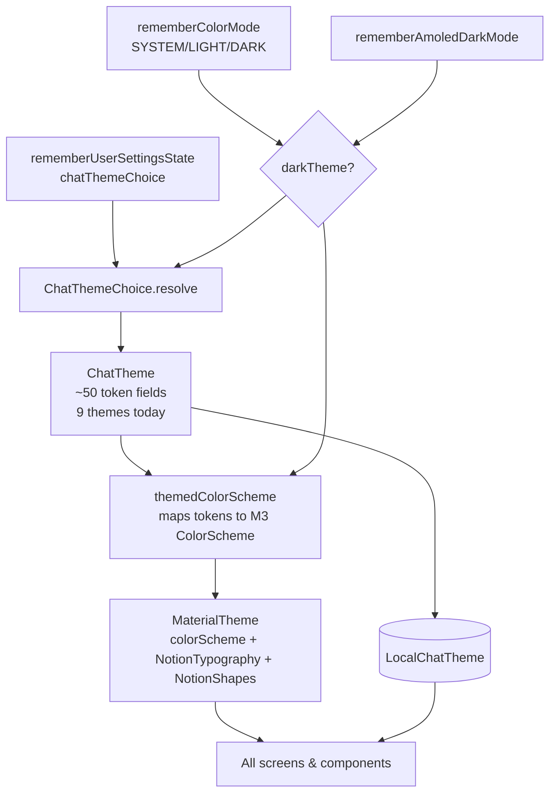
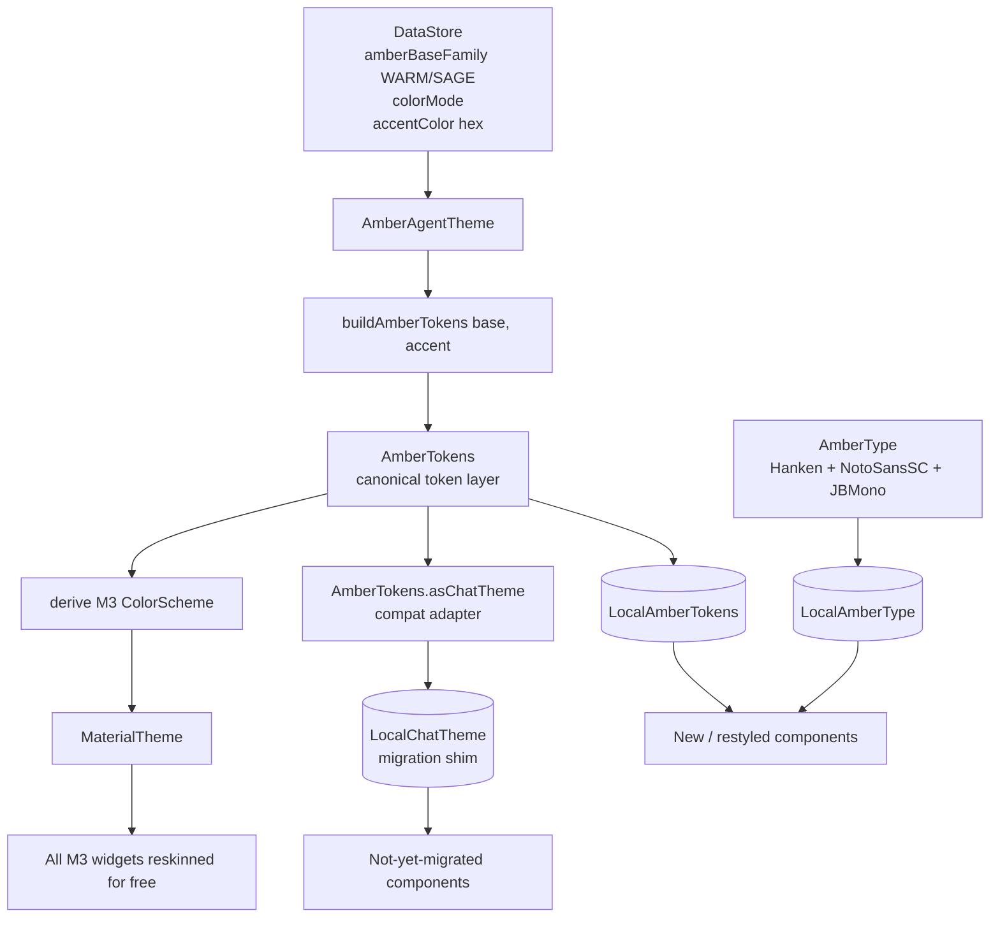
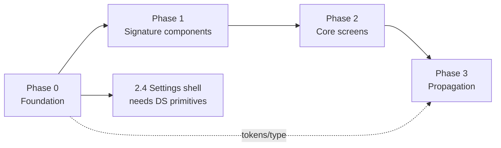
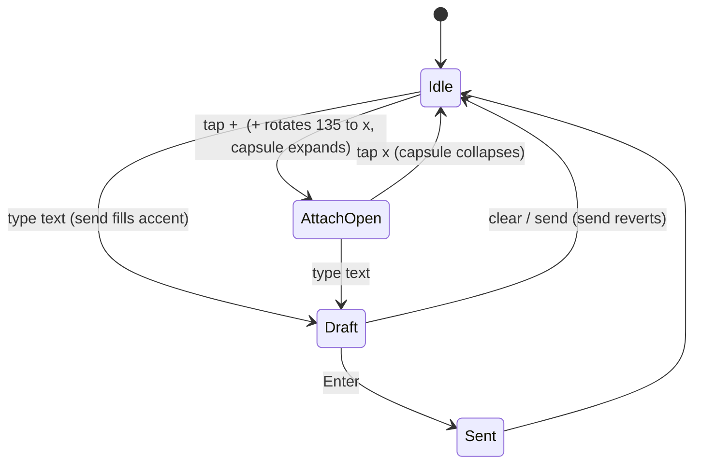
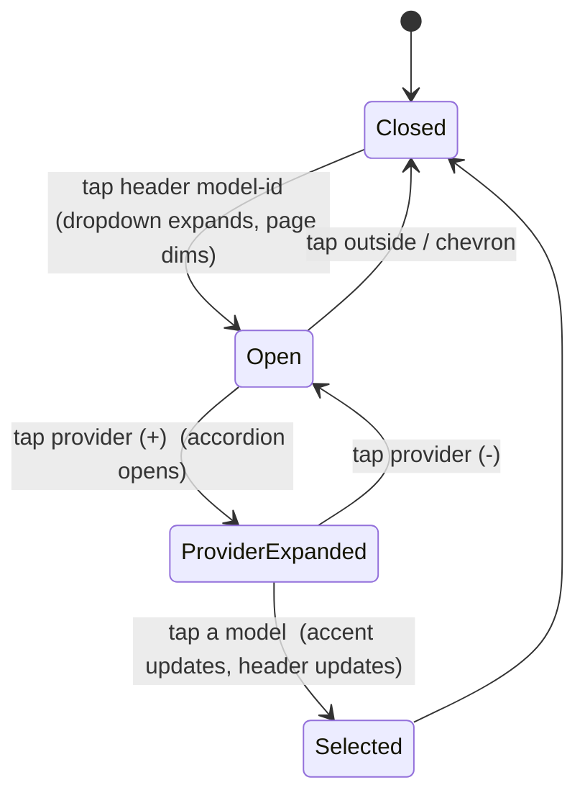

# Amber Design System — "Terminal × Modern" / Graphite

**Implementation & Design Plan**

> **For agentic workers:** REQUIRED SUB-SKILL — use `superpowers:subagent-driven-development` (recommended) or `superpowers:executing-plans` to implement task-by-task. Steps use checkbox (`- [ ]`) syntax.

| | |
|---|---|
| **Status** | Plan approved-in-principle; D1–D6 signed off; awaiting execution start |
| **Date** | 2026-06-07 |
| **Branch / worktree** | `amberagent/ui-graphite-redesign` → `ui-graphite/` |
| **Base commit** | `8168ba67` (Bump version to 2.6.7) off `main` |
| **Design source** | Claude Design handoff → `ui-graphite/docs/cloud-design/amberagent/` |
| **Authoritative spec** | `project/Amber Design System.md` + `project/redesign/oc-amber.css` |
| **Target** | `project/Amber Redesign.html` (static canvas) + `Amber Prototype.html` (wired app) |

---

## Table of contents

1. [TL;DR](#1-tldr)
2. [Context & background](#2-context--background)
3. [Goals & non-goals](#3-goals--non-goals)
4. [Design system reference (self-contained)](#4-design-system-reference-self-contained)
5. [Current-state analysis](#5-current-state-analysis)
6. [Target architecture](#6-target-architecture)
7. [Decision log (D1–D6)](#7-decision-log-d1d6)
8. [Token mapping](#8-token-mapping)
9. [Implementation plan — phases & tasks](#9-implementation-plan--phases--tasks)
10. [File-by-file change manifest](#10-file-by-file-change-manifest)
11. [Component mapping matrix](#11-component-mapping-matrix)
12. [Screen coverage matrix](#12-screen-coverage-matrix)
13. [Interaction state machines](#13-interaction-state-machines)
14. [Cross-cutting concerns](#14-cross-cutting-concerns)
15. [Testing & verification strategy](#15-testing--verification-strategy)
16. [Risk register](#16-risk-register)
17. [Rollout, migration & rollback](#17-rollout-migration--rollback)
18. [Effort & sequencing](#18-effort--sequencing)
19. [Open questions](#19-open-questions)
20. [Glossary](#20-glossary)
21. [Appendix — reference index](#21-appendix--reference-index)

---

## 1. TL;DR

**What:** Reskin the Amber Android (Jetpack Compose) app to a warm-neutral graphite design system ("Terminal × Modern") — token-driven, with a monospace/sans split as the brand signature, flat & hairline surfaces, one themeable accent.

**Why:** Establish a distinct, cohesive visual identity that sheds the "standard Material template" look. The design already exists (HTML/CSS/JS handoff); this plan turns it into production Compose.

**How (one paragraph):** Replace the app's 9 legacy chat themes with 4 Graphite bases (`light/dark/sage/sage-dark`) modeled exactly on `oc-amber.css`; decouple the **accent** into its own user setting (5 curated colors, independent of base); add the **mono/sans typography split**; map the new tokens onto Material 3's `ColorScheme` so existing widgets reskin automatically while new components read a dedicated `AmberTokens` layer; restyle the signature components and screens; delete the legacy decorative bloom/halo/orb (explicit anti-goals).

**Golden rule (from the spec):** **Reskin, never restructure.** Apply the visual language to existing screens; do not remove, simplify, or invent product functionality.

**Scope:** Foundation → signature components → core screens (chat, model picker, settings) → systematic propagation to all remaining screens.

**Signed-off decisions:** hard-replace legacy themes (D3); bundle a Noto Sans SC subset (D5); accent decoupled (D2); decoration deleted (D4); `AmberTokens` canonical + M3 mapping (D1); verify via preview matrices + targeted tests, not per-token TDD (D6).

---

## 2. Context & background

### 2.1 What Amber is

AmberAgent is an Android AI-assistant/agent platform (Jetpack Compose + Kotlin), evolving from a chat client toward an Agent Kernel + Surfaces architecture. LLM/markdown/highlight infrastructure was originally forked from **rikkahub** (AGPL/commercial dual license) and has diverged since 2026-05. App id `app.amber.agent`; UI lives under `app/amber/feature/ui/`.

### 2.2 The design lineage (important)

This is **not** the first design pass. The current code already ports an **earlier** design iteration:

- `pages/chat/ChatTheme.kt` header comment: *"V3 设计稿主题 token —— themes.jsx 完整搬运"* ("V3 design tokens — fully ported from themes.jsx").
- The handoff bundle contains that same `themes.jsx` (now superseded) plus the **new** `redesign/oc-amber.css` + `aa-*.jsx`.

So the lineage is: **V3 (themes.jsx, shipped) → Terminal × Modern (oc-amber.css, this plan).** The new direction is more constrained and opinionated: a mono/sans split, hairline-first surfaces, a single themeable accent, and the **removal** of the ambient bloom/halo decoration the V3 themes rely on.

### 2.3 Why a token+M3 reuse strategy fits

The app already routes a rich token set (`ChatTheme`, ~50 fields) through `AmberAgentTheme`, which maps those tokens onto Material 3's `ColorScheme` and exposes them via `LocalChatTheme`. That pipeline is exactly the vehicle we need — we swap the *values* and *philosophy*, not the *mechanism*. This honors the spec's own instruction ("reuse the existing implementation; don't re-derive") and the project's "simplest viable, no over-engineering" rule.

---

## 3. Goals & non-goals

### Goals
- A faithful Compose implementation of the Terminal × Modern visual language (tokens, type, components, motion) matching `oc-amber.css` / `aa-*.jsx`.
- 4 bases × light/dark behavior × 5 themeable accents, all correct.
- The mono/sans split applied rigorously (machine-facts = mono; human prose = sans/cn).
- Every existing screen restyled with **zero loss of functionality**.
- A reusable DS primitive layer so future screens stay on-system by construction.

### Non-goals
- No new product features, no information-architecture changes, no screen removals.
- No port of the prototype's React/DOM structure (recreate visuals idiomatically in Compose).
- No "PhoneScreen" device-frame chrome (that's a prototype artifact; Android provides status/nav bars).
- No backend/data-layer/agent-kernel changes.
- No localization changes beyond what the reskin touches (English default; existing i18n untouched).

---

## 4. Design system reference (self-contained)

> Authoritative source: `oc-amber.css` (tokens/primitives/keyframes) and `Amber Design System.md` (rules). This section reproduces the essentials so the plan stands alone.

### 4.1 Aesthetic direction

**Terminal × Modern, warm-neutral.** A calm, papery graphite world where interface *chrome* whispers and *content* speaks. Personality from one restrained move: **monospace for machine-facts** against a humanist sans for everything a person reads. Warm off-white paper, soft ink, one earthy accent (terracotta = "amber"). Flat surfaces, hairline borders, generous quiet space.

**Anti-goals (read as "AI slop" here):** gradient backgrounds on UI; rounded cards with a colored left-border; neon; drop-shadow stacks; Inter/Roboto; emoji as iconography; breathing orbs / gemstone blobs; multiple accents competing.

### 4.2 Color tokens — 4 bases

CSS custom properties scoped to `.amb[data-theme]`. Never literal hex in a component.

| Token | light | dark | sage | sage-dark | Role |
|---|---|---|---|---|---|
| `--bg` | `#f4f2ec` | `#161512` | `#f0f2ea` | `#131711` | Page background |
| `--surface` | `#faf9f5` | `#1c1b17` | `#f6f8f0` | `#191d15` | Cards, trays |
| `--surface-2` | `#efece4` | `#211f1a` | `#e7eadf` | `#1e2219` | Insets: pills, chips, toggles-off |
| `--raised` | `#ffffff` | `#23211c` | `#ffffff` | `#20241b` | Focused field / active thumb |
| `--ink` | `#1b1a17` | `#ece8df` | `#1b201a` | `#e6ebdf` | Primary text / "ink button" fill |
| `--ink-2` | `#57544c` | `#a8a298` | `#535a4d` | `#a0a896` | Secondary text, inactive icons |
| `--ink-3` | `#8f8b80` | `#756f64` | `#888f7e` | `#6e7563` | Tertiary / metadata text |
| `--ink-4` | `#b6b1a4` | `#564f45` | `#b0b5a4` | `#515845` | Faint: placeholders, disabled, markers |
| `--line` | `#e4e0d6` | `#2e2b25` | `#e0e3d6` | `#2a2e22` | Hairline borders, dividers |
| `--line-2` | `#d6d1c4` | `#3a362e` | `#d0d4c4` | `#353a2c` | Stronger border (chips, active) |
| `--user-bg` | `#1b1a17` | `#ece8df` | `#1b201a` | `#e6ebdf` | User bubble fill (inverts in dark) |
| `--user-ink` | `#f6f4ee` | `#1b1a17` | `#f3f5ec` | `#1b201a` | User bubble text |
| `--code-bg` | `#edeae1` | `#211f1a` | `#e8ebdf` | `#1e2219` | Inline code background |
| `--signal` | `#5e9c6e` | `#5e9c6e` | `#2f8f76` | `#4caf8e` | Live/online/just-finished green |

**Accent (independent of base).** Default `--accent: #b8623a` (terracotta). Curated palette of 5:

| Accent | hex | `--accent-ink` (text on accent) |
|---|---|---|
| terracotta | `#b8623a` | `#ffffff` |
| sage-green | `#5e9c6e` | `#0f150e` |
| blue | `#4f86d6` | `#ffffff` |
| purple | `#9277c4` | `#ffffff` |
| rose | `#c2607a` | `#ffffff` |

`inkFor(hex)` rule: green→`#0f150e`, gold→`#1a1408`, else→`#ffffff`.

**Accent vs. signal — the rule.** Accent = *user selection* (chosen model, active provider, selected swatch, send button once there's a draft, pinned). Signal-green = *system liveness* (streaming/online dots, a tool call that just succeeded). Never conflate; they stay distinct even when the accent is also green.

**Shadows (per base; overlays only).** light `--shadow: 0 1px 2px rgba(40,36,28,.05), 0 8px 24px -16px rgba(40,36,28,.18)`; `--shadow-lg: 0 2px 6px rgba(40,36,28,.06), 0 24px 48px -24px rgba(40,36,28,.28)`. Dark/sage-dark deeper, pure-black based.

### 4.3 Typography

Three families:

```
--font-ui:   "Hanken Grotesk", "Noto Sans SC", system-ui, sans-serif;   /* Latin UI */
--font-cn:   "Noto Sans SC", "Hanken Grotesk", system-ui, sans-serif;   /* Chinese body */
--font-mono: "JetBrains Mono", "Noto Sans SC", ui-monospace, monospace; /* machine facts */
```

**Scale (px, 380-wide mobile):**

| Use | size / weight | font |
|---|---|---|
| Screen/section title | 18.5–19 / 700 | cn |
| Header session title | 16 / 700 | cn |
| Body (chat, list rows) | 15–15.5 / 400–500 | cn |
| Secondary / descriptions | 12.5–13.5 / 400 | cn |
| Metadata, ids, ctx, price | 11–12.5 / 400–500 | **mono** |
| Section eyebrow label | 11 / 600, ls .12em, UPPERCASE | **mono** |
| Tiny tag / badge | 10.5 / 600 | cn or mono |

Never below ~10.5px. `.mono` also enables tabular nums + slashed zero. **The mono/sans split is the brand** — mono only for machine-facts (model ids, `200K ctx`, `$3/M`, timings, `// AGENT` eyebrows, version strings, tool names, the `amber` wordmark); never mono human prose, never sans machine facts.

### 4.4 Spacing, radius, borders

- **Spacing:** screen gutters 16–18; chat turn gaps 22; list row padding 13–14; section-label top margin 20–26.
- **Radii:** cards/fields 14; chips/pills/toggles 999 (full); composer pill 26; small badges 5–8; phone screen 40 (N/A native).
- **Borders:** hairline `1px var(--line)`; stronger `var(--line-2)`. Prefer hairline + flat fill over shadow. Shadow only for true overlays.
- **Layout:** flex/grid with `gap`; never margin-spacing siblings.

### 4.5 Motion

Easing `cubic-bezier(.2,.85,.25,1)` (press `.2,.8,.2,1`).

| Name | Use |
|---|---|
| `.pressable` | every tappable control: `scale(.975)` on press + color transitions |
| `blink` | terminal cursor (1.05s steps) |
| `breathe` | live dot halo (2.4s) |
| `fadeRise` | chat turns entering (translateY 4px) |
| `screenIn` | overlay sheets |
| `slideInR`/`slideInL` | router push/pop (respect reduce-motion → none) |
| width / `grid-template-rows` morphs | attach capsule, model groups (.28–.34s) |

Only the cursor and live dot loop. No infinite decorative loops on content.

### 4.6 Component catalog (spec §6.2)

Wordmark · StatusBar/HomeIndicator · two-line ChatHeader · Context meter (5 mono bars + %, **no donut**) · Top model menu (expanding dropdown, provider accordion, color = the only selection signal) · ThinkingStrip · ToolCall row · AskUser card · User bubble (asymmetric radius `16/16/5/16`, max 82%) · Assistant turn (mono `amber` label + streaming cursor + faint action icons) · Composer/InputBar (3 surface-2 surfaces on a surface tray, morphing `+`→capsule, accent send on draft) · List row (SRow) · Segmented control (Seg) · Toggle · Section label (mono `//` eyebrow) · Status pill.

### 4.7 Invariants (spec §7 — the make-or-break rules)

1. Reskin, don't restructure. 2. Tokens only. 3. Mono = machine, sans/cn = human. 4. Immersive bottom (composer tray = surface + top hairline; 3 surfaces share surface-2). 5. Accent = selection, signal = liveness. 6. One accent at a time. 7. Flat & hairline first. 8. No badge/check noise. 9. `.pressable` everywhere; targets ≥ 44dp. 10. Works in all 4 bases × light/dark × ≥2 accents.

---

## 5. Current-state analysis

### 5.1 Existing theme pipeline



**Key files (confirmed):**

| Concern | File |
|---|---|
| Theme root | `feature/ui/theme/Theme.kt` (`AmberAgentTheme`) |
| Token layer + 9 themes | `feature/ui/pages/chat/ChatTheme.kt` |
| Legacy palette | `feature/ui/theme/Color.kt` (`ExtendColors`, `CustomColors`) |
| Typography | `feature/ui/theme/Type.kt` |
| Fonts on disk | `res/font/jetbrains_mono.ttf`, `res/font/noto_serif_sc.otf` |
| Theme picker UI | `feature/ui/pages/setting/SettingDisplayPage.kt` |

### 5.2 What already aligns (reuse)

- **Token→M3 mapping mechanism** is exactly what we need.
- **JetBrains Mono** is already bundled (mono signature half is ready).
- **Paper** (`#FDFAF3` + `#B5683A`) and **Sage** legacy themes are near-identical to the new `light`/`sage` intent — confirms the palette direction.
- Mature `LocalChatTheme` consumption across components.

### 5.3 What conflicts (must change)

| Conflict | Current | New requirement |
|---|---|---|
| Accent coupling | accent baked into each `ChatTheme` | accent **independent** setting (§2.3) |
| Decoration | `bloom*`, `topHalo*`, `WhisperHalo`, `SendOrb`, ambient `Background` | **deleted** (anti-goals §1) |
| Context meter | `ContextRing.kt` (donut ring) | 5 mono **bars** + % (§6.2) |
| Typography | M3 default font + size overrides, no mono/sans rule | **mono/sans split** is the signature |
| CN font | only **Noto Serif SC** bundled | **Noto Sans SC** subset (per §3 + D5) |
| Theme count | 9 decorative themes | 4 flat bases (D3 hard-replace) |
| Send button | `SendOrb` (haloed orb) | flat accent-fill circle |

### 5.4 Inventory

**Screens (`feature/ui/pages/`):** assistant · backup · board · chat · debug · developer · extensions · favorite · history · imggen · live · log · miniapp · search · setting · share · stats · webview.

**Component groups (`feature/ui/components/`):** ai · debug · easteregg · message · nav · richtext · table · ui · webview · workspace.

**Chat surface (`pages/chat/`):** AmberMark · Background · ChatDrawer(+VM) · ChatList(+sections/indicators/support) · ChatPage · ChatPageSplit · **ContextRing** · **SendOrb** · **WhisperHalo** · ChatTheme · ChatVM · ConversationList · Export · TTSAutoPlay.

**Message components (`components/message/`):** ChatMessage · ChatMessageTools · ChatMessageReasoning · ChatMessageCot · ChatMessageActions · ChatMessageAskUserStep · ChatMessageAvatar · ChatMessageBranch · ChatMessageRenderers · … .

**Composer (`components/ai/`):** ChatInput · ChatInputComposers · ChatInputAttachments · ChatInputUsage · ChatInputSandbox.

---

## 6. Target architecture

### 6.1 New layering



- **`AmberTokens`** is the single source of truth in code (mirrors `oc-amber.css`). New/restyled components read `LocalAmberTokens` + `LocalAmberType`.
- The same tokens **derive the M3 `ColorScheme`**, so the hundreds of existing M3 widgets reskin without per-widget edits.
- A thin **`asChatTheme()` adapter** keeps existing `LocalChatTheme.current.xxx` reads compiling during migration; legacy decoration fields are dropped as their consumers are deleted.

### 6.2 Why both `AmberTokens` and the M3 mapping

M3's `ColorScheme` lacks several semantic slots this design needs (`surface-2`, `raised`, `ink-3`, `ink-4`, `line-2`, `signal`, `user-bg/ink`, `code-bg`). `AmberTokens` carries the full set; the M3 mapping carries the subset M3 understands so legacy widgets inherit the new neutrals/accent. New components prefer `AmberTokens`.

### 6.3 Module boundaries

- `feature/ui/theme/` — tokens, type, theme wrapper (no component logic).
- `feature/ui/components/ds/` — **new** stateless DS primitives (Card/Field/Btn/Dot/Cursor/SectionLabel/SRow/Seg/Toggle/ContextMeter). One responsibility each; preview-driven.
- Existing `pages/*` and `components/*` — restyled to consume the above.

---

## 7. Decision log (D1–D6)

| # | Decision | Choice (signed off) | Rationale | Consequence |
|---|---|---|---|---|
| D1 | Token strategy | `AmberTokens` canonical + M3 mapping + `asChatTheme()` shim | Full token set + free reskin of M3 widgets + low migration churn | New token file; temporary adapter |
| D2 | Accent | Independent DataStore setting, 5 curated | Fidelity to §2.3; enables live theming | Accent removed from per-theme baking |
| D3 | Legacy themes | **Hard-replace** with 4 bases | Cleaner system; aligns with anti-goals | Existing users' look changes on next launch |
| D4 | Decoration | **Delete** bloom/halo/orb | Explicit anti-goals; replace already removes them | Remove `SendOrb`/`WhisperHalo` + ambient `Background` |
| D5 | Fonts | Bundle **Noto Sans SC subset** + Hanken; keep JB Mono | Exact CN match cross-device | +few MB APK |
| D6 | Verification | Preview matrices + targeted tests (not per-token TDD) | Visual reskin; avoid over-engineering | UI tests only for stateful pieces |

---

## 8. Token mapping

`oc-amber.css` → `AmberTokens` field → M3 `ColorScheme` slot (— = no M3 slot; consume `AmberTokens` directly).

| CSS token | `AmberTokens` | M3 slot |
|---|---|---|
| `--bg` | `bg` | `background`, `surfaceContainerLowest`, `surfaceDim` |
| `--surface` | `surface` | `surface`, `surfaceContainerLow` |
| `--surface-2` | `surface2` | `surfaceVariant`, `surfaceContainer` |
| `--raised` | `raised` | `surfaceBright`, `surfaceContainerHighest` |
| `--ink` | `ink` | `onBackground`, `onSurface` |
| `--ink-2` | `ink2` | `onSurfaceVariant` |
| `--ink-3` | `ink3` | — |
| `--ink-4` | `ink4` | — |
| `--line` | `line` | `outlineVariant` |
| `--line-2` | `line2` | `outline` |
| `--user-bg` | `userBg` | — |
| `--user-ink` | `userInk` | — |
| `--code-bg` | `codeBg` | — |
| `--signal` | `signal` | — (optionally `tertiary`) |
| `--accent` | `accent` | `primary`, `secondary` |
| `--accent-ink` | `accentInk` | `onPrimary`, `onSecondary` |

---

## 9. Implementation plan — phases & tasks

### Phase dependency graph



> Phase 0 is fully step-coded (execution-ready). Phases 1–3 are task-mapped: each names the exact existing file, the design reference, the concrete end-state, and verification; line-level diffs are produced when the executing agent opens each file (faithful reskin requires reading the target — pre-writing diffs for unread files would be guesses).

---

### Phase 0 — Foundation (execution-ready)

**Definition of done:** app builds & runs; a Graphite base + chosen accent applies app-wide; mono/sans split available; DS primitives exist with previews; theme/accent picker works. No screen logic changed yet.

#### Task 0.1 — Bundle Hanken Grotesk, Noto Sans SC subset, JetBrains Mono weights

**Files:**
- Create: `app/src/main/res/font/hanken_grotesk_regular.ttf` … `_medium`, `_semibold`, `_bold` (Google Fonts; 400/500/600/700)
- Create: `app/src/main/res/font/noto_sans_sc_regular.otf` … `_medium`, `_bold` (Noto Sans SC subset — mirror the existing `noto_serif_sc.otf` subset approach; 400/500/700)
- Modify: `feature/ui/theme/Type.kt`

- [ ] **Step 1: Add font resources.** Place the 4 `hanken_grotesk_*.ttf` and 3 `noto_sans_sc_*.otf` files in `res/font/`. (JetBrains Mono already present.)
- [ ] **Step 2: Define families in `Type.kt`** (append; keep existing exports):

```kotlin
val HankenGrotesk = FontFamily(
    Font(R.font.hanken_grotesk_regular, FontWeight.Normal),
    Font(R.font.hanken_grotesk_medium, FontWeight.Medium),
    Font(R.font.hanken_grotesk_semibold, FontWeight.SemiBold),
    Font(R.font.hanken_grotesk_bold, FontWeight.Bold),
)

@OptIn(ExperimentalTextApi::class)
private fun jbMono(weight: FontWeight) = Font(
    resId = R.font.jetbrains_mono,
    variationSettings = FontVariation.Settings(FontVariation.weight(weight.weight)),
)
val JetBrainsMonoFamily = FontFamily(
    jbMono(FontWeight.Normal), jbMono(FontWeight.Medium),
    jbMono(FontWeight.SemiBold), jbMono(FontWeight.Bold),
)

val NotoSansSC = FontFamily(
    Font(R.font.noto_sans_sc_regular, FontWeight.Normal),
    Font(R.font.noto_sans_sc_medium, FontWeight.Medium),
    Font(R.font.noto_sans_sc_bold, FontWeight.Bold),
)
```

- [ ] **Step 3: Build.** `./gradlew :app:compileDebugKotlin` → SUCCESSFUL.
- [ ] **Step 4: Commit.** `git commit -am "feat(ds): bundle Hanken Grotesk + Noto Sans SC subset + JB Mono weights"`

#### Task 0.2 — `AmberTokens` layer (4 bases, faithful to oc-amber.css)

**Files:** Create `feature/ui/theme/AmberTokens.kt`

- [ ] **Step 1: Immutable + CompositionLocal + base instances** (values from §4.2):

```kotlin
package app.amber.feature.ui.theme

import androidx.compose.runtime.Immutable
import androidx.compose.runtime.staticCompositionLocalOf
import androidx.compose.ui.graphics.Color

@Immutable
data class AmberTokens(
    val bg: Color, val surface: Color, val surface2: Color, val raised: Color,
    val ink: Color, val ink2: Color, val ink3: Color, val ink4: Color,
    val line: Color, val line2: Color,
    val userBg: Color, val userInk: Color, val codeBg: Color,
    val signal: Color, val accent: Color, val accentInk: Color,
    val isDark: Boolean,
)

enum class AmberBase { LIGHT, DARK, SAGE, SAGE_DARK }

internal val AmberLight = AmberTokens(
    bg = Color(0xFFF4F2EC), surface = Color(0xFFFAF9F5), surface2 = Color(0xFFEFECE4), raised = Color(0xFFFFFFFF),
    ink = Color(0xFF1B1A17), ink2 = Color(0xFF57544C), ink3 = Color(0xFF8F8B80), ink4 = Color(0xFFB6B1A4),
    line = Color(0xFFE4E0D6), line2 = Color(0xFFD6D1C4),
    userBg = Color(0xFF1B1A17), userInk = Color(0xFFF6F4EE), codeBg = Color(0xFFEDEAE1),
    signal = Color(0xFF5E9C6E), accent = Color(0xFFB8623A), accentInk = Color(0xFFFFFFFF), isDark = false,
)
internal val AmberDark = AmberTokens(
    bg = Color(0xFF161512), surface = Color(0xFF1C1B17), surface2 = Color(0xFF211F1A), raised = Color(0xFF23211C),
    ink = Color(0xFFECE8DF), ink2 = Color(0xFFA8A298), ink3 = Color(0xFF756F64), ink4 = Color(0xFF564F45),
    line = Color(0xFF2E2B25), line2 = Color(0xFF3A362E),
    userBg = Color(0xFFECE8DF), userInk = Color(0xFF1B1A17), codeBg = Color(0xFF211F1A),
    signal = Color(0xFF5E9C6E), accent = Color(0xFFB8623A), accentInk = Color(0xFFFFFFFF), isDark = true,
)
internal val AmberSage = AmberTokens(
    bg = Color(0xFFF0F2EA), surface = Color(0xFFF6F8F0), surface2 = Color(0xFFE7EADF), raised = Color(0xFFFFFFFF),
    ink = Color(0xFF1B201A), ink2 = Color(0xFF535A4D), ink3 = Color(0xFF888F7E), ink4 = Color(0xFFB0B5A4),
    line = Color(0xFFE0E3D6), line2 = Color(0xFFD0D4C4),
    userBg = Color(0xFF1B201A), userInk = Color(0xFFF3F5EC), codeBg = Color(0xFFE8EBDF),
    signal = Color(0xFF2F8F76), accent = Color(0xFFB8623A), accentInk = Color(0xFFFFFFFF), isDark = false,
)
internal val AmberSageDark = AmberTokens(
    bg = Color(0xFF131711), surface = Color(0xFF191D15), surface2 = Color(0xFF1E2219), raised = Color(0xFF20241B),
    ink = Color(0xFFE6EBDF), ink2 = Color(0xFFA0A896), ink3 = Color(0xFF6E7563), ink4 = Color(0xFF515845),
    line = Color(0xFF2A2E22), line2 = Color(0xFF353A2C),
    userBg = Color(0xFFE6EBDF), userInk = Color(0xFF1B201A), codeBg = Color(0xFF1E2219),
    signal = Color(0xFF4CAF8E), accent = Color(0xFFB8623A), accentInk = Color(0xFFFFFFFF), isDark = true,
)

fun baseTokens(b: AmberBase) = when (b) {
    AmberBase.LIGHT -> AmberLight; AmberBase.DARK -> AmberDark
    AmberBase.SAGE -> AmberSage; AmberBase.SAGE_DARK -> AmberSageDark
}
val LocalAmberTokens = staticCompositionLocalOf { AmberLight }
```

- [ ] **Step 2: Curated accents + `accentInkFor` + builder:**

```kotlin
data class AmberAccent(val hex: Color, val label: String)
val AmberAccents = listOf(
    AmberAccent(Color(0xFFB8623A), "terracotta"),
    AmberAccent(Color(0xFF5E9C6E), "sage-green"),
    AmberAccent(Color(0xFF4F86D6), "blue"),
    AmberAccent(Color(0xFF9277C4), "purple"),
    AmberAccent(Color(0xFFC2607A), "rose"),
)
fun accentInkFor(accent: Color): Color = when (accent) {
    Color(0xFF5E9C6E) -> Color(0xFF0F150E)
    else -> Color(0xFFFFFFFF)
}
fun buildAmberTokens(base: AmberBase, accent: Color): AmberTokens =
    baseTokens(base).copy(accent = accent, accentInk = accentInkFor(accent))
```

- [ ] **Step 3: Build** → SUCCESSFUL. **Step 4: Commit** `feat(ds): AmberTokens (4 bases) + curated accents`.

#### Task 0.3 — Persist base + accent; resolve in theme; replace legacy

**Files:** Modify the settings model behind `rememberUserSettingsState()` (locate: `grep -rn "chatThemeChoice" app/src/main/java/app/amber`); Modify `feature/ui/theme/Theme.kt`; Rebuild `feature/ui/pages/chat/ChatTheme.kt`.

- [ ] **Step 1:** Add persisted fields `amberBaseFamily: String` (`WARM`|`SAGE`, default `WARM`) and `accentColor: String` (hex, default `#b8623a`) following the existing `chatThemeChoice` persistence pattern.
- [ ] **Step 2:** In `AmberAgentTheme`, resolve base + accent:

```kotlin
// D3: hard-replace — Graphite is the only theme system.
val base = when {
    settings.displaySetting.amberBaseFamily == "SAGE" && darkTheme -> AmberBase.SAGE_DARK
    settings.displaySetting.amberBaseFamily == "SAGE" -> AmberBase.SAGE
    darkTheme -> AmberBase.DARK
    else -> AmberBase.LIGHT
}
val accent = parseHex(settings.displaySetting.accentColor)
val amberTokens = remember(base, accent) { buildAmberTokens(base, accent) }
```

- [ ] **Step 3:** Derive the M3 `ColorScheme` from `amberTokens` per §8 (delete the old `chatTheme`-based `themedColorScheme` block). Rebuild `ChatThemeChoice` down to the 4 bases; add `fun AmberTokens.asChatTheme(): ChatTheme` so existing `LocalChatTheme.current` reads keep compiling; provide it via `LocalChatTheme`. Remove the 9 legacy theme instances + bloom/halo fields once no consumer references them.
- [ ] **Step 4:** Provide locals: `LocalAmberTokens provides amberTokens`, `LocalAmberType provides amberType` (Task 0.4), keep `LocalDarkMode`. Build & run; confirm warm-graphite app-wide, no crash.
- [ ] **Step 5: Commit** `feat(ds): resolve Graphite base + independent accent; replace legacy themes`.

#### Task 0.4 — Typography split

**Files:** Create `feature/ui/theme/AmberType.kt`

- [ ] **Step 1:** Latin UI via Hanken; CN body via bundled `NotoSansSC`; mono via JetBrains Mono (tabular + slashed-zero). UI/cn families compose Hanken weights then NotoSansSC weights so Latin uses Hanken and hanzi uses bundled Noto Sans SC. Define:

```kotlin
@Immutable
data class AmberTextStyles(
    val screenTitle: TextStyle,  // 18.5–19 / 700 cn
    val sessionTitle: TextStyle, // 16 / 700 cn
    val body: TextStyle,         // 15–15.5 / 400–500 cn
    val secondary: TextStyle,    // 12.5–13.5 / 400 cn
    val metaMono: TextStyle,     // 11–12.5 / 400–500 mono (tnum, zero)
    val eyebrowMono: TextStyle,  // 11 / 600, ls .12em, UPPERCASE mono
    val tinyTag: TextStyle,      // 10.5 / 600
)
val LocalAmberType = staticCompositionLocalOf { defaultAmberTextStyles() }
```

`metaMono`/`eyebrowMono` use `JetBrainsMonoFamily` + `fontFeatureSettings = "tnum 1, zero 1"`. Also expose `amberTypography: Typography` for M3 defaults.

- [ ] **Step 2:** KDoc the rule: *mono only for machine facts*. Prefer `style = AmberType.metaMono` at call sites.
- [ ] **Step 3: Preview** sans title + mono `claude-sonnet-4-5 · 200K · $3/M`; confirm tabular digits. **Step 4: Commit** `feat(ds): mono/sans typography split`.

#### Task 0.5 — DS primitives + live dot + cursor

**Files:** Create `feature/ui/components/ds/{Primitives,LiveDot,BlinkingCursor,SectionLabel}.kt`

- [ ] **Step 1:** `Pressable` modifier — `scale(.975)` on press + transitions; ≥44dp helper.
- [ ] **Step 2:** `AmberCard`/`AmberField` — surface + 1dp `line` + 14dp radius; field focus → `raised` + `ink3` border.
- [ ] **Step 3:** `BtnInk`/`BtnAccent` — ink/accent fills (RoundedCornerShape(15.dp); superellipse unavailable → accepted deviation).
- [ ] **Step 4:** `Dot` (7dp, `signal`, 2.4s breathe halo; `.idle`→`ink4`, no halo); `Cursor` (1.05s blink; accent/ink/signal).
- [ ] **Step 5:** `SectionLabel` — mono uppercase eyebrow with accent `//`.
- [ ] **Step 6: Preview** all in a 4-base × 2-accent grid. **Step 7: Commit** `feat(ds): primitives, live dot, cursor, section label`.

#### Task 0.6 — Theme/accent picker in settings

**Files:** Modify `feature/ui/pages/setting/SettingDisplayPage.kt`

- [ ] **Step 1:** Add "色系 (Warm/Sage)" segmented, reuse "明暗" (`ColorMode`), and a 5-swatch accent picker (`AmberAccents`) writing `amberBaseFamily`/`accentColor`.
- [ ] **Step 2:** Live-apply (theme reads DataStore reactively). Build & run; toggle all combos.
- [ ] **Step 3: Commit** `feat(ds): base family + accent pickers`.

---

### Phase 1 — Signature components

**DoD per task:** restyled to spec; `@Preview` across 4 bases × ≥2 accents; build green; invariant gate (§4.7) satisfied; commit.

| Task | File(s) | Reference | End-state (concise) |
|---|---|---|---|
| 1.1 Wordmark | `chat/AmberMark.kt` | aa-base Wordmark | `amber` mono 700 + terracotta blinking `Cursor` |
| 1.2 Context meter | rewrite `chat/ContextRing.kt`→`ContextMeter` | aa-chat ContextMeter | 5 mono bars + %, accent-filled; no donut; +unit test for bar math |
| 1.3 Delete decoration | delete `chat/SendOrb.kt`,`WhisperHalo.kt`; strip `chat/Background.kt` | §1 anti-goals | no bloom/halo/orb; send = flat accent circle |
| 1.4 ChatHeader | `chat/ChatPage.kt`/`ChatList.kt` header | aa-chat ChatHeader | left icon · 2-line title (bold + mono model-id w/ chevron) · context meter · new/edit |
| 1.5 ThinkingStrip | `message/ChatMessageReasoning.kt`,`ChatMessageCot.kt` | aa-chat ThinkingStrip | brain + mono `Thinking` + mono `Ns · mode` + chevron; thoughts behind 2dp `line2` rule |
| 1.6 ToolCall | `message/ChatMessageTools.kt` | aa-chat ToolCall | mono on `codeBg`: status square + accent name + faint arg + `signal` ✓ / live dot |
| 1.7 AskUser | `message/ChatMessageAskUserStep.kt` | aa-chat AskUserCard | accent `?` + "询问 N 个问题" + pill options |
| 1.8 Bubble + turn | `message/ChatMessage.kt`,`ChatMessageActions.kt` | aa-chat UserBubble/AgentTurn | user bubble `userBg`/`userInk` radius 16/16/5/16 max 82%; assistant mono `amber` label + cursor + faint actions |
| 1.9 Composer | `components/ai/ChatInput*.kt` | aa-chat InputBar + attachments-panel | surface tray + top hairline; 3 surface-2 surfaces; `+`→`[× image file]` morph; pill 26dp; accent send on draft; +UI test |

---

### Phase 2 — Core screens

| Task | File(s) | Reference | End-state |
|---|---|---|---|
| 2.1 Home / empty | `chat/ChatPage.kt` (empty) | 01 Chat.html, Redesign home | terminal `amber` wordmark + restrained greeting; no orb/halo |
| 2.2 Conversation | `chat/ChatList.kt` + message composition | 01 Chat.html, Refined Chat Screens.html | restyled turns/tool/think/ask + header + composer; 22dp turn gaps; hidden scrollbar; keep branching/virtualization |
| 2.3 Model picker | locate model-select UI; modify | aa-model TopModelMenu, 02 Model Picker.html | top dropdown expands under header (animated height), dims page; provider accordion (+/−); active provider+model accent-colored; rows `name … ctx` mono; no check/badge; +UI test |
| 2.4 Settings | `pages/setting/*` (home, memory, models) | aa-settings, aa-pages, 03/04 html | `AmberCard` groups of `SRow`, `Seg`/`Toggle`, mono `SectionLabel`; account card; accent swatch row |

---

### Phase 3 — Propagation (recipe + checklist)

**Recipe (spec §9), per screen:** (1) read the screen; (2) swap M3/legacy surfaces → `AmberCard`/`AmberField` + tokens; (3) mono for machine-facts + `SectionLabel` eyebrows; (4) decoration → flat/hairline; (5) invariant gate; (6) preview 4 bases × 2 accents; (7) commit. See the [screen coverage matrix](#12-screen-coverage-matrix) for the full list.

**Completeness critic (final task):** grep components for literal `Color(0xFF` and hardcoded font `sp` to catch off-token escapes; confirm no residual bloom/halo; verify core screens across all 4 bases × light/dark × 5 accents; log anything intentionally skipped.

---

## 10. File-by-file change manifest

| File | Action | Responsibility | Phase |
|---|---|---|---|
| `res/font/hanken_grotesk_*.ttf` (×4) | create | Latin UI font | 0.1 |
| `res/font/noto_sans_sc_*.otf` (×3) | create | CN body font (subset) | 0.1 |
| `theme/Type.kt` | modify | font families | 0.1 |
| `theme/AmberTokens.kt` | create | token layer + accents | 0.2 |
| `theme/AmberType.kt` | create | type split + scale | 0.4 |
| settings model (DataStore) | modify | persist base family + accent | 0.3 |
| `theme/Theme.kt` | modify | resolve tokens, M3 map, providers | 0.3 |
| `pages/chat/ChatTheme.kt` | modify | rebuild to 4 bases + `asChatTheme()` shim; drop legacy | 0.3 |
| `theme/Color.kt` | review | keep `ExtendColors` if still referenced; else trim | 0.3 |
| `components/ds/Primitives.kt` etc. | create | DS primitives | 0.5 |
| `components/ds/ContextMeter.kt` | create | bars meter | 1.2 |
| `pages/setting/SettingDisplayPage.kt` | modify | base/accent picker | 0.6 |
| `pages/chat/AmberMark.kt` | modify | wordmark | 1.1 |
| `pages/chat/ContextRing.kt` | rewrite→`ContextMeter` | context bars | 1.2 |
| `pages/chat/SendOrb.kt`, `WhisperHalo.kt` | **delete** | remove decoration | 1.3 |
| `pages/chat/Background.kt` | modify | strip ambient bloom | 1.3 |
| `pages/chat/ChatPage.kt`, `ChatList.kt` | modify | header, empty, composition | 1.4 / 2.1 / 2.2 |
| `components/message/ChatMessage*.kt` | modify | bubble/turn/think/tool/ask/actions | 1.5–1.8 |
| `components/ai/ChatInput*.kt` | modify | composer | 1.9 |
| model-select UI (TBD-locate) | modify | top model menu | 2.3 |
| `pages/setting/*` | modify | settings reskin | 2.4 |
| all remaining `pages/*` | modify | propagation | 3 |
| worktree `.gitignore` | modify | ignore `docs/cloud-design/**/uploads` + `screenshots` (13 MB) | 0.0 |

---

## 11. Component mapping matrix

| Design component (§6.2) | Reference file | Existing app file | Transformation |
|---|---|---|---|
| Wordmark | aa-base.jsx | `chat/AmberMark.kt` | glyph → mono `amber` + cursor |
| Live dot / cursor | oc-amber.css | new `ds/LiveDot`,`BlinkingCursor` | port keyframes to `infiniteTransition` |
| Context meter | aa-chat.jsx | `chat/ContextRing.kt` | ring → 5 bars |
| ChatHeader | aa-chat.jsx | `chat/ChatPage/ChatList` header | one-line → two-line + mono model trigger |
| ThinkingStrip | aa-chat.jsx | `message/ChatMessageReasoning`,`Cot` | restyle + left rule |
| ToolCall | aa-chat.jsx | `message/ChatMessageTools` | mono on code-bg + signal ✓ |
| AskUser | aa-chat.jsx | `message/ChatMessageAskUserStep` | accent ? + pill options |
| User bubble | aa-chat.jsx | `message/ChatMessage` | userBg fill + asymmetric radius |
| Assistant turn/actions | aa-chat.jsx | `message/ChatMessage`,`ChatMessageActions` | mono label + faint actions |
| Composer | aa-chat.jsx + attachments-panel.jsx | `components/ai/ChatInput*` | tray + morphing + + accent send |
| Top model menu | aa-model.jsx | model-select UI (locate) | bottom sheet/list → top dropdown accordion |
| SRow / Seg / Toggle / SectionLabel | aa-settings.jsx | new `ds/*` + `pages/setting/*` | new primitives |
| Page scaffold | aa-pages.jsx | `pages/*` headers | PageHeader pattern |

---

## 12. Screen coverage matrix

Priority: P0 = design-covered core; P1 = high-traffic; P2 = secondary; P3 = internal/debug.

| Screen (`pages/`) | Priority | Reference | Phase | Status |
|---|---|---|---|---|
| chat (conversation) | P0 | 01 Chat / Refined | 2.2 | [ ] |
| chat (home/empty) | P0 | Redesign home | 2.1 | [ ] |
| model picker | P0 | 02 Model Picker | 2.3 | [ ] |
| setting (home) | P0 | 03 Settings | 2.4 | [ ] |
| setting (memory) | P0 | Redesign set-memory | 2.4 | [ ] |
| setting (models) | P0 | Redesign set-models | 2.4 | [ ] |
| setting (providers/skills/search/runtime/experimental/privacy) | P1 | aa-settings/aa-pages | 3 | [ ] |
| history | P1 | aa-pages Sessions | 3 | [ ] |
| assistant | P1 | aa-settings | 3 | [ ] |
| search | P1 | — | 3 | [ ] |
| board | P2 | — | 3 | [ ] |
| favorite | P2 | — | 3 | [ ] |
| stats | P2 | — | 3 | [ ] |
| imggen | P2 | — | 3 | [ ] |
| live | P2 | — | 3 | [ ] |
| extensions / miniapp / webview / share | P2 | — | 3 | [ ] |
| backup | P2 | — | 3 | [ ] |
| log / debug / developer | P3 | — | 3 | [ ] |
| nav drawer / table / workspace (components) | P1 | aa-pages | 3 | [ ] |

---

## 13. Interaction state machines

### Composer (`+` morph + send)



### Top model menu



---

## 14. Cross-cutting concerns

- **Theming correctness:** every restyled surface must read tokens; verify in all 4 bases × light/dark × ≥2 accents. AMOLED handling: the legacy amoled path is superseded by the dark base; confirm pure-black users still get an acceptable dark (consider an amoled variant of `dark` later — out of scope, log in §19).
- **Accessibility:** maintain ≥44dp targets (invariant 9); check text contrast for each base+accent (esp. light accents on accent fills — handled by `accentInkFor`); respect system font scale (use `sp`, avoid fixed `dp` text); honor reduce-motion for slide transitions.
- **Internationalization:** all human-readable strings stay in `res/values*/strings.xml`; do not hardcode UI copy. CN is primary body language; mono is Latin/digits only — ensure CN never renders mono. Default English untouched.
- **Performance:** prefer `staticCompositionLocalOf` for tokens (no recompose churn); `@Immutable` token classes; avoid per-frame allocations in `Dot`/`Cursor` (use a single `infiniteTransition`). Bundled fonts add APK size (D5) — use subsets. Watch composer morph animation on low-end devices (animate width/alpha, not layout thrash).
- **RTL:** asymmetric bubble radius must mirror in RTL (use `start/end` corner sizing).
- **Dead code:** deleting `SendOrb`/`WhisperHalo` and legacy themes may orphan helpers — run the completeness critic grep (§9 Phase 3) and remove only confirmed-dead code (per project rule: mark, then delete with authorization).

---

## 15. Testing & verification strategy

Per D6 — a visual reskin, so verification is preview + targeted tests, not per-token TDD.

| Layer | Method | Where |
|---|---|---|
| Build gate | `./gradlew :app:compileDebugKotlin` each task; `:app:assembleDebug` per phase | all |
| Visual matrix | `@Preview` per component/screen × 4 bases × light/dark × ≥2 accents | every restyled unit |
| Logic tests | Compose UI test (`createComposeRule`) | composer morph + send-enable (1.9); context-bar math (1.2); model-menu open/close/select (2.3) |
| Manual smoke | install on emulator; chat → model menu → settings | Warm-L/D, Sage-L/D × 2 accents |
| Regression | confirm every control still works (invariant 1) | per screen |

---

## 16. Risk register

| Risk | Likelihood | Impact | Mitigation |
|---|---|---|---|
| Legacy theme removal breaks far-flung `LocalChatTheme` readers | Med | High | `asChatTheme()` shim keeps reads compiling; migrate then delete fields |
| Model-menu restructure trips "reskin not restructure" | Med | Med | Keep all functionality (model list, switching, ctx); only the surface changes; confirm with user if behavior shifts |
| Bundled CJK font inflates APK | High | Low | Subset like existing Serif; measure before/after |
| Mono accidentally applied to CN prose | Med | Med | Strict KDoc rule + review; mono families list JB Mono first only for meta styles |
| Hanken/JB Mono variable-weight rendering quirks | Low | Med | Pin explicit weight files / variation axis; preview all weights |
| Decoration deletion leaves visual gaps (empty state felt bare) | Med | Low | Replace with restrained terminal greeting per Home spec |
| Scope creep across 18 screen groups | High | Med | Phase 3 is recipe-driven + matrix-tracked; P0/P1 first |
| AMOLED users lose pure-black | Low | Low | Log as follow-up amoled variant (§19) |

---

## 17. Rollout, migration & rollback

- **Migration:** on first launch post-update, users land on `light`/`dark` Graphite (family default `WARM`) with terracotta accent; their old theme choice is ignored (legacy enum removed). One-time visual change (accepted, D3).
- **Feature flag (optional):** if a safer rollout is wanted later, gate via a build flag — *not planned now* given hard-replace sign-off.
- **Rollback:** all work is on `amberagent/ui-graphite-redesign`; `main` is untouched. Abandoning = drop the branch/worktree (`git worktree remove ui-graphite`). Partial rollback = revert per-phase commits (frequent commits make this clean).
- **Commit hygiene:** one commit per task; conventional messages; never commit to `main`.

---

## 18. Effort & sequencing

Rough order-of-magnitude (not a commitment; depends on review cadence):

| Phase | Tasks | Rough size |
|---|---|---|
| 0 Foundation | 6 | ~1–2 days (fonts + tokens + type + primitives + picker) |
| 1 Components | 9 | ~2–4 days (composer + model trigger are the heavy ones) |
| 2 Core screens | 4 | ~2–3 days |
| 3 Propagation | ~15 screen groups | ~3–6 days (recipe-driven; parallelizable across subagents) |

Critical path: 0.1→0.2→0.3→0.4 (everything depends on tokens+type), then 0.5 unblocks components & settings in parallel. Phase 3 is embarrassingly parallel once primitives exist.

---

## 19. Open questions

- **Locate model-select UI:** exact file(s) for the current model picker (sheet vs. page) — resolve at Task 2.3 start (`grep -rn "model" components/ai pages/setting`).
- **`ExtendColors` fate:** is the rikkahub `red/orange/green/blue/gray` palette still consumed? If yes, keep; if only by removed code, trim (Task 0.3 review).
- **AMOLED variant:** ship a pure-black variant of `dark`/`sage-dark` for OLED power saving? (follow-up, not in scope.)
- **Tablet/`ChatPageSplit`:** the design is phone-first (380-wide). Confirm tablet/split layout expectations before reskinning `ChatPageSplit.kt`.
- **`docs/cloud-design/` in VCS:** commit the handoff as reference, or gitignore the 13 MB image dirs? (default: gitignore `uploads/` + `screenshots/`, keep md/css/jsx.)

---

## 20. Glossary

- **Base** — one of the 4 neutral palettes (`light`/`dark`/`sage`/`sage-dark`).
- **Accent** — the single user-chosen highlight color (5 curated), independent of base.
- **Signal** — the liveness green, distinct from accent.
- **Mono/sans split** — machine-facts in JetBrains Mono; human prose in Hanken/Noto Sans SC. The brand signature.
- **Token** — a named semantic color/size (`AmberTokens` field); components never use raw hex.
- **Reskin, not restructure** — apply visuals without changing functionality/IA.
- **`AmberTokens` / `LocalAmberTokens`** — canonical code token layer + its CompositionLocal.
- **`asChatTheme()`** — migration shim mapping `AmberTokens` onto the legacy `ChatTheme` shape.

---

## 21. Appendix — reference index

**Design handoff (in worktree):** `ui-graphite/docs/cloud-design/amberagent/`
- `README.md` — handoff instructions
- `project/Amber Design System.md` — written spec (read first)
- `project/redesign/oc-amber.css` — tokens/primitives/keyframes (authoritative)
- `project/redesign/aa-base.jsx` · `aa-chat.jsx` · `aa-model.jsx` · `aa-settings.jsx` · `aa-pages.jsx` · `aa-app.jsx`
- `project/redesign/tweaks-panel.jsx` — live theming reference
- `project/01 Chat.html` · `02 Model Picker.html` · `03 Settings.html` · `04 More.html` · `Refined Chat Screens.html`
- `project/Amber Prototype.html` (wired app) · `Amber Redesign.html` (static canvas)
- `project/screenshots/` · `project/uploads/` — visual references

**App anchors:** `feature/ui/theme/{Theme,Color,Type}.kt` · `feature/ui/pages/chat/ChatTheme.kt` · `feature/ui/pages/setting/SettingDisplayPage.kt` · `feature/ui/pages/chat/*` · `feature/ui/components/message/*` · `feature/ui/components/ai/ChatInput*.kt`

---

## Progress log — 2026-06-07 (autonomous /goal run)

**Commits on `amberagent/ui-graphite-redesign` (base `8168ba67`):**
1. docs: plan + design handoff reference
2. feat: Graphite token + type foundation; flip app theme to AmberTokens
3. feat: DS primitives + base/accent picker in settings
4. feat: context meter ring→bars; remove bottom bloom + dead WhisperHalo
5. feat: reskin chat message components (tool/think/ask/actions)
6. feat: bubble + amber label + flat send + two-line header/empty wordmark; delete SendOrb
7. feat: reskin model picker (mono trigger + accordion, accent-active)
8. chore: delete dead AmberMark gem
9. feat: mono/flat polish — history, search, stats, assistant
10. feat: mono context-size input in SettingModelPage
11. test: Graphite preview harness + DS primitives preview matrix
12. test: extract contextMeterFilledBars + JVM unit test

**Success-criteria status:**

| # | Criterion | Status |
|---|---|---|
| 1 | `assembleDebug` passes | ✅ verified (exit 0) |
| 2 | legacy themes + bloom/halo/orb removed; 4 bases + 5 accents switchable | ✅ (WhisperHalo/SendOrb/AmberMark deleted, bloom call removed; picker in settings) |
| 3 | mono/sans split in chat/model/settings core | ✅ core screens |
| 4 | Phase 1 + Phase 2 + Phase 3 every screen reskinned, zero regression | 🟡 Phase 1 ✅ (all 9), Phase 2 core ✅; ALL screens reskinned at color level via the AmberTokens→M3 mapping; per-screen mono-polish done on history/search/stats/assistant/settings-model; long tail (board, favorite, imggen, live, extensions, miniapp, webview, share, backup, log/debug/developer, remaining setting subpages, nav/table/workspace) inherits Graphite but has no individual mono pass yet |
| 5 | targeted UI tests | 🟡 context-meter math unit test ✅ (runs+passes); composer +→capsule morph deferred (flat send shipped instead); model-menu instrumentation test not written (needs device) |
| 6 | completeness critic: no bare hex / no residual decoration | 🟡 dead decoration deleted; reskinned components are token-based; full-codebase literal-hex purge of untouched files NOT done (large, pre-existing) |
| 7 | core screens preview in 4 bases × accents | 🟡 reusable preview harness + DS primitives matrix shipped; per-screen preview matrices not all written |

**Key TODOs (need user):**
- **FONTS (D5):** Hanken Grotesk + Noto Sans SC subset binaries not bundled — `AmberSans` currently falls back to the platform sans (Roboto Latin + system Noto Sans CJK). Drop `hanken_grotesk_*.ttf` + `noto_sans_sc_*.otf` into `app/src/main/res/font/` and point `AmberSans`/CN family at them (see `AmberType.kt` TODO) for full fidelity. JetBrains Mono (the mono signature) is exact today.
- **Visual review:** run the app in all 4 bases × light/dark × ≥2 accents and walk chat → model menu → settings → history. Compile-verified only; pixel fidelity needs human eyes.
- Composer `+`→capsule morph (progressive enhancement) not implemented; flat accent send shipped.
- Model-list provider chip scroll-to-selected math is approximate after the accordion merge (pre-existing approximation; no crash) — true up if it bothers in use.

**Remaining work (next rounds):** per-screen mono polish on the long-tail screens; model-menu + composer instrumentation tests; broaden preview matrices; optional full literal-hex audit.

---

*Plan + progress current as of commit 12. Foundation, all signature components, core screens, and a buildable Graphite APK are in place.*
